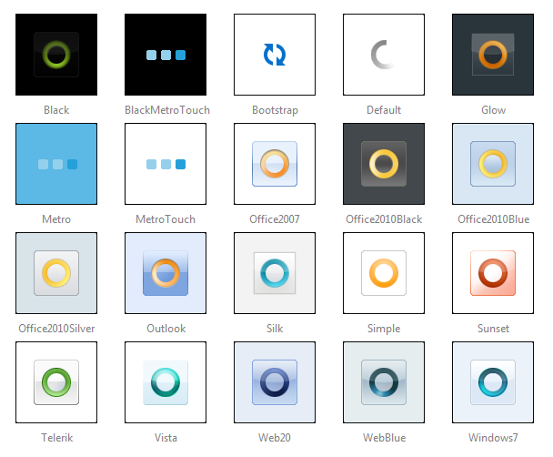

# Skins

This help article describes how __RadAjaxLoadingPanel__ works with skins, shows a figure of the available skins, and describes how to work with transparency settings and the __BackgroundPosition__ property.

## 

As of Q1 2009, __RadAjaxLoadingPanel__ supports skinning similar to all other controls in the UI for ASP.NET AJAX suite. You can change a __RadAjaxLoadingPanel__'s skin by setting the __Skin__ property to the name of the respective skin.

>caution Unlike all other RadControls, for a __RadAjaxLoadingPanel__ the __Skin__ property's default value is "" (no skin). The main reason for this is backwards compatibility. If this was not the default setting, the appearance of all legacy loading panels will be spoiled and two loading images will appear.
>

__Built-in Skins__

__Figure 1__ shows the embedded skins and what they look like for the __RadAjaxLoadingPanel__. They are embedded in the Telerik.Web.UI.dll assembly as web resources. To use a built-in skin you only need to set the __Skin__ property of the control. You can find built-in skins in this folder: "C:\Program Files\Telerik\UI for ASP.NET AJAX QX 20XX\Skins".

__Figure 1:__ This figure shows the __RadAjaxLoadingPanel__ using each of the embedded skins.

>note The __Hay__ , __Forest__ , __Sitefinity__ and __Transparent__ skins are obsolete and have been removed from the Telerik.Web.UI.Skins.dll assembly as of __Q1 2014__ .You can find more information on the matter in[this blog post](http://blogs.telerik.com/aspnet-ajax/posts/13-04-11/6-telerik-asp.net-ajax-skins-going-obsolete).
>

If the __Skin__ property is set, the loading panel will NOT hide the updated control entirely, because transparency is applied by default from the skin. You can change this behavior by setting __EnableSkinTransparency="false"__. Setting the __RadAjaxLoadingPanel__ control's __Transparency__ property will increase the actual visible transparency if the skin transparency is not disabled.

When the __Skin__ property is set, the __RadAjaxLoadingPanel__ control will render two nested 
 elements instead of one. Thisallows developers to use a non-transparent loading image and a transparent background.

The __RadAjaxLoadingPanel__'s __BackgroundPosition__ property enables the developer to position the loading image in the loading panel (__Top__, __TopRight__, __TopLeft__, __CenterLeft__, __Center__, __CenterRight__, __BottomLeft__, __Bottom__, __BottomRight__ and __None__). The default value is __Center__. Choosing __None__ is useful in cases when the loading image is larger than the updated control (e.g. a textbox).

__Custom Skins__

Apart from using the embedded skins, you can easily create a custom skin for a __RadAjaxLoadingPanel__. A [code library example](http://www.telerik.com/community/code-library/aspnet-ajax/ajax/how-to-create-and-use-custom-skins-for-radajaxloadingpanel.aspx), demonstrates how to do that and provides some useful tips.

# See Also

 * [Overview]()

 * [Controlling Appearance of a RadAjaxLoadingPanel]()

 * [Demo: AjaxLoadingPanel](http://demos.telerik.com/aspnet-ajax/ajax/examples/loadingpanel/loadingimages/defaultcs.aspx)
