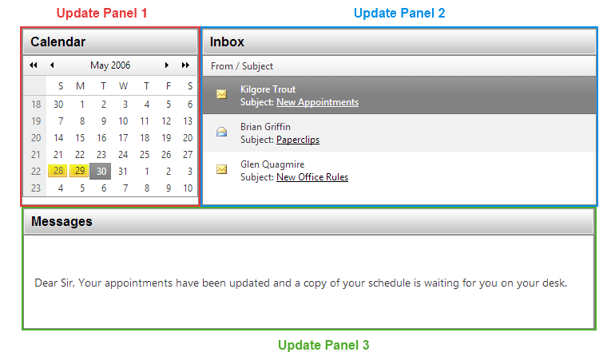
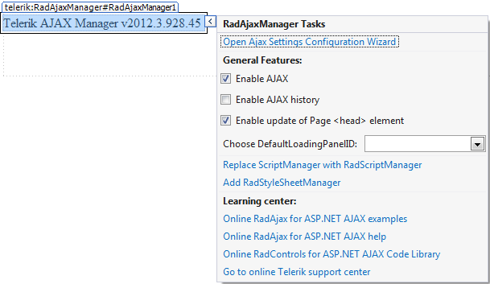
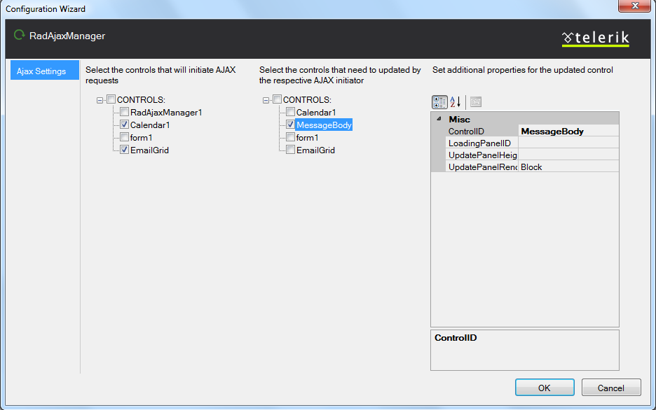

# RadAjax Advantages

This help article described how you can AJAX-enable a page using **Telerik RadAjax**, what are its benefits and how it can be configured.

The greatest advantage of the **Telerik RadAjax** tool is that you don't need to make any changes to your existing applications or build new ones in some specific way so that they can be AJAX-enabled. **RadAjax** for ASP.NET AJAX uses the Microsoft ASP.NET AJAX engine to ajax-ify applications, however eliminates the need of using numerous UpdatePanels, triggers, etc.

The click-and-Go™ technology of **Telerik RadAjax** for ASP.NET AJAX allows you to AJAX-enable any ASP.NET application without making any modification, without writing a single line of code:

* **Existing applications** - In order to AJAX-enable an existing application, you need to simply:

1. Add Microsoft ASP.NET AJAX to your project.

1. Drop a [RadAjaxManager]() to your form.

1. Define the AJAX relations using a single dialogue in Visual Studio.

1. Press **F5** to run.

* **New applications** - you don't have to follow any specific guidelines when building an application that is to be AJAX-enabled with **Telerik RadAjax** . Simply build a regular postback-based application the way you are used to and use the [AJAX Manager]() to AJAX-enable it at the end.

## AJAX-enabling Without RadAjax for ASP.NET AJAX

When using Microsoft ASP.NET AJAX, the standard approach to AJAX-enable am application will require you to place "UpdatePanels" around each area that needs to be updated. This may introduce some challenges with preserving the application's layout (i.e. you need to figure out how to group the various elements). Consider the example this article will follow. It begins as an ASP.NET web page that has three controls: a calendar, an email list and a message body.When the user select a date from the calendar the e-mails that are received that day are shown in the grid. Once an e-mail is selected its content is displayed in the message body.

**Figure 1**: Adding three **UpdatePanels** to AJAX-enable a page using Microsoft ASP.NET AJAX may not seem difficult.

In simple scenarios like the one above placing UpdatePanels may not be very difficult. But imagine you have a real-life application with dozens of UI controls that need to start working with AJAX. Placing 20+ UpdatePanels and figuring which element should go in the respective panel may be a challenge even for the most advanced developers.

## AJAX-enabling a sample application with Telerik RadAjax for ASP.NET AJAX

**Telerik RadAjax** for ASP.NET AJAX offers a fundamentally different approach to AJAX-enabling existing applications. Basically you need to perform two easy tasks:

1. Drag and drop the AJAX Manager control on your form

1. Set the AJAX relations using a single dialogue in Visual Studio .Net design mode

Figure 2: A **RadAjaxManager** designer, visible when the Smart tag is clicked.
>caption 

Once the AJAX Manager is placed on the form you need to use its configuration dialog to define the AJAX relations among the controls on the page, i.e. which controls should initiate AJAX request and which controls should be updated by each respective AJAX request.For example:

* "Message Body" UpdatePanel - Trigger 1: The needs to be updated when an **e-mail item** is clicked

* "Message Body" UpdatePanel - Trigger 2: The needs to be updated when the **calendar** is clicked

* "E-mail list" UpdatePanel - Trigger 1: The needs to be updated when the **calendar** is clicked

The combination of these **3** Triggers define the **2** AJAX relations on the page, which are:

1. When the **calendar** is clicked the **e-mail list** and the **message body** need to be updated

1. When an **e-mail message**is clicked the **message body** only needs to be updated

As you can see, it is not very easy to figure out what will be the effect of the combination of triggers, especially when you have complex real-life application. This task can required placing multiple Update Panels and setting numerous triggers.Moreover, setting several triggers that facilitate every of the numerous AJAX relations will definitely need serious planning and probably something like a "Trigger diagram". In contrast, the Telerik RadAjax framework offers a centralized place where you can define and modify the AJAX relations on the page. This is done through the single configuration dialog of the AJAX Manager in Visual Studio .Net design mode.

If we need to implement the above scenario we need to simply set the two relations in the dialog.

**Relation 1:** When the **calendar** is clicked the **e-mail list**and the **message body**need to be updated

**Relation 2:** When an **e-mail message**is clicked the **message body** only needs to be updated

It is clearly of benefit for developers to be able to see all AJAX relations at a glance in one centralized place (the AJAX Manager dialog) , rather than having to configure every Trigger of every UpdatePanel individually.

The logic for setting AJAX relations in the AJAX Manager dialog leads to another benefit - the AJAX relations are defined in the same sequence in which users interact with the interface of the application.

## See Also

 * [Add AjaxSettings Programmatically]()
