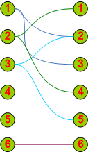

# RadAjaxManager Overview


**RadAjaxManager** is one of the two major controls of the UI for ASP.NET AJAX. The other one is [AJAX Panel](). **RadAjaxManager** allows developers to rapidly develop powerful and complex AJAX solutions.

The main features of **RadAjaxManager** are:

* You can AJAX-enable all controls that normally work with postbacks.

* It lets you define visually and codeless (in Visual Studio design-time) which controls should initiate AJAX requests and which controls should be updated.

* You do not need to modify your application logic.

* You can update a number of page elements at once regardless of their position on the page.

* You do not need to write any JavaScript or invoke AJAX requests manually.

Using a single **RadAjaxManager** on the page you can create complex web applications like Microsoft Outlook ® Web Access portal.

The visual designer of **RadAjaxManager**, accessible in Visual Studio, lets you set even the most complicated update scenarios such as the one shown in **Figure 1**:

**Figure 1** - Example of scenario with Ajax-enabled controls

1. Single control updates one or more controls with an AJAX request – **1** updates **2** and **3**

1. Second control updates other controls (or even controls from the previous scenario) with an AJAX request – **3** updates **2** and **5**

1. A control updates itself with an AJAX request – **6** updates **6** (i.e., itself)

1. Call the **RadAjaxManager** API from a control on the page and update control(s) on the page. – Using the **RadAjaxManager** API, **2** is made to update **1** and **4**.

In order to use **RadAjaxManager**, you need to drag it from the **Visual Studio** toolbox to your page.

>caution Note that you cannot have two **RadAjaxManagers** in a single page. If you are using **MasterPage** or **WebUserControl** , the best option is to use a single **RadAjaxManager** on the master/main page.
>


## Setting the Control Relations in Configuration Wizard

**RadAjaxManager** comes with a configuration wizard (**Figure 2**) for setting the relations between the AJAX request initiator and the controls that will be updated. You can start the configuration wizard by right-clicking the control and choosing the **Configure RadAjaxManager** command in the control's Smart Tag.

The **RadAjaxManager** Configuration Wizard is pretty intuitive and simple to use. The tool has three panes:

1. The left pane is a treeview with all controls on the page. Select a control that will initiate the callback request. Only the controls that have their check boxes checked will initiate callbacks. Once you select the control in the left pane, move to the middle pane to choose the controls that will be updated.

1. The middle pane is another treeview with all controls on the page. Here you can select which controls will be updated after a callback request from the control that is **checked and selected** in the left pane.Please note that your selection in the middle pane can be applied only to one control from the left pane. Thus, you can have different sets of controls that will be updated depending on the callback initiator control (from the left pane). After you set the controls that will be updated (middle pane), you may select a loading panel for each one of them in the right pane.

1. The right pane lets you specify the loading panel that will be used for the controls selected in the middle pane. Each control that will be updated can have a separate loading panel set. A default loading panel could be set as well through the **DefaultLoadingPanelID** property of the **RadAjaxManager** control. If it is used, there is no need to set the loading panel on each new AJAX setting—the default loading panel will be automatically applied everywhere.

You can find the working code example of **Figure 2** in this [demo](http://demos.telerik.com/aspnet-ajax/ajax/examples/manager/firstlook/defaultcs.aspx).

**Figure 2**: The RadAjaxManager property builder has three panes which you use to set which controls perform AJAX updates.

## Setting the Control Relations in Code-Behind

You can set the relationship between AJAX-ified and updated controls on the server-side using the **AddAjaxSetting** methods:


````C#
	        RadAjaxManager1.AjaxSettings.AddAjaxSetting(<ajaxified control>, <updated control>);
	        RadAjaxManager1.AjaxSettings.AddAjaxSetting(<ajaxified control>, <updated control>, <LoadingPanel> or null if none);
	    
````
````VB.NET
	    RadAjaxManager1.AjaxSettings.AddAjaxSetting(<ajaxified control>, <updated control>)
	    RadAjaxManager1.AjaxSettings.AddAjaxSetting(<ajaxified control>, <updated control>, <LoadingPanel> or Nothing if none)			
````


## Client-side Functions

You can use any external control to force **RadAjaxManager** to perform an AJAX request by calling the manager's client-side functions. When using this function, the event target defaults to the **RadAjaxManager** instance. The following examples illustrate how you could manually trigger an AJAX request.

>note You can construct the JavaScript function calls manually or alternatively use the server-side method[GetAjaxEventReference](http://www.telerik.com/help/aspnet-ajax/m_telerik_web_ui_radajaxcontrol_getajaxeventreference.html)and have **RadAjax** generate the necessary code for you.
>


Forcing an AJAX request by using **ajaxRequest()**:

**$find("<%=AjaxManager1.ClientID%>").ajaxRequest(arguments)**

* **arguments** – The parameters, which the control had used when it raised the request.(Optional)

The ajaxRequest()) can be handled by the [AjaxRequest]() event on the server.


The **ajaxRequestWithTarget(eventTarget, eventArgument)** function can be called to simulate a postback/AJAX request sent by another control with the specified UniqueID and specified arguments:

**$find("<%=AjaxManager1.ClientID%>").ajaxRequestWithTarget(eventTarget, eventArgument)**

* **eventTarget** – The control that should raise a postback event. Otherwise, if your control is in an **INamingContainer**, you should use the control's **UniqueID**.

* **eventArgument** – This is an optional argument for the event.

When you set a control as an **eventTarget**, it will raise an AJAX request and will update the controls that it was set to update in the configuration wizard. This function can be handled by the corresponding event handler (i.e., Button_Click) on the server.

# See Also

 * [Overview]()

 * [Overview]()

 * [Overview]()
