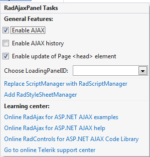

# Design Time

Display **Smart Tags** by right clicking the control and choosing **Show Smart Tag** from the context menu, or clicking the small rightward-pointing arrow located in the upper right corner of the control.

The Smart Tags for [RadAjaxPanel]() and [RadAjaxManager]() are nearly identical. The RadAjaxManager Smart Tag differs from the RadAjaxPanel version in that it has aConfigure Ajax Manager link and a "Choose DefaultLoadingPanelID" drop down list instead of "Choose LoadingPanelID". RadAjaxPanel also has a **Add RadAjaxManager** option.

## RadAjaxPanel
>caption 

## General Features

* **Enable AJAX** : When this item is checked, all requests for controls within the RadAjaxPanel are handled via AJAX. If not checked, requests are handled in the legacy postback manner.

* **Enable AJAX History** : When checked, browser history is enabled even when using AJAX. The forward and back buttons of the browser work as expected in a standard postback web site.

* **Enable update of Page `<head>` element** : If this option is checked, the Page `<Head>` element can be modified during AJAX updates.

* **Choose LoadingPanelID** : Select a [LoadingPanel]() instance from the drop down list to display during AJAX updates.

>caution The Enable AJAX History feature currently works for Internet Explorer only.
>

## Learning Center

* Links navigate you directly to examples, help, and code library.

* You can also search the Telerik web site for a given string.

* You can navigate directly to the [Telerik Support Center](http://www.telerik.com/support/home.aspx).

