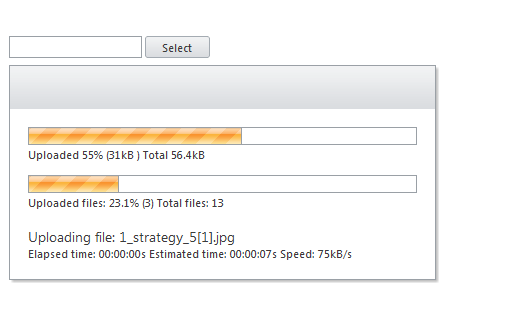

# AsyncUpload Overview

## General Information

**RadAsyncUpload** offers *asynchronous upload* capability while maintaining the look of the regular **RadUpload** control. The upload process requires that the files are uploaded to a custom handler and not to the hosting page. Files are stored in a temporary location *until a postback* occurs. The temporary location is cleaned-up automatically.

Internally, **RadAsyncUpload** can choose between four modules for uploading - File API, IFrame, Flash and Silverlight. The module with higher priority is File API. The module with highest priority is File API. If the browser does not support File API that module is automatically changed to Silverlight. If there is no Silverlight installed on the client machine, **RadAsyncUpload** will utilize the Flash module. If there is no Flash as well, **RadAsyncUpload** will use the IFrame module, which is supported out of the box on all browsers.

The control *supports web farm* scenarios. Upload progress is available in this scenario as long as Flash or Silverlight is installed on the client machine.

## Temporary Files

**RadAsyncUpload** relies on saving temporary files to work. When posted, files are saved to the designated temp folder (**App_Data/RadUploadTemp** by default) with unique names. Once a postback occurs the **RadAsyncUpload** fires the **OnFileUploaded** event for each file. The target file is passed as part of the arguments to the event and can be set as either valid (default) or invalid. After the events fire, all files marked as valid are automatically saved to the **TargetFolder** if it’s set.

Finally, all processed temporary files are deleted. Temporary files are also deleted after a set amount of time defined by the **TemporaryFileExpiration** property which can be set seperately to a **RadAsyncUpload** control as well as globally in the web.config:

>note With the release of **Q1 2011 SP2 RadAsyncUpload** supports setting the temporary folder globally in the appSettings section of the web.config.
> **< add key="Telerik.AsyncUpload.TemporaryFolder" value="[path_to_the_temporary_folder]" />** 
>The path can be relative or absolute.
>

## Validation

Validation for **RadAsyncUpload** differs from validation in **RadUpload** as it is now possible to validate size on the client, as long as the **File API** upload module is used or there is Silverlight or Flash installed on the client's browser. If the validation fails, **RadAsyncUpload** will fire **OnClientValidationFailed**.

## Web Farms

In web farms, each server will need to use the *same MachineKey* that **RadAsyncUpload** uses for encryption. Most web farms should already have their MachineKeys synchronized as this is the recommended approach for web farm deployment.

# See Also

 * [Getting Started]()

 * [Migrating from RadUpload for ASP.NET AJAX to RadAsyncUpload]()

 * [RadAsyncUpload vs. RadUpload for ASP.NET AJAX]()

 * [RadAsyncUpload Modules]()

 * [Online Demos](http://demos.telerik.com/aspnet-ajax/asyncupload/examples/overview/defaultcs.aspx)
