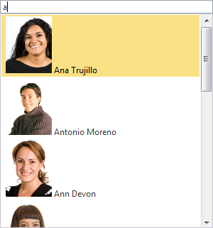

# Client Templates


## Overview

RadAutoCompleteBox provides support for client templates. The template itself contains mark up and binding expressions which are evaluated against a **DataItem** and then rendered as the Item's content on the client. The templates support the following type of expressions which are evaluated at run-time:

* **#=...#** - Evaluates the JavaScript code expression or a string property from the data item and outputs the result in the template.

* **#...#** - Evaluates the JavaScript code expression inside, but does not output value.

* **#:...#** - Evaluates the JavaScript code expression or a string property from the data item, and outputs the HTML encoeded result in the template.

>important Client templates **can not** contain server controls.
>


## Server side representation

On the server, the template will be represented as a string property of the control named **ClientDropDownItemTemplate**. The following application scenario shows an example of client templates.

````ASPNET
<telerik:RadAutoCompleteBox runat="server" ID="RadAutoCompleteBox2" InputType="Token"
	Filter="StartsWith" Width="300px" DropDownWidth="300px" DropDownHeight="298px">
	<WebServiceSettings Path="AutoCompleteBox.aspx" Method="GetChildren" />
	<ClientDropDownItemTemplate> 
		
		<span>#= Text #</span>
	</ClientDropDownItemTemplate>
</telerik:RadAutoCompleteBox>
````


````C#
[WebMethod]
public static AutoCompleteBoxData GetChildren(object context)
{
	string searchString = ((Dictionary<string, object>)context)["Text"].ToString();
	DataTable data = GetChildNodes(searchString);
	List<AutoCompleteBoxItemData> result = new List<AutoCompleteBoxItemData>();

	foreach (DataRow row in data.Rows)
	{
		AutoCompleteBoxItemData childNode = new AutoCompleteBoxItemData();
		childNode.Text = row["ContactName"].ToString();
		childNode.Value = row["CustomerID"].ToString();
		result.Add(childNode);
	}

	AutoCompleteBoxData res = new AutoCompleteBoxData();
	res.Items = result.ToArray();

	return res;
}

private static DataTable GetChildNodes(string searchString)
{
	SqlCommand selectCommand = new SqlCommand(@"SELECT * FROM [CustomerPhotos] WHERE ContactName LIKE @ContactName + '%'");
	selectCommand.Parameters.AddWithValue("ContactName", searchString);
	return GetData(selectCommand);
}

private static DataTable GetData(SqlCommand selectCommand)
{
	selectCommand.Connection = new SqlConnection(ConfigurationManager.ConnectionStrings["TelerikConnectionString"].ConnectionString);
	SqlDataAdapter adapter = new SqlDataAdapter(selectCommand);

	DataTable data = new DataTable();
	adapter.Fill(data);

	return data;
}
````
````VB.NET
<WebMethod()>
Public Shared Function GetChildren(context As Object) As AutoCompleteBoxData
	Dim searchString As String = DirectCast(context, Dictionary(Of String, Object))("Text").ToString()
	Dim data As DataTable = GetChildNodes(searchString)
	Dim result As New List(Of AutoCompleteBoxItemData)()

	For Each row As DataRow In data.Rows
		Dim childNode As New AutoCompleteBoxItemData()
		childNode.Text = row("ContactName").ToString()
		childNode.Value = row("CustomerID").ToString()
		result.Add(childNode)
	Next

	Dim res As New AutoCompleteBoxData()
	res.Items = result.ToArray()

	Return res
End Function

Private Shared Function GetChildNodes(searchString As String) As DataTable
	Dim selectCommand As New SqlCommand("SELECT * FROM [CustomerPhotos] WHERE ContactName LIKE @ContactName + '%'")
	selectCommand.Parameters.AddWithValue("ContactName", searchString)
	Return GetData(selectCommand)
End Function

Private Shared Function GetData(selectCommand As SqlCommand) As DataTable
	selectCommand.Connection = New SqlConnection(ConfigurationManager.ConnectionStrings("TelerikConnectionString").ConnectionString)
	Dim adapter As New SqlDataAdapter(selectCommand)

	Dim data As New DataTable()
	adapter.Fill(data)

	Return data
End Function
````


|  **RadAutoCompleteBox** before a selection is made. |  **RadAutoCompleteBox** after a selection is made. |
| ------ | ------ |
|||

# See Also

 * [Overview]()
