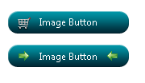

# Image Button


## 

__RadButton__provides an easy way to show a custom image on the control.The image can be used as a background, or can represent the button itself (Image Button).When using the __RadButton__control as an Image Button, the user mustset __Width__ and __Height__, because we don't use an actual  tag, but the image is setas background to the Button's wrapper element (<span>). All the Image-related properties are controlled through the __RadButton.Image__property.
>caption Figure 1: RadButton used as ImageButton (the image represents the button).


>caption Figure 2: RadButton with background image, icons and text.




There are two ways to display an image on the control:

1. The first and the easiest way is to set the __Image.ImageUrl__ propertyto the location of the image used. Setting the __IsBackgroundImage__ totrue enables the developer to use the image as background, and set text and icons to his/her button.

1. The second way to set the image using __RadButton__'s __CssClass__property. Basically we set the background-image in the __CssClass__, and enable theimage button functionality by setting__Image.EnableImageButton=true__ (__Example 1__).

This approach is preferred when you want to use an image sprite for the button (see sample below). You setthe background-image and background-position in the __CssClass__, and then in the__HoveredCssClass__ and __PressedCssClass__, only thebackground-position of the hovered and pressed image. If the user wants she/he can display adifferent image when the mouse is hovering over the control, or the button is pressedusing the __HoveredImageUrl__ and __PressedImageUrl__ properties respectively.

__Example 1__: Configure a RadButton as an Image Button through the __CssClass__ and __Image.EnableImageButton=true__ properties.

````XML
		<style type="text/css">
			.classImage
			{
				background: url(img/categories.png);
				background-position: 0 0;
				width: 150px;
				height: 94px;
			}
			.classHoveredImage
			{
				background-position: 0 -100px;
			}
			.classPressedImage
			{
				background-position: 0 -200px;
			}
		</style>
````


````ASPNET
	<telerik:radbutton id="RadButton1" runat="server" text="Image Button" cssclass="classImage"
			hoveredcssclass="classHoveredImage" pressedcssclass="classPressedImage">
		<Image EnableImageButton="true" />
	</telerik:radbutton>
````


>note Note: It is always good to set the __Text__ property, no matter if the control is used solely as image button (no text and icons shown), because this way the accessibility of the control is improved.
>


# See Also

 * [Button - Image Buttons](http://demos.telerik.com/aspnet-ajax/button/examples/imagebutton/defaultcs.aspx)

 * [Overview]()

 * [Overview]()

 * [Split Button]()

 * [Toggle button]()
