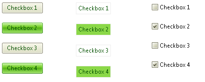
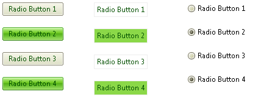

# Toggle button


## 

The __RadButton__ control can be easily configured to behave as a toggle button. Simply set the __ToggleType__ property to a value different than __ButtonToggleType__.__None__, and the button is transformed into a check box, a radio button or a completely customized toggle button. Since the __ButtonType__ property controls how the component looks like, the user can have his/her buttons look like standard buttons or even __<input type="submit|button" />__elements, and behave like check boxes or radio buttons. Here are some code samples showing how this is achieved:

* [Configure RadButton Controls as CheckBoxes](#configure-radbutton-controls-as-checkboxes)

* [Configure RadButton Controls as Radio Buttons](#configure-radbutton-controls-as-radio-buttons)

* [Configure a RadButton Control with Custom Toggle States](#configure-a-radbutton-control-with-custom-toggle-states)

## Configure RadButton Controls as CheckBoxes

In order to configure the __RadButton__ as a checkbox you must do the following steps:

1. Set the __ToggleType__ property of the button to "__CheckBox__".

1. Choose the desired button type through the __ButtonType__ property:

* __StandardButton__ - For a standard button layout.

* __LinkButton__ - For link button layout.

* __ToggleButton__ - For a native checkbox layout.

1. Define whether the checkbox is checked or not through the __Checked__ property.

1. You can make a further customization to both toggle states through the correspondingproperties (e.g., __Text__, __Value__,__Selected__, __CssClass__, etc.) of the __RadButtonToggleState__ class.

__Example 1__: Configuring RadButton as a checkbox with a __StandardButton__,__LinkButton__ and __ToggleButton__ button type.

````ASPNET
	<telerik:RadButton ID="btnToggle1" runat="server" Text="Checkbox 1" ToggleType="CheckBox"
	ButtonType="StandardButton"></telerik:RadButton>
	<telerik:RadButton ID="btnToggle2" runat="server" Text="Checkbox 2" ToggleType="CheckBox" ButtonType="LinkButton"></telerik:RadButton>
	<telerik:RadButton ID="btnToggle2" runat="server" Text="Checkbox 3" ToggleType="CheckBox" ButtonType="ToggleButton"></telerik:RadButton> 
````


>caption Figure 1: RadButton's checkbox functionality is relevant not only for a native checkbox appearance but also fora StandardButton and LinkButton button types.



## Configure RadButton Controls as Radio Buttons

In order to configure the __RadButton__ as a radio button you must do the following steps:

1. Set the __ToggleType__ property of the button to "__Radio__".

1. Choose the desired button type through the __ButtonType__ property:

* __StandardButton__ - For a standard button layout.

* __LinkButton__ - For link button layout.

* __ToggleButton__ - For a native radio button layout.

1. Define whether the radio button is checked or not through the __Checked__ property.

1. Set a common value for the __GroupName__ property of the radio buttons that are within the same group.

1. You can make a further customization to both toggle states through the corresponding properties (e.g., __Text__, __Value__, __Selected__, __CssClass__, etc.) of the __RadButtonToggleState__ class.

__Example 2__: Configuring RadButton as a radio button with a __StandardButton__, __LinkButton__ and __ToggleButton__ button type.

````ASPNET
	<telerik:RadButton ID="btnToggle1" runat="server" Text="Radio Button 1" ToggleType="Radio" ButtonType="StandardButton"></telerik:RadButton>
	<telerik:RadButton ID="btnToggle2" runat="server" Text="Radio Button 2" ToggleType="Radio" ButtonType="LinkButton"></telerik:RadButton>
	<telerik:RadButton ID="btnToggle3" runat="server" Text="Radio BUtton 3" ToggleType="Radio" ButtonType="ToggleButton"></telerik:RadButton> 
````


>caption Figure 2: RadButton's radio button functionality is relevant not only for a native radio button's appearance but also for a StandardButton and LinkButton button types.




## Configure a RadButton Control with Custom Toggle States

In order to configure a __RadButton__ with custom toggle states you must do the following steps:

1. Set the __ToggleType__ property of the button to "__CustomToggle__".

1. Choose the desired button type through the __ButtonType__ property:

* __StandardButton__ - For a standard button layout.

* __LinkButton__ - For link button layout.

* __ToggleButton__ - For a native layout.

1. Add as many __RadButtonToggleState__ instances as you liketo the __ToggleStates__ collection. Make a further customization to each toggle state through the corresponding properties (e.g., __Text__, __Value__, __Selected__, __CssClass__, etc.) of the __RadButtonToggleState__ class.

__Example 3__: Configuring RadButton with custom toggles states with a __StandardButton__, __LinkButton__ and __ToggleButton__ button type.

````ASPNET
	<telerik:RadButton ID="btnToggle1" runat="server" ToggleType="CustomToggle" ButtonType="StandardButton">
	<ToggleStates>
	 <telerik:RadButtonToggleState Text="UnChecked" PrimaryIconCssClass="rbToggleCheckbox" />
	 <telerik:RadButtonToggleState Text="Filled" PrimaryIconCssClass="rbToggleCheckboxFilled" />
	 <telerik:RadButtonToggleState Text="Checked" PrimaryIconCssClass="rbToggleCheckboxChecked" />
	</ToggleStates>
	</telerik:RadButton>
	<telerik:RadButton ID="btnToggle1" runat="server" ToggleType="CustomToggle" ButtonType="LinkButton">
	<ToggleStates>
	 <telerik:RadButtonToggleState Text="UnChecked" PrimaryIconCssClass="rbToggleCheckbox" />
	 <telerik:RadButtonToggleState Text="Filled" PrimaryIconCssClass="rbToggleCheckboxFilled" />
	 <telerik:RadButtonToggleState Text="Checked" PrimaryIconCssClass="rbToggleCheckboxChecked" />
	</ToggleStates>
	</telerik:RadButton>
	<telerik:RadButton ID="btnToggle1" runat="server" ToggleType="CustomToggle" ButtonType="ToggleButton">
	<ToggleStates>
	 <telerik:RadButtonToggleState Text="UnChecked" PrimaryIconCssClass="rbToggleCheckbox" />
	 <telerik:RadButtonToggleState Text="Filled" PrimaryIconCssClass="rbToggleCheckboxFilled" />
	 <telerik:RadButtonToggleState Text="Checked" PrimaryIconCssClass="rbToggleCheckboxChecked" />
	</ToggleStates>
	</telerik:RadButton> 
````


>caption Figure 3: RadButton's custom toggle state functionality is relevant also for a StandardButton and LinkButton button types.


In the code above, the __PrimaryIconCssClass__property is used to specify a three-state (3-state) checkbox, and the Text property to have different text depending on the currently selected state.

To take a closer look at __RadButton__'s "toggle button" functionality please visit our [online demos](http://demos.telerik.com/aspnet-ajax/button/examples/togglebutton/defaultcs.aspx).


# See Also

 * [Button - Toggle Button Online Demo](http://demos.telerik.com/aspnet-ajax/button/examples/togglebutton/defaultcs.aspx)

 * [Overview]()

 * [Split Button]()

 * [Overview]()

 * [Image Button]()
