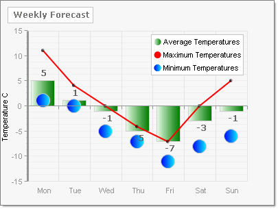

# Multiple Chart Types in a Single Chart


>caution  __RadChart__ has been replaced by[RadHtmlChart](http://www.telerik.com/products/aspnet-ajax/html-chart.aspx), Telerik's client-side charting component.	If you are considering __RadChart__ for new development, examine the[RadHtmlChart documentation](ffd58685-7423-4c50-9554-f92c70a75138)and[online demos](http://demos.telerik.com/aspnet-ajax/htmlchart/examples/overview/defaultcs.aspx)first to see if it will fit your development needs.	If you are already using __RadChart__ in your projects, you can migrate to __RadHtmlChart__ by following these articles:[Migrating Series](2f393f28-bc31-459c-92aa-c3599785f6cc),[Migrating Axes](3f1bea81-87b9-4324-b0d2-d13131031048),[Migrating Date Axes](93226130-bc3c-4c53-862a-f9e17b2eb7dd),[Migrating Databinding](d6c5e2f1-280c-4fb0-b5b0-2f507697511d),[Feature parity](010dc716-ce38-480b-9157-572e0f140169).	Support for __RadChart__ is discontinued as of __Q3 2014__ , but the control will remain in the assembly so it can still be used.	We encourage you to use __RadHtmlChart__ for new development.
>


## 

RadChart allows you to combine several [chart types]() in a single chart. You can use the ChartSeries Collection Editor at design-time to create the ChartSeries and set the respective ChartSeriesType. You can also add chart series and set chart type programmatically.

To designate dissimilar [chart types]() in a single chart at design time, click on a series, then select the __Type__ property from the drop down list.
>caption 


To assign chart types to a series at run-time programmatically you can pass the ChartSeriesType in the constructor or assign the ChartSeriesType after the series is constructed.The example below passes three chart series types to the constructor.

>tabbedCode

````C#
	     
	ChartSeries chartSeries =
	 new ChartSeries("Average Temperatures", ChartSeriesType.Bar);
	ChartSeries chartSeries2 =
	 new ChartSeries("Maximum Temperatures", ChartSeriesType.Line);
	ChartSeries chartSeries3 =
	 new ChartSeries("Minimum Temperatures", ChartSeriesType.Bubble);
				
````


````VB.NET
	
	    Dim chartSeries As New ChartSeries("Average Temperatures", ChartSeriesType.Bar)
	    Dim chartSeries2 As New ChartSeries("Maximum Temperatures", ChartSeriesType.Line)
	    Dim chartSeries3 As New ChartSeries("Minimum Temperatures", ChartSeriesType.Bubble)
	
````


>end

Use the Axis.Range property to set minimum values, maximum values and step amount for each axis.  The screen shot below shows three chart series types in the same chart. See below for the full source.
>caption 




>tabbedCode

````C#
	     
	RadChart radChart = new RadChart();
	radChart.PlotArea.Appearance.Dimensions.Margins.Right =
	Telerik.Charting.Styles.Unit.Percentage(10);
	radChart.Legend.Appearance.Position.Auto = false;
	radChart.Legend.Appearance.Position.X = 220;
	radChart.Legend.Appearance.Position.Y = 50;
	radChart.ChartTitle.Appearance.Position.AlignedPosition =
	Telerik.Charting.Styles.AlignedPositions.TopLeft;
	radChart.ChartTitle.TextBlock.Text = "Weekly Forecast";
	radChart.ChartTitle.TextBlock.Appearance.TextProperties.Font =
	new System.Drawing.Font("Verdana", 9, System.Drawing.FontStyle.Bold);
	radChart.PlotArea.XAxis.AutoScale = false;
	radChart.PlotArea.XAxis.AddRange(1, 7, 1);
	radChart.PlotArea.XAxis[0].TextBlock.Text = "Mon";
	radChart.PlotArea.XAxis[1].TextBlock.Text = "Tue";
	radChart.PlotArea.XAxis[2].TextBlock.Text = "Wed";
	radChart.PlotArea.XAxis[3].TextBlock.Text = "Thu";
	radChart.PlotArea.XAxis[4].TextBlock.Text = "Fri";
	radChart.PlotArea.XAxis[5].TextBlock.Text = "Sat";
	radChart.PlotArea.XAxis[6].TextBlock.Text = "Sun";
	radChart.PlotArea.XAxis.IsZeroBased = false;
	radChart.PlotArea.YAxis.AxisMode = ChartYAxisMode.Extended;
	radChart.PlotArea.YAxis.AxisLabel.TextBlock.Text = "Temperature C";
	radChart.PlotArea.YAxis.Appearance.Width = 3;
	// Create the series and assign the ChartSeriesType
	ChartSeries chartSeries =
	new ChartSeries("Average Temperatures", ChartSeriesType.Bar);
	chartSeries.Appearance.TextAppearance.TextProperties.Font =
	new System.Drawing.Font("Verdana", 9, System.Drawing.FontStyle.Bold);
	chartSeries.Appearance.FillStyle.MainColor =
	System.Drawing.Color.Honeydew;
	chartSeries.Appearance.FillStyle.SecondColor =
	System.Drawing.Color.Green;
	// Define the items in the series
	chartSeries.AddItem(5);
	chartSeries.AddItem(1);
	chartSeries.AddItem(-1);
	chartSeries.AddItem(-5);
	chartSeries.AddItem(-7);
	chartSeries.AddItem(-3);
	chartSeries.AddItem(-1);
	// Create the series and assign the ChartSeriesType
	ChartSeries chartSeries2 =
	new ChartSeries("Maximum Temperatures", ChartSeriesType.Line);
	chartSeries2.Appearance.LabelAppearance.Visible = false;
	chartSeries2.Appearance.LineSeriesAppearance.Color =
	System.Drawing.Color.Red;
	// Define the items in the series
	chartSeries2.AddItem(11);
	chartSeries2.AddItem(4);
	chartSeries2.AddItem(0);
	chartSeries2.AddItem(-4);
	chartSeries2.AddItem(-7);
	chartSeries2.AddItem(0);
	chartSeries2.AddItem(5);
	// visually enhance the data points
	chartSeries2.Appearance.PointMark.Dimensions.Width = 5;
	chartSeries2.Appearance.PointMark.Dimensions.Height = 5;
	chartSeries2.Appearance.PointMark.FillStyle.MainColor =
	System.Drawing.Color.Black;
	chartSeries2.Appearance.PointMark.Visible = true;
	// Create the series and assign the ChartSeriesType
	ChartSeries chartSeries3 =
	new ChartSeries("Minimum Temperatures", ChartSeriesType.Bubble);
	chartSeries3.Appearance.LabelAppearance.Visible = false;
	chartSeries3.Appearance.FillStyle.MainColor = System.Drawing.Color.Blue;
	chartSeries3.Appearance.FillStyle.SecondColor = System.Drawing.Color.Aqua;
	// Define the items in the series
	chartSeries3.AddItem(1);
	chartSeries3.AddItem(0);
	chartSeries3.AddItem(-5);
	chartSeries3.AddItem(-7);
	chartSeries3.AddItem(-11);
	chartSeries3.AddItem(-8);
	chartSeries3.AddItem(-6);
	// visually enhance the data points
	chartSeries3.Appearance.PointMark.Dimensions.Width = 5;
	chartSeries3.Appearance.PointMark.Dimensions.Height = 5;
	chartSeries3.Appearance.PointMark.FillStyle.MainColor =
	System.Drawing.Color.Black;
	chartSeries3.Appearance.PointMark.Visible = true;
	// Add the series to the chart, chart to page.
	radChart.Series.Add(chartSeries);
	radChart.Series.Add(chartSeries2);
	radChart.Series.Add(chartSeries3);
	this.Page.Controls.Add(radChart);
				
````


````VB.NET
	     
	    Dim radChart As New RadChart()
	    radChart.PlotArea.Appearance.Dimensions.Margins.Right = Telerik.Charting.Styles.Unit.Percentage(10)
	    radChart.Legend.Appearance.Position.Auto = False
	    radChart.Legend.Appearance.Position.X = 220
	    radChart.Legend.Appearance.Position.Y = 50
	    radChart.ChartTitle.Appearance.Position.AlignedPosition = Telerik.Charting.Styles.AlignedPositions.TopLeft
	    radChart.ChartTitle.TextBlock.Text = "Weekly Forecast"
	    radChart.ChartTitle.TextBlock.Appearance.TextProperties.Font = New System.Drawing.Font("Verdana", 9, System.Drawing.FontStyle.Bold)
	    radChart.PlotArea.XAxis.AutoScale = False
	    radChart.PlotArea.XAxis.AddRange(1, 7, 1)
	    radChart.PlotArea.XAxis(0).TextBlock.Text = "Mon"
	    radChart.PlotArea.XAxis(1).TextBlock.Text = "Tue"
	    radChart.PlotArea.XAxis(2).TextBlock.Text = "Wed"
	    radChart.PlotArea.XAxis(3).TextBlock.Text = "Thu"
	    radChart.PlotArea.XAxis(4).TextBlock.Text = "Fri"
	    radChart.PlotArea.XAxis(5).TextBlock.Text = "Sat"
	    radChart.PlotArea.XAxis(6).TextBlock.Text = "Sun"
	    radChart.PlotArea.XAxis.IsZeroBased = False
	    radChart.PlotArea.YAxis.AxisMode = ChartYAxisMode.Extended
	    radChart.PlotArea.YAxis.AxisLabel.TextBlock.Text = "Temperature C"
	    radChart.PlotArea.YAxis.Appearance.Width = 3
	    ' Create the series and assign the ChartSeriesType
	    Dim chartSeries As New ChartSeries("Average Temperatures", ChartSeriesType.Bar)
	    chartSeries.Appearance.TextAppearance.TextProperties.Font = New System.Drawing.Font("Verdana", 9, System.Drawing.FontStyle.Bold)
	    chartSeries.Appearance.FillStyle.MainColor = System.Drawing.Color.Honeydew
	    chartSeries.Appearance.FillStyle.SecondColor = System.Drawing.Color.Green
	    ' Define the items in the series
	    chartSeries.AddItem(5)
	    chartSeries.AddItem(1)
	    chartSeries.AddItem(-1)
	    chartSeries.AddItem(-5)
	    chartSeries.AddItem(-7)
	    chartSeries.AddItem(-3)
	    chartSeries.AddItem(-1)
	    ' Create the series and assign the ChartSeriesType
	    Dim chartSeries2 As New ChartSeries("Maximum Temperatures", ChartSeriesType.Line)
	    chartSeries2.Appearance.LabelAppearance.Visible = False
	    chartSeries2.Appearance.LineSeriesAppearance.Color = System.Drawing.Color.Red
	    ' Define the items in the series
	    chartSeries2.AddItem(11)
	    chartSeries2.AddItem(4)
	    chartSeries2.AddItem(0)
	    chartSeries2.AddItem(-4)
	    chartSeries2.AddItem(-7)
	    chartSeries2.AddItem(0)
	    chartSeries2.AddItem(5)
	    ' visually enhance the data points
	    chartSeries2.Appearance.PointMark.Dimensions.Width = 5
	    chartSeries2.Appearance.PointMark.Dimensions.Height = 5
	    chartSeries2.Appearance.PointMark.FillStyle.MainColor = System.Drawing.Color.Black
	    chartSeries2.Appearance.PointMark.Visible = True
	    ' Create the series and assign the ChartSeriesType
	    Dim chartSeries3 As New ChartSeries("Minimum Temperatures", ChartSeriesType.Bubble)
	    chartSeries3.Appearance.LabelAppearance.Visible = False
	    chartSeries3.Appearance.FillStyle.MainColor = System.Drawing.Color.Blue
	    chartSeries3.Appearance.FillStyle.SecondColor = System.Drawing.Color.Aqua
	    ' Define the items in the series
	    chartSeries3.AddItem(1)
	    chartSeries3.AddItem(0)
	    chartSeries3.AddItem(-5)
	    chartSeries3.AddItem(-7)
	    chartSeries3.AddItem(-11)
	    chartSeries3.AddItem(-8)
	    chartSeries3.AddItem(-6)
	    ' visually enhance the data points
	    chartSeries3.Appearance.PointMark.Dimensions.Width = 5
	    chartSeries3.Appearance.PointMark.Dimensions.Height = 5
	    chartSeries3.Appearance.PointMark.FillStyle.MainColor = System.Drawing.Color.Black
	    chartSeries3.Appearance.PointMark.Visible = True
	    ' Add the series to the chart, chart to page.
	    radChart.Series.Add(chartSeries)
	    radChart.Series.Add(chartSeries2)
	    radChart.Series.Add(chartSeries3)
	    Me.Page.Controls.Add(radChart) 
				
````


>end
