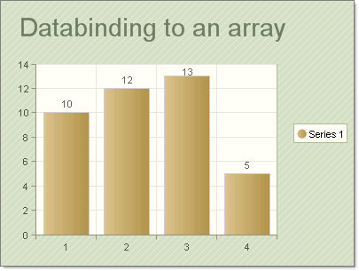

# Data Binding RadChart to an Array

>caution  **RadChart** has been replaced by [RadHtmlChart](http://www.telerik.com/products/aspnet-ajax/html-chart.aspx), Telerik's client-side charting component. If you are considering **RadChart** for new development, examine the [RadHtmlChart documentation]() and [online demos](http://demos.telerik.com/aspnet-ajax/htmlchart/examples/overview/defaultcs.aspx) first to see if it will fit your development needs. If you are already using **RadChart** in your projects, you can migrate to **RadHtmlChart** by following these articles: [Migrating Series](), [Migrating Axes](), [Migrating Date Axes](), [Migrating Databinding](), [Features parity](). Support for **RadChart** is discontinued as of **Q3 2014**, but the control will remain in the assembly so it can still be used. We encourage you to use **RadHtmlChart** for new development.

To bind a RadChart to an [Array](http://msdn2.microsoft.com/en-us/library/system.array(VS.71).aspx) object, assign the RadChart DataSource property to the array, then call the RadChart DataBind() method. The example below demonstrates data binding to an array of integers.



````C#
protected void Page_Load(object sender, EventArgs e)
{
   int[] intArray = new int[4] { 10, 12, 13, 5 };
   RadChart1.DataSource = intArray;
   RadChart1.DataBind();
} 			
````
````VB
Protected Sub Page_Load(ByVal sender As Object, ByVal e As EventArgs)
	Dim intArray As Integer() = New Integer(4) {10, 12, 13, 5}
	RadChart1.DataSource = intArray
	RadChart1.DataBind()
End Sub
````

# See Also

 * [Data Binding RadChart to a Database Object]()

 * [Data Binding RadChart to a Generic List]()

 * [Data Binding RadChart to an ObjectDataSource]()

 * [Data Binding RadChart to an XML file]()

 * [Data Binding RadChart]()
