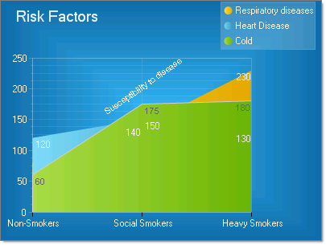

# Axis Labels

>caution  __RadChart__ has been replaced by[RadHtmlChart](http://www.telerik.com/products/aspnet-ajax/html-chart.aspx), Telerik's client-side charting component.	If you are considering __RadChart__ for new development, examine the[RadHtmlChart documentation](ffd58685-7423-4c50-9554-f92c70a75138)and[online demos](http://demos.telerik.com/aspnet-ajax/htmlchart/examples/overview/defaultcs.aspx)first to see if it will fit your development needs.	If you are already using __RadChart__ in your projects, you can migrate to __RadHtmlChart__ by following these articles:[Migrating Series](2f393f28-bc31-459c-92aa-c3599785f6cc),[Migrating Axes](3f1bea81-87b9-4324-b0d2-d13131031048),[Migrating Date Axes](93226130-bc3c-4c53-862a-f9e17b2eb7dd),[Migrating Databinding](d6c5e2f1-280c-4fb0-b5b0-2f507697511d),[Feature parity](010dc716-ce38-480b-9157-572e0f140169).	Support for __RadChart__ is discontinued as of __Q3 2014__ , but the control will remain in the assembly so it can still be used.	We encourage you to use __RadHtmlChart__ for new development.
>

Labels are displayed for each:

* *Chart axis* to describe the category of values along the axis.For example "Products", "Risk Factors", time periods or geographic areas.

* *Chart axis item* to describe the specific value or category for that item.

## Formatting Axis Labels

* To format the *chart axis label* use the PlotArea.<axis>.AxisLabel to access __Appearance__ and __TextBlock__ properties

* To set the formatting for *all labels* on an axis use the PlotArea.<axis>.Appearance LabelAppearance and TextAppearance properties.

* To format a label for a *specific chart axis item* use the PlotArea.<axis>.Items[].Appearance property__.__

Use the __MinValue__ and __MaxValue__ properties to specify the minimum and maximum values for the data to display. The __MinValue__property allows you to specify either negative or positive number as the minimum value. In the example below the __MinValue__= -50, __MaxValue__= 50 and __Step__ = 10.
>caption 

The PlotArea..Appearance.ValueFormat property automatically formats axis label values as __Currency__, __Scientific__, __General__, __Number__, __Percent__, __ShortDate__, __ShortTime__, __LongDate__, __LongTime__ or __None__.

## Positioning Axis Labels

You can specify the horizontal and vertical alignment of axis labels and axis item labels using the __Appearance.Position__ property of the axis label or chart axis item respectively. __Position__ has sub properties for AlignedPosition, Auto, X and Y.

Use AlignedPosition to automatically place the label __Right__, __Left__, __Top__, __Center__, __TopRight__, __TopLeft__, __BottomRight__ or __BottomLeft__.
>caption 

Use the RotationAngle property to spin axis and axis item labels to any angle.In the example below the XAxis.Appearance.LabelAppearance.RotationAngle is set to 45.
>caption 

By turning off the Position.Auto property and setting Position.AlignedPosition to __None__ you can place the axis label any where in the plot area.In the example below the __PlotArea.YAxis.AxisLabel.Appearance.Position__ property is configured such that__:__

* AlignedPosition =None

* Auto = False

* X = 120

* Y = 200

The __YAxis.AxisLabel.Appearance.RotationAngle__ = 325.

>note This isn't a recommended or usual approach but serves to illustrate the flexibility of the object model.
>

Also in the example below, the __PlotArea.XAxis.AutoScale__ is turned off so the __PlotArea.XAxis.Items__ collection could be populated manually.Each ChartAxisItem has its TextBlock.Text property populated with the strings "Non-Smokers", "Social Smokers" and "Heavy Smokers".
>caption 

