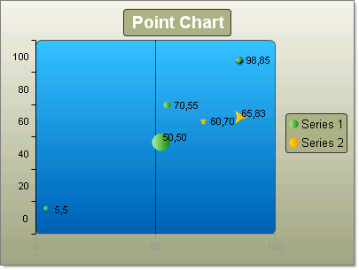

# Point Charts

>caution  **RadChart** has been replaced by[RadHtmlChart](http://www.telerik.com/products/aspnet-ajax/html-chart.aspx), Telerik's client-side charting component.	If you are considering **RadChart** for new development, examine the[RadHtmlChart documentation](ffd58685-7423-4c50-9554-f92c70a75138)and[online demos](http://demos.telerik.com/aspnet-ajax/htmlchart/examples/overview/defaultcs.aspx)first to see if it will fit your development needs.	If you are already using **RadChart** in your projects, you can migrate to **RadHtmlChart** by following these articles:[Migrating Series](2f393f28-bc31-459c-92aa-c3599785f6cc),[Migrating Axes](3f1bea81-87b9-4324-b0d2-d13131031048),[Migrating Date Axes](93226130-bc3c-4c53-862a-f9e17b2eb7dd),[Migrating Databinding](d6c5e2f1-280c-4fb0-b5b0-2f507697511d),[Feature parity](010dc716-ce38-480b-9157-572e0f140169).	Support for **RadChart** is discontinued as of **Q3 2014** , but the control will remain in the assembly so it can still be used.	We encourage you to use **RadHtmlChart** for new development.
>

## 

Point or "Scatter" charts are used to show correlations between two sets of values.The point chart lets you observe the dependence of one value to another and is often used for scientific data modeling. The Point chart is typically not used used with time dependent data where a Line chart is more suited.

To change the display of any given point use the chart item's PointAppearance property. Here you can change the Dimensions property to control Height, Width, Margins Paddings. The **Figure** property lets you choose from a set of predefined shapes other than the default Ellipse shape (e.g. Cross, Diamond, Circle, Rectangle, Triangle and several different Star marker shapes).

To create a Vertical Point Chart set the SeriesOrientation property to **Vertical**. Set the RadChart DefaultType property or ChartSeries.Type to **Point**. Add one or more chart series to the Series collection. Add one or more chart items to the seriesItems collection. Populate numeric values forXValue and YValue properties of each chart series item.
>caption 

To create a Horizontal Point Chart set the SeriesOrientation property to **Horizontal**. Set the RadChart DefaultType property or ChartSeries.Type to **Point**. Add one or more chart series to the Series collection. Add one or more chart items to the seriesItems collection. Populate numeric values for XValue and YValue properties of each chart series item.
>caption 

