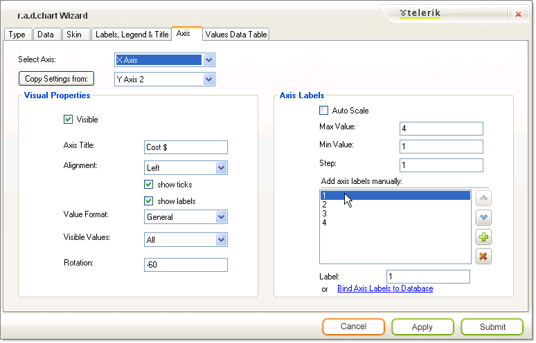

# The Wizard Axis Tab

>caution  **RadChart** has been replaced by[RadHtmlChart](http://www.telerik.com/products/aspnet-ajax/html-chart.aspx), Telerik's client-side charting component.	If you are considering **RadChart** for new development, examine the[RadHtmlChart documentation](ffd58685-7423-4c50-9554-f92c70a75138)and[online demos](http://demos.telerik.com/aspnet-ajax/htmlchart/examples/overview/defaultcs.aspx)first to see if it will fit your development needs.	If you are already using **RadChart** in your projects, you can migrate to **RadHtmlChart** by following these articles:[Migrating Series](2f393f28-bc31-459c-92aa-c3599785f6cc),[Migrating Axes](3f1bea81-87b9-4324-b0d2-d13131031048),[Migrating Date Axes](93226130-bc3c-4c53-862a-f9e17b2eb7dd),[Migrating Databinding](d6c5e2f1-280c-4fb0-b5b0-2f507697511d),[Feature parity](010dc716-ce38-480b-9157-572e0f140169).	Support for **RadChart** is discontinued as of **Q3 2014** , but the control will remain in the assembly so it can still be used.	We encourage you to use **RadHtmlChart** for new development.
>

The **Axis** tab lets you select an axis from the drop down list at the top of the page.You can then modify the properties below and they will be retained for the selected axis.Use the **Copy Settings From** button to replicate settings from another axis.

## Visual Properties

The **Visual Properties** section of the page controls properties for the axis as a whole.

* Uncheck the **Visible**checkbox to hide the entire axis (including labels and tick marks).

* **Axis Title**text populates a single label that appears for the axis as a whole.

* Use the **Alignment** property to place the axis label in a predefined position, e.g. Left, Right, Top, Bottom, Center, TopRight, TopLeft, BottomRight, BottomLeft.

* Uncheck **Show Ticks** to hide the [axis tick marks]().

* Uncheck **Show Labels** to hide the axis labels (but not the Axis Title).

* The **Value Format**drop down list automatically formats axis labels as various kinds of dates, times, percentages, numbers and currency.

* **Visible Values** can be All, Positive or Negative values.

* **Rotation**is used to rotate the axis label text. Positive numbers spin the labels clockwise, negative numbers counter-clockwise.

## Axis Labels

* Turn off **Auto Scale**if you want to provide custom axis labels instead of the default numeric values. Turning off Auto Scale also lets you use the **Min**, **Max**and **Step**values.

* Enter **Min**and **Max**values to control the number of series items to be displayed along that axis. Enter a **Step**value to control the interval between axis labels.

* If Auto Scale is off you can use the provided list box to add, delete and reorder axis label items manually. By selecting any one of the axis label values in the listbox you can assign a text label.

* Click the **Bind Axis Labels to Database** link to navigate back to the [Data tab]().
>caption 

The settings in the Axis Tab shown above result in the following X Axis labeling example:
>caption 

