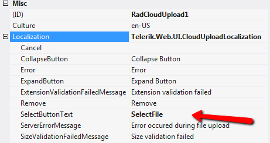
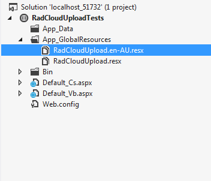
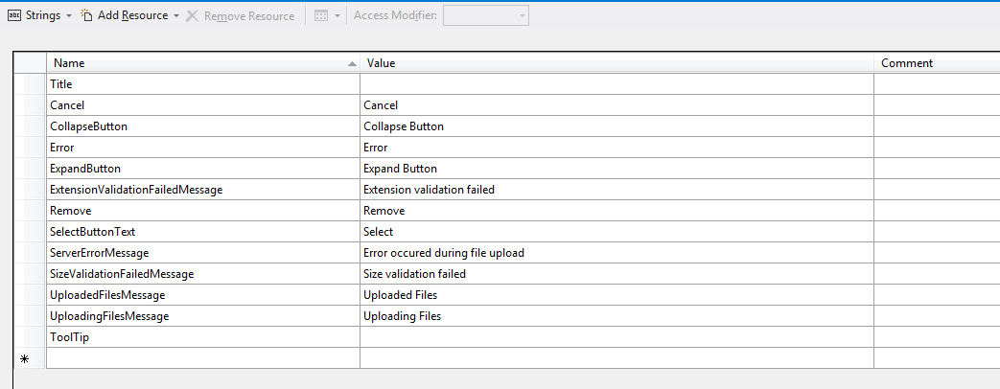

# Localizing RadCloudUpload


The localization support for __RadCloudUpload__ lets you completely translate the user interface, or simply adapt a few strings.

## Localization Property

The __Localization__ property specifies the strings that appear in the runtime user interface of __RadCloudUpload__. By changing the values of each named sub-property, you change the appearance of the string the control uses:

````ASPNET
	            <telerik:RadCloudUpload runat="server" ID="RadCloudUpload1" Localization-SelectButtonText="SelectFile"...>
	            </telerik:RadCloudUpload>
````



>note This technique is useful when customizing some of the messages of a particular instance. The messages are not shared between upload instances. A complete translation using this approach is not appropriate.
>


>caption  

| Key | Default Value | Description |
| ------ | ------ | ------ |
|Localization-SelectButtonText|Select|Sets the text of the __Select__ button.|
|Localization-Cancel|Cancel|Sets the text of the __Cancel__ button. (visible when the FileListPanelSettings-RenderButtonText property is set to True)|
|Localization-CollapseButton|Collapse Button|Sets the text of the __Collapse__ button.|
|Localization-Error|Error|Sets the text of the __Error__ message.|
|Localization-ExpandButton|ExpandButton|Sets the text of the __Expand__ button.|
|Localization-ExtensionValidationFailedMessage|Extension validation failed|Sets the text of the __ExtensionValidationFailedMessage__ message.|
|LocalizationPath|N/A|Use this property, when you need to load the localization files from another directory.|
|Localization-Remove|Remove|Sets the text of the __Remove__ button.|
|Localization-ServerErrorMessage|Error occured during file upload|Sets the text of the __ServerErrorMessage__ message.|
|Localization-SizeValidationFailedMessage|Size validation failed|Sets the text of the __SizeValidationFailedMessage__ .|
|Localization-UploadedFilesMessage|Uploaded Files|Sets the text of the __UploadedFilesMessage__ .|
|Localization-UploadingFilesMessage|Uploading Files|Sets the text of the __UploadingFilesMessage__ .|

## Global Resource Files

The primary means for localization in ASP.NET is to use resource files. Resource files are simple XML files that can be easily edited and transferred to other applications. You can use resource files to change the default (English) localization for __RadCloudUpload__ that is stored in the __Telerik.Web.UI__ assembly.

To create a global resource file to localize the upload follow these steps:

1. Create the __App_GlobalResources__ folder in the root of your web application.

2. Copy the default resource __RadCloudUpload.resx__ file into it. This file can be found in the __App_GlobalResources__ folder of the directory where you installed the RadControls.

3. Make a copy of the file and rename the copy so that its name contains the Culture Identifier. The resource files used by RadCloudUpload follow a strict naming convention:

__RadCloudUpload.<Culture Identifier>.resx__

>note The __Culture Identifier__ consists of a language code followed by a dash and the country code. Example: “en-US”, “fr-CA” and so on.
>


For example RadCloudUpload.en-AU.resx. Both files should be present in the__App_GlobalResources__ folder:



4. Edit the strings using the Visual Studio editor or your favorite text editor. Customize strings just as you would set the __Localization__ property.



>caution Make sure that the __ReservedResource__ message is preserved. It is used for identification purposes and is never displayed.
>


You can now switch the upload so that it uses your new resource file by setting the active culture:


