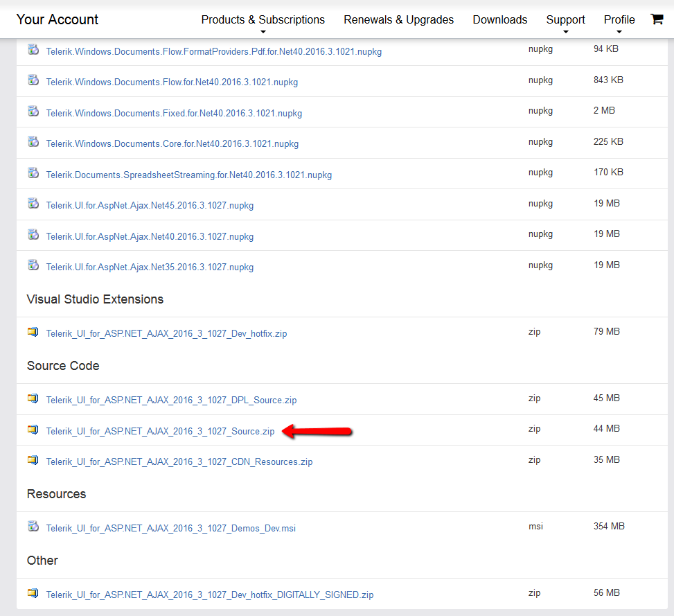

# Using Amazon SDK v2 in version Q1 2017 and later

As specified in the [Changes and Backwards Compatibility]() article, as from Q1 2017 the RadCloudUpload is internally referencing version 3 of the Amazon SDK for .NET. In order to do so, we are internally referencing the new version in a hardcoded fashion. The referenced dlls are [AWSSDK.Core.dll](https://www.nuget.org/packages/AWSSDK.Core/) and [AWSSDK.S3.dll](https://www.nuget.org/packages/AWSSDK.S3/). 

However, if you need to keep on using the previously referenced to Amazon SDK v2 in version Q1 2017 or later, you can follow the following steps:

1. Download the source code of the Telerik UI for ASP.NET AJAX from your account.

	 

2. Navigate to Telerik_UI_for_ASP.NET_AJAX_Source\Telerik.Web.UI\CloudUpload\RadCloudUpload.cs. Find **amazonAssemblyName** private field and change the value as demonstrated below:

	Replace the **private string amazonAssemblyName** value with **"AWSSDK.Core";**

	After the change, the **amazonAssemblyName** private field should look like this:	
````C#
public partial class RadCloudUpload : RadWebControl, ILocalizableControl
{
   #region Private Members

		private static readonly object CloudUploadedFile = new object();
		internal FileListPanelSettings _panelSettings = null;
		private CloudUploadLocalization _localization;
		private string amazonAssemblyName = "AWSSDK.Core";
		.....		
}		
````
	
3. Use the instructions in the Telerik_UI_for_ASP.NET_AJAX_Source, in order to build the source code. Once the code is built with the above-described change, you can add and reference the generated assemblies in your project and continue using Amazin SDK v2. 
 


