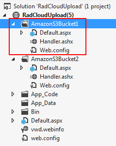

# Using Multiple Accounts for One Cloud Storage Provider


In some scenarios it is needed to upload files in multiple accounts or containers (buckets) for one storage provider. This would require a special configuration. With the default **RadCloudUpload** configuration it is possible to have only one Cloud Storage Provider per type in the configuration file. For example you could have only one Amazon, Azure or Telerik Backend Services (formerly Everlive) configurations in the web.config file. The steps below show how to upload in multiple containers for one provider.

>important All providers configuration is stored in the configuration files. It is not allowed to define provider's configuration in the markup of the control or through the code behind. This is because the configuration contains sensitive data (access key, secret key and etc.). By using it in that way it will not be passed from server to the client. At the sametime it will be accessible from the cloud upload's handler, where the actual uploading happens.
>


## Configure RadCloudUpload to use multiple accounts or containers for one Cloud Storage Provider

1. Change the allow definition for the **RadCloudUpload** section in the web.config of the root folder to "Everywhere":

	````XML
	<?xml version="1.0"?>
	<configuration>
		<configSections>
			<sectionGroup name="telerik.web.ui">
				<section name="radCloudUpload" type="Telerik.Web.UI.CloudUploadConfigurationSection" allowDefinition="Everywhere" requirePermission="false"/>
			</sectionGroup>
		</configSections>
		...
	</configuration>
	````


2. Create a new folder

3. Add new Web form

4. Add new Custom Handler

5. Add new configuration file

6. Configure the web.config in the newly added folder:

	````XML
	<?xml version="1.0" ?>
	<configuration>
	<system.web>
	</system.web>
	<telerik.web.ui>
		<radCloudUpload>
			<storageProviders>
				<!--Remove the existing provider from the web.config of the root folder.
				If it is not set then the next row is not needed.-->
				<remove name="Amazon"/>
				<add name="Amazon" type="Telerik.Web.UI.AmazonS3Provider" accessKey="" secretKey="" bucketName="" subFolderStructure="" uncommitedFilesExpirationPeriod="2" />
			</storageProviders>
		</radCloudUpload>
	</telerik.web.ui>
	</configuration>
	````


7. Configure the Custom Handler:


	````C#
	<%@ WebHandler Language="C#" Class="Handler" %>
	using System;
	using System.Web;
	using Telerik.Web.UI;

	public class Handler : CloudUploadHandler
	{
	}
	````
	````VB.NET
	<%@ WebHandler Language="VB" Class="Handler" %>

	Imports System
	Imports System.Web
	Imports Telerik.Web.UI

	Public Class Handler : Inherits CloudUploadHandler
	End Class
	````


8. Add **RadCloudUpload** control to the form and configure it to use the added custom handler:

	````ASPNET
	<telerik:RadCloudUpload ID="RadCloudUpload2" runat="server" ProviderType="Amazon" HttpHandlerUrl="~/AmazonS3Bucket1/Handler.ashx">
	</telerik:RadCloudUpload>
	````


# See Also

 * [Configuring Telerik Backend Services Provider]()

 * [Configuring Azure Blob Storage Provider]()

 * [Configuring Amazon S3 Provider]()
