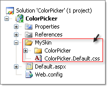
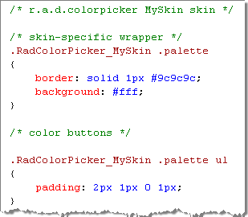
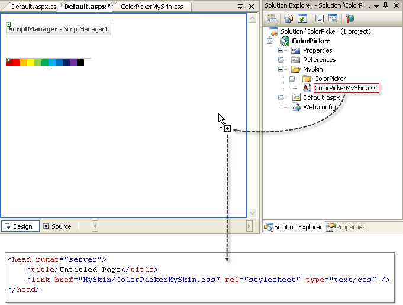

# Creating a Custom Skin


The following tutorial demonstrates creating a custom __RadColorPicker__ skin, using the default skin as a base. This new skin will take the appearance of the color picker from its default look:
>caption 


...to the following:
>caption 


See [Understanding the Skin CSS File]() for more information on specific CSS file properties.

## Prepare the Project

1. In a new AJAX enabled application web form, add a __RadColorPicker__. Set the __EnabledEmbeddedSkins__ property to __false__.

1. In the Solution Explorer, create a new "MySkin" folder in your project.

1. Copy the default RadColorPicker skin files from the installation directory to the "MySkin" directory; copy both the \ColorPicker 0directory that contains the images for this skin and the ColorPicker.Default.css file that defines the skin styles.

>note The file path will typically be similar to this example: *\Program Files\Telerik\<Your Version of Telerik UI for ASPNET AJAX>\Skins\Default.* 
>


1. The solution should now look something like the screenshot below:
>caption 



1. In the Solution Explorer, rename "ColorPicker.Default.css" to "ColorPicker.MySkin.css".
>caption 


## Edit the Skin CSS File

1. Open "ColorPicker.MySkin.css" for editing in Visual Studio.

1. Press __Control-H__ to invoke the Find and Replace dialog.

1. Set __Find what:__ to "_Default", __Replace with:__ to "_MySkin", and __Look in:__to __Current Document__.

1. Click the __Replace All__ button.
>caption 


1. The style sheet should now look something like the example below.
>caption 



1. From the Solution Explorer drag the "ColorPicker.MySkin.css" to the design surface of the form. This step will automatically add a reference to the page "<head>" tag as a "<link>" as shown in the screenshot below.
>caption 



1. Change the __Skin__ property of your RadColorPicker control to "MySkin".

1. Run the application. The new skin looks just like the Default skin:
>caption 


## Edit the Skin CSS File

1. This walk-through demonstrates changing the border of the color picker to be slightly insert, the "No Color" area to be a light steel blue, and the light and dark text in the preview area to be SkyBlue and DarkBlue respectively. Before starting to modifying the style sheet, take a look at this abbreviated DOM-tree of __RadColorPicker__:

````XML
		<table id="RadColorPicker1" class="radcolorpicker RadColorPicker_Default">
			<tr>
				<td>
					<div id="RadColorPicker1_palette" class="palette">
						<div id="RadColorPicker1_emptycolor" class="emptycolor selectedcolor">
							<a></a>
						</div>
						<ul>
							<li><a class="colorbox" /></li>
							...
						</ul>
						<div class="colorpreview" id="RadColorPicker1_preview">
							<span class="colorvaluedark" /><span class="colorvaluelight" />
						</div>
					</div>
				</td>
			</tr>
		</table>
````


1. The classes that control the appearance for border of the color picker are the ".RadColorPicker_MySkin" and ".palette" classes. Locate the ".RadColorPicker_MySkin .palette" CSS selector and set the border to have a 2 pixel insert.

````XML
		.RadColorPicker_MySkin .palette
		{
			border: inset 2px #9c9c9c;
			background: #fff;
		} 
````


1. Change the color picker background by located the CSS selector ".RadColorPicker_MySkin .palette .emptycolor" and ".RadColorPicker_MySkin .palette .emptycolor.selectedColor". Change the background-color to be "LightSteelBlue".

````XML
		.RadColorPicker_MySkin .palette .emptycolor, .RadColorPicker_MySkin .palette .emptycolor.selectedColor
		{
			background-color: LightSteelBlue;
			border: 1px solid #C5C5C5 !important;
			font-size: 12px;
			line-height: 30px;
			margin: 2px 2px 0pt;
			text-align: center;
		} 
````


1. Change the font color of preview window text to light blue and dark blue. Find the CSS selectors ".RadColorPicker_MySkin .palette .colorpreview .colorvaluedark", ".RadColorPicker_MySkin .palette .colorpreview .colorvaluelight" and change the Color property:

````XML
		.RadColorPicker_MySkin .palette .colorpreview .colorvaluedark
		{
			color: SkyBlue;
			margin-right: 2px;
		}
		.RadColorPicker_MySkin .palette .colorpreview .colorvaluelight
		{
			color: DarkBlue;
			margin-left: 2px;
		} 
````


1. Press __F5__ to run the application. Notice that both the border, "No Color" area color and preview text color has changed.
>caption 


For more information about Cascading Style Sheets, see

* [World Wide Web Consortium CSS specifications](http://www.w3.org/Style/CSS/)

* [W3 Schools CSS tutorial](http://www.w3schools.com/css/default.asp)

* [Guide to Cascading Style Sheets](http://www.htmlhelp.com/reference/css/)


# See Also

 * [Controlling Appearance]()

 * [Understanding the Skin CSS File]()

 * [CSS Classes]()
