# Change the height of the input element

>caution This page contains information about RadComboBox for ASP.NET Ajax version **2009.1.311 and later.** If you are using any previous version - please check [this article]().
>

## Introduction

**Vertical dimensions** [Telerik Visual Style Builder](http://stylebuilder.telerik.com/)

## Gather your tools

````ASPNET
<telerik:RadComboBox runat="server" id="RadComboBox1">    
	<Items>        
		<telerik:RadComboBoxItem Text="Alpha" />        
		<telerik:RadComboBoxItem Text="Vita" />        
		<telerik:RadComboBoxItem Text="Ghamma" />        
		<telerik:RadComboBoxItem Text="Epsilon" />        
		<telerik:RadComboBoxItem Text="Zeta" />        
		<telerik:RadComboBoxItem Text="Eta" />        
		<telerik:RadComboBoxItem Text="Theta" />        
		<telerik:RadComboBoxItem Text="Iota" />       
		<telerik:RadComboBoxItem Text="Kappa" />        
		<telerik:RadComboBoxItem Text="Lambda" />    
	</Items>
</telerik:RadComboBox>
````

Now that we have a test project, we will need to take one Office2007 skin from this folder: `<RadControls install folder>`\Skins\Office2007\Copy the file **ComboBox.Office2007.css** and the folder ComboBox, create a Skins folder in your project, create a sub-folder named **50pxOffice2007** and Paste them in it. Modify your RadComboBox declaration like this to disable the embedded skin:

````ASPNET
<telerik:radcombobox 
    runat="server" 
    skin="Office2007" 
    enableembeddedskins="false" 
    id="RadComboBox">
````

Add a link to the CSS file in the head tag:

````ASPNET
<link href="Skins/50pxOffice2007/ComboBox.Office2007.css" rel="stylesheet" type="text/css" />
````

Check if everything renders properly - the combobox skin should look like the Office2007 skin now.

## Claim your skin

To really make the skin your own you will need to give it a name. As you probably already guessed, mine will be called **50pxOffice2007**, but you can be more creative. First rename your skin CSS file to ComboBox.50pxOffice2007.css:

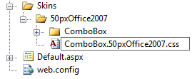

and change the link in the test file to:

````ASPNET
<link href="Skins/50pxOffice2007/ComboBox.50pxOffice2007.css" rel="stylesheet" type="text/css" />
````

The actual name of the CSS file does not really matter but it’s a good practice to name your assets with meaningful names that will help you find them easier. Now open the file and invoke the Find&Replace tool with Ctrl+H or Edit `->` Find and Replace `->` Quick Replace. Pay attention to what you are replacing and replace all occurrences of **_Office2007** with **_50pxOffice2007** in the CSS file:

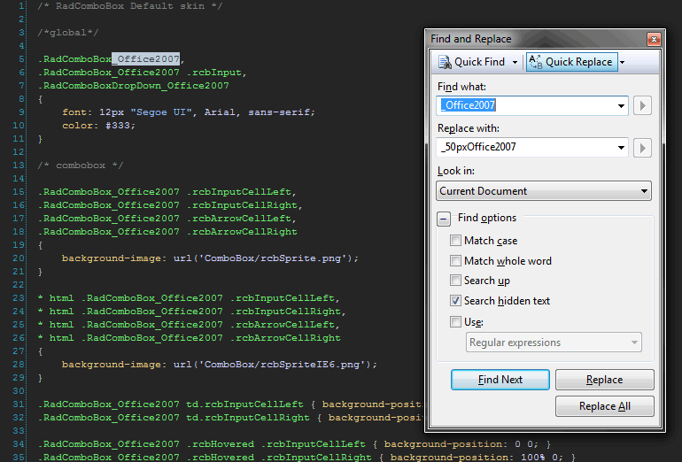

Save the file. Open Default.aspx and change RadComboBox skin name accordingly:

````ASPNET
<telerik:radcombobox 
runat="server" 
skin="50pxOffice2007" 
enableembeddedskins="false">
````

Check if the skin renders okay.

## Getting Your Hands Dirty

Now that we have an external skin of our own, we can start changing it to fit our needs. First launch your Photoshop and open the **rcbSprite.png** (not the IE6 one – It is 8bit indexed alpha). Are you confused? Let’s fix that:

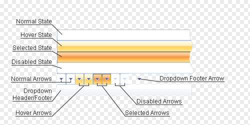

As you can see, the top four rows are for the four RadComboBox state backgrounds, while the fifth row contains only the drop down arrow backgrounds. The rest of the sprite is used for styling the drop down header and footer.So, now that we know how the sprite is constructed, we need to resize the state and the arrow backgrounds to 50px height. To be able to do that, first we will need to resize the RadComboBox sprite image canvas to fit the expanding contents. Use Image `->` Canvas Size or Ctrl+Alt+C and enter 300px for height (5x50+what remains for the header). Align the contents to the top. Next, drag some guides from the top ruler and place them in 50px intervals starting from the first 50px. Then one by one cut the different states and the header (select one state with the Selection tool, create new Layer via Cut with the context menu and drag it to its new place) and place them under every guide until you get this:


Now we are ready to resize the state sprites.

## Running with Scissors

After placing the states at their proper places, we’ll need to resize them carefully in order to preserve the gradients as much as possible. To do that we will need scaling algorithm different than Nearest Neighbor – go to Edit `->` Preferences `->` General `->` Image Interpolation and choose Bicubic or Bicubic Smoother. Hit OK. Now use the Selection tool to select the bottom half of the Normal state then hold Ctrl and drag it until you reach the bottom guide with the bottom edge of the selection. You should get something like this in the end:


Now select one or several pixels high line closer to the inner edges, change to the Move tool (with V) and scale the selection upwards (or downwards depending on where you selected) until you get this:

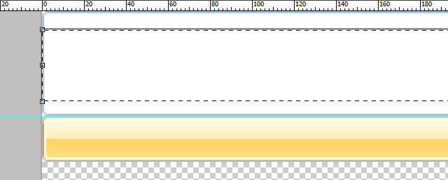

Split the second sprite right in the middle – select from the half to the bottom edge, separating the light from the dark colors, hold Ctrl and drag to the bottom guide.

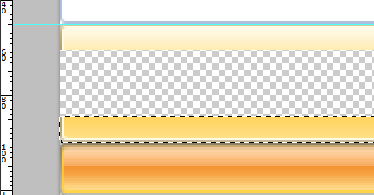

Drag a new guide in the middle of the empty space (at exactly 75px), like this:


Next, carefully select the bottom part of the sprite from the top edge to 3px above the bottom one. We want to leave the bottom edge and the corner transparency intact. Your selection should look like this:

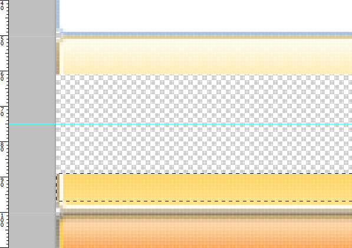

Scale it to the middle:

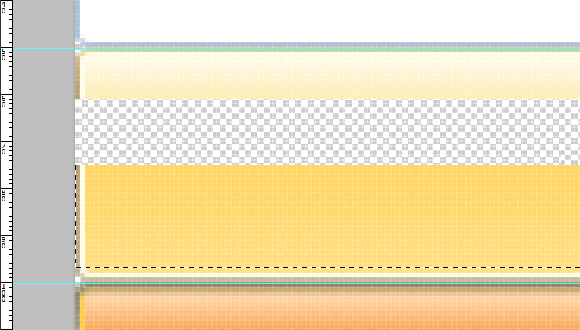

And do the same to the top part of the sprite:

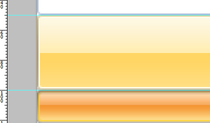

Now repeat for the rest of the states until you get to the arrows.

## Pixel Art

Now that we have all the states ready, we should also resize the arrow ends. This task is more complicated since the arrow is part of the background. So, in order to resize them, we will need first to separate the arrows from the background. To do so we will use a Magic Wand (tool – activated with W). Adjust some of the tool properties – set the Tolerance to 110, switch off Anti-alias, but leave Contiguous on. Now select the arrows one by one, excluding the disabled two – we’ll need to change the tolerance to 20 before doing so. Also add to the selection the white arrow pixels in the hover and selected states. Most skins probably won’t require using tolerance and additional pixels, but we chose one of the hardest so you can get the idea. After you finish selecting, get the context menu up and do a Layer via Cut:

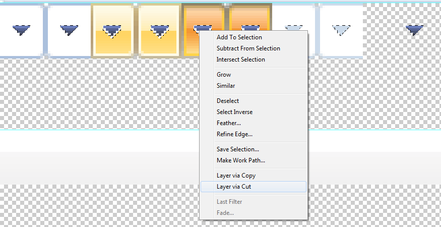

After cutting the arrows, hide the new layer and you can resize the states as before. There’s one little detail though – every state now will have a hole in the middle. Fill it up before you start resizing – either with copy and paste, with the Stamp tool (be careful with the source of the stamp though) or by using select and duplicate (Ctrl + Alt + drag selection). Show the hidden arrows in the end and move their layer to the middle. You should get something like this in the end:


We are ready with the sprite now.

## Saving your work

Now that we have the sprite image ready, we should replace the existing ones in the external skin we prepared. Open Save for Web and Devices dialog and use the following options to save **rcbSprite.png**:

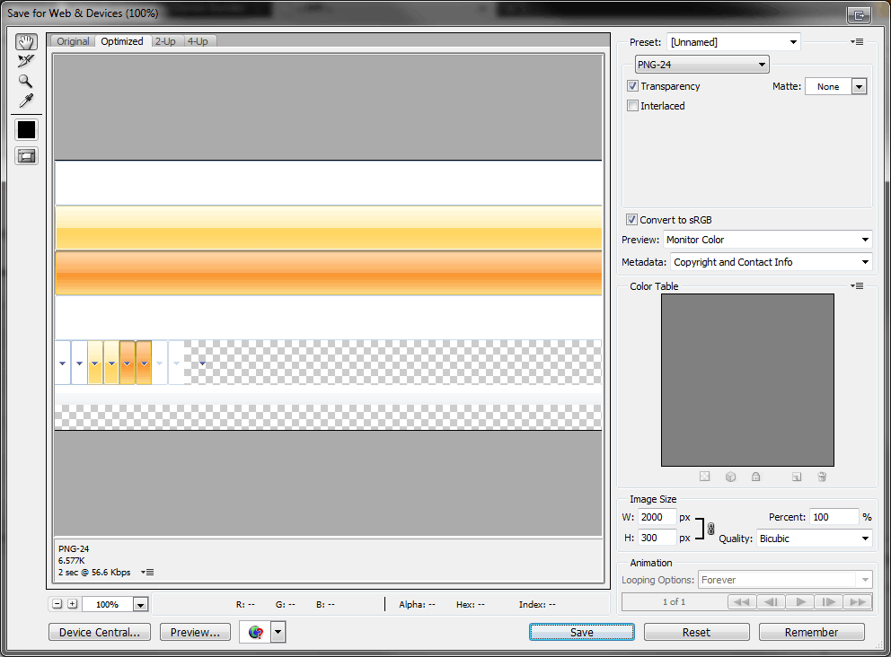

Note that we are using **24bit PNG with alpha transparency** here. Replace the rcbSprite.png file which you’ve opened in the beginning. Since IE6 doesn’t support the alpha transparency of 24bit PNGs (rendering it completely opaque), we will need a second sprite image only for this browser. Bring up again Save for Web and Devices but use these options this time:

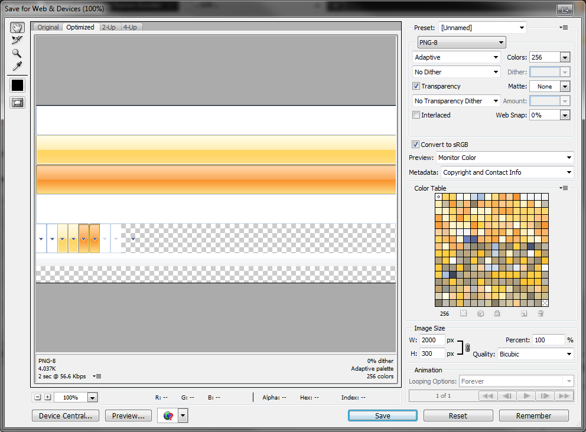

Make sure **Matte** is set to **None**, otherwise you won’t get index transparency on the state corners. Hit Save and replace the **rcbSpriteIE6.png** file in the same folder.

## Specificity Wars

Now that we are done with the sprite images, a relatively easy part remains – fixing the skin CSS to support the new sprite height we have made. Switch to your editor and open the CSS file. First thing to do is to override the default height and line-height of the Office2007 RadComboBox. Add this CSS rule somewhere in your CSS file, let’s say at the end:

````CSS
div.RadComboBox_50pxOffice2007 table td.rcbInputCell
{ 
    height: 50px; 
    line-height:50px;
}
````

Note the element type in front of the first class – it is used to **raise the specificity** so that we can override the base stylesheet selectors (the baseStyleSheet was added in Q3 2009 release). If you want to learn more about specificity, there’s an excellent article in the [Smashing Magazine](http://www.smashingmagazine.com/2007/07/27/css-specificity-things-you-should-know/). Now that we have RadComboBox height, we should change the background-positions of the four states. Find the lines below in the file (**note that the line numbers below can change in next releases,** these are based on the Q2 2009 Office2007 skin) and change them accordingly to the sprite image background positions - from divisible by 22, to divisible by 50:

Around lines 40-44:

````CSS
.RadComboBox_50pxOffice2007 .rcbHovered .rcbReadOnly td.rcbInputCellLeft 
{ 
    background-position: 0 -50px; 
}

.RadComboBox_50pxOffice2007 .rcbHovered .rcbReadOnly td.rcbInputCellRight
{ 
    background-position: 100% -50px; 
} 

.RadComboBox_50pxOffice2007 .rcbFocused .rcbReadOnly td.rcbInputCellLeft 
{ 
    background-position: 0 -100px; 
}

.RadComboBox_50pxOffice2007 .rcbFocused .rcbReadOnly td.rcbInputCellRight 
{ 
    background-position: 100% -100px;
}
````

Around lines 56-85:

````CSS
.RadComboBox_50pxOffice2007 td.rcbArrowCellLeft { background-position: -18px -200px; }
.RadComboBox_50pxOffice2007 td.rcbArrowCellRight { background-position: 0 -200px; }
.RadComboBox_50pxOffice2007 .rcbHovered .rcbArrowCellLeft { background-position: -54px -200px; }
.RadComboBox_50pxOffice2007 .rcbHovered .rcbArrowCellRight { background-position: -36px -200px; }
.RadComboBox_50pxOffice2007 .rcbFocused .rcbArrowCellLeft { background-position: -90px -200px; }
.RadComboBox_50pxOffice2007 .rcbFocused .rcbArrowCellRight { background-position: -72px -200px; }
.RadComboBox_50pxOffice2007 td.rcbArrowCellHidden,
.RadComboBox_50pxOffice2007 .rcbHovered td.rcbArrowCellHidden,
.RadComboBox_50pxOffice2007 .rcbFocused td.rcbArrowCellHidden { background-position: -15px -200px; }
/* Read-only styles */
.RadComboBox_50pxOffice2007 .rcbHovered .rcbReadOnly td.rcbArrowCellHidden { background-position: -51px -200px; }
.RadComboBox_50pxOffice2007 .rcbFocused .rcbReadOnly td.rcbArrowCellHidden { background-position: -87px -200px; }
.RadComboBox_50pxOffice2007 .rcbReadOnly td.rcbArrowCellLeft { background-position: -18px -200px; }
.RadComboBox_50pxOffice2007 .rcbReadOnly td.rcbArrowCellRight { background-position: -2px -200px; }
.RadComboBox_50pxOffice2007 .rcbHovered .rcbReadOnly .rcbArrowCellLeft { background-position: -54px -200px; }
.RadComboBox_50pxOffice2007 .rcbHovered .rcbReadOnly .rcbArrowCellRight { background-position: -38px -200px; }
.RadComboBox_50pxOffice2007 .rcbFocused .rcbReadOnly .rcbArrowCellLeft { background-position: -90px -200px; }
.RadComboBox_50pxOffice2007 .rcbFocused .rcbReadOnly .rcbArrowCellRight { background-position: -74px -200px; }
.RadComboBox_50pxOffice2007 .rcbReadOnly td.rcbArrowCellHidden { background-position: -15px -200px; }
.RadComboBox_50pxOffice2007 .rcbHovered .rcbReadOnly td.rcbArrowCellHidden { background-position: -51px -200px; }
.RadComboBox_50pxOffice2007 .rcbFocused .rcbReadOnly td.rcbArrowCellHidden { background-position: -87px -200px; }
Around line 114:
.RadComboBoxDropDown_50pxOffice2007 .rcbHeader,
.RadComboBoxDropDown_50pxOffice2007 .rcbFooter
{
background-color: #f1f2f4;
background-position: 0 -250px;
}
````

Around lines 150-156:

````CSS
.RadComboBox_50pxOffice2007 .rcbDisabled td.rcbInputCellLeft { background-position: 0 -150px; }
.RadComboBox_50pxOffice2007 .rcbDisabled td.rcbInputCellRight { background-position: 100% -150px; }
.RadComboBox_50pxOffice2007 .rcbDisabled td.rcbArrowCellLeft { background-position: -126px -200px; }
.RadComboBox_50pxOffice2007 .rcbDisabled td.rcbArrowCellRight { background-position: -108px -200px; }
.RadComboBox_50pxOffice2007 .rcbDisabled .rcbReadOnly td.rcbArrowCellRight { background-position: -110px -200px; }
.RadComboBox_50pxOffice2007 table.rcbDisabled td.rcbArrowCellHidden,
.RadComboBox_50pxOffice2007 .rcbDisabled .rcbReadOnly td.rcbArrowCellHidden { background-position: -123px -200px; }
````

Around line 172:

````CSS
.RadComboBoxDropDown_50pxOffice2007 .rcbMoreResults a
{ 
    background-position: -157px-220px;
}
````

Refresh your page – your 50px RadComboBox looks great! One finishing touch – if you want to change the font family and size – use the style on line 9 to do it:

````CSS
.RadComboBox_50pxOffice2007,.RadComboBox_50pxOffice2007 .rcbInput,.RadComboBoxDropDown_50pxOffice2007
{
    font: bold 18px "Segoe UI", Arial, sans-serif; 
    color: #333;
}
````

That’s all. I hope this tutorial was helpful to you. Have fun designing new and exciting skins for RadComboBox.

You can download a sample project from [here](http://blogs.telerik.com/Files/ComboResizeTutorial.zip).