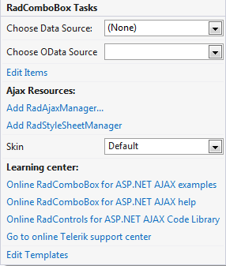
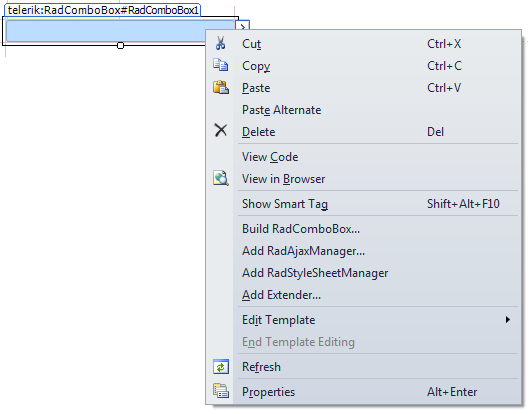
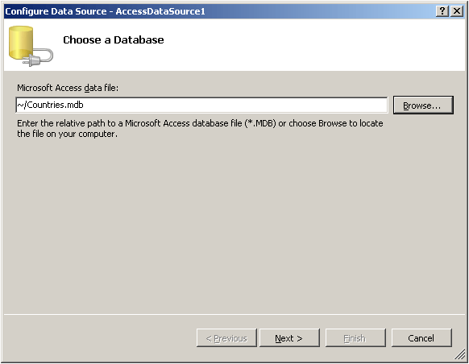
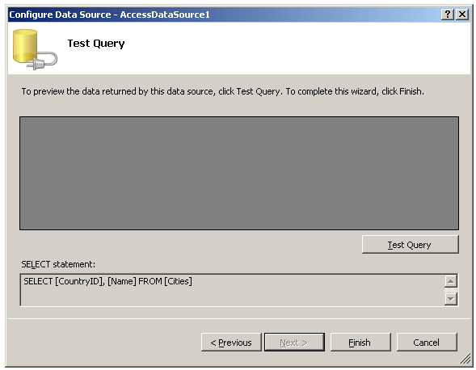
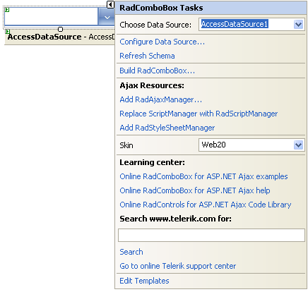
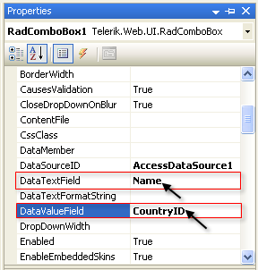
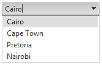

# Getting Started

This tutorial will walk you through creating a **RadComboBox** and shows how to:

* Create a simple RadComboBox with elements set in design time.

* Populate RadComboBox from a data source.

## Creating a Simple RadComboBox

1. Drag a RadComboBox from the Toolbox onto your Web Page.

2. The [Smart Tag]() should appear automatically. From the Smart Tag, choose **Build RadComboBox...**
>caption 

3. The **[RadComboBox Item Builder]()** appears.

4. Click the **Add item** icon in the upper left corner. A new **RadComboBoxItem** appears in the item builder.
>caption 

5. Set the **Text** property to "First Item".

6. Add two more items in the same way.

7. Press **OK** to exit the **RadComboBox Item Builder**.

8. Back in the Smart Tag, choose a **[Skin]()** from the drop-down control.
>caption 

9. Right-click the **RadComboBox** instance and select **Properties**.
>caption 

10. In the properties pane for the RadComboBox, Set the **Height** property to 150.

11. Run the application. Open the drop-down list to see the items.
>caption 

## Binding to an AccessDataSource

1. In order to [bind the RadComboBox to an AccessDataSource](), you must first have a DataSource component on your page. Drag an **AccessDataSource** component from the Toolbox onto the same page where your RadComboBox is.
>caption 

2. From the Smart Tag of the AccessDataSource, choose **Configure DataSource.**
>caption 

3. Click the Browse button, locate, and select the AccessData File and press **Next** to continue.
>caption 

4. Specify the columns from a table and press **Next** to continue.
>caption 

5. You may choose to test your Query to preview the data. Finally, press Finish to exit.
>caption 

6. On the **RadComboBox** Smart Tag, choose the AccessDataSource from the drop-down list labelled **Choose Data Source**.
>caption 

7. In the properties pane for RadComboBox, set the **DataTextField** and **DataValueField**.
>caption 

8. Run the application. The data from your table now appears in the RadComboBox.
>caption 

