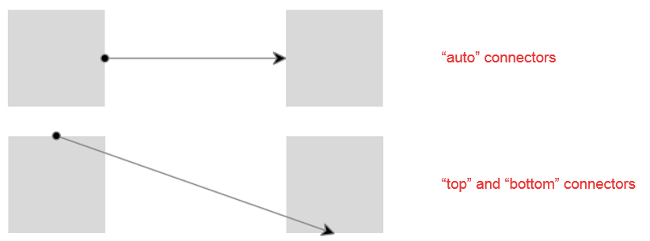
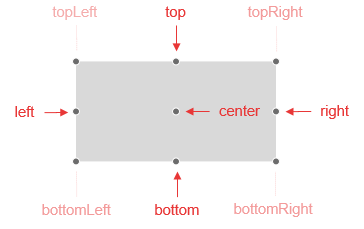

# Connector

This article explains what a connector is, how to use it and how to configure the connectors of a **DiagramShape** object in **Telerik ASP.NET	Diagram component**. A sample configuration of the described properties can be seen in **Example 1**.

The **DiagramConnector** is a visual intermediate between the Connection and the Shape. It represents the attachment point of a Connection to a	Shape.

Connectors are part of a [Shape]()'s definition and you can specify the binding of a connection to a shape directly via the shape or via one of its connectors. If you specify a shape as a connection's endpoint the auto-connector will be used. This means that the endpoint of the connection will switch to the most convenient (in the sense of shortest path) connector automatically. If you specify a shape's connector as an endpoint for a connection the endpoint will remain attached to that given Connector instance.



### ConnectorsCollection

Defines the connectors the shape owns. By default each shape has five active connectors – four for the directions and one auto connector. You can control the active	connectors of a shape by adding them to the shape’s **ConnectorsCollection**. Through the **DiagramShapeConnector** object	you can configure the values of its properties like **Name**, **Description** and **Position**.

**Name**—defines which of the nine predefined connectors to be enabled. The available values are: **auto**, **bottom**, **bottomLeft**, **bottomRight**, **left**, **right**, **top**,	**topLeft** and **topRight**.

>caption **Figure 1**. Connector names



**Description**—the connector description.

**Position**—the function that positions the connector. It can be used in order to add custom connectors to a custom shape.

>caption **Figure 2**: Connectors configuration


>caption **Example 1**: In this example you can see how to enable all built-in connectors of a shape. The first shape in **Figure 1** has the default set of five connectors, while the second one has all nine connectors defined:

````ASPNET
<telerik:RadDiagram ID="RadDiagram1" runat="server" Height="700">
	<ShapesCollection>
		<telerik:DiagramShape Id="s1" X="40" Y="40">
		</telerik:DiagramShape>
		<telerik:DiagramShape Id="s2" X="250" Y="40">
			<ConnectorsCollection>
				<telerik:DiagramShapeConnector Name="Auto"  Description="" Position=""/>
				<telerik:DiagramShapeConnector Name="Bottom" />
				<telerik:DiagramShapeConnector Name="BottomLeft" />
				<telerik:DiagramShapeConnector Name="BottomRight" />
				<telerik:DiagramShapeConnector Name="Left" />
				<telerik:DiagramShapeConnector Name="Right" />
				<telerik:DiagramShapeConnector Name="Top" />
				<telerik:DiagramShapeConnector Name="TopLeft" />
				<telerik:DiagramShapeConnector Name="TopRight" />
			</ConnectorsCollection>
		</telerik:DiagramShape>
	</ShapesCollection>
</telerik:RadDiagram>
````

# See Also

 * [ASP.NET Diagram Control Product Overview]()

 * [RadDiagram Server-Side Programming]()