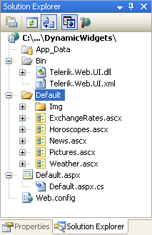

# Adding Controls Inside Dynamically Created Docks

When implementing a dynamic personalized Portal site using the techniques described in [Dynamically Creating RadDock Controls](), the dynamically created controls often contain specialized custom controls. When re-creating the **RadDock** controls after a postback, the application needs to re-create these custom controls as well. The following example shows one way to accomplish this.

1. Create a new AJAX-enabled Web application.

1. In order to add some custom controls to your application, locate the **"Live Demos\Dock\Examples"** folder under your installation directory and drag the **"Default"** folder from there to your solution in the Solution Explorer. Delete the "Default.html", "DefaultCS.aspx", and "DefaultVB.aspx" files. The Solution Explorer should looks something like the following screen shot:

	

1. To let the user select a control to add to the page, drag a **DropDownList** from the toolbox onto your page. Click on the ellipsis button next to its **Items** property, and add five items, setting the following properties:

	1. **Text**="ExchangeRates.ascx", **Value**="~/Default/ExchangeRates.ascx", **Selected**=**True**

	1. **Text**="Horoscopes.ascx", **Value**="~/Default/Horoscopes.ascx"

	1. **Text**="News.ascx", **Value**="~/Default/News.ascx"

	1. **Text**="Pictures.ascx", **Value**="~/Default/Pictures.ascx"

	1. **Text**="Weather.ascx", **Value**="~/Default/Weather.ascx"

1. Drag a **Button** from the toolbox onto the page, and set its **Text** property to "Add Dock";

1. Add a **RadDockLayout** with a few **RadDockZone** controls inside it.

1. Just like in the [Dynamically Creating RadDock Controls]() topic, add a property for storing the current dock states:

	1. At the top of the code behind for your Web page, add two new **using** statements (C#) or **Imports** statements (VB) for System.Collections.Generic and Telerik.Web.UI:

		**C#**
			 
			using System.Collections.Generic;
			using Telerik.Web.UI; 

		**VB**
		
			Imports System.Collections.Generic
			Imports Telerik.Web.UI 

	1. Add the following property definition to the class definition of your Web page:

		**C#**
			 
			 //Store the info about the added docks in the session.
			 private List<DockState> CurrentDockStates
			 {
			   get
			   {
				 List<DockState> _currentDockStates = (List<DockState>)Session["CurrentDockStates"];
				 if (Object.Equals(_currentDockStates, null))
				 {
				   _currentDockStates = new List<DockState>();
				   Session["CurrentDockStates"] = _currentDockStates;
				 }
				 return _currentDockStates;
			   }
			   set
			   {
				 Session["CurrentDockStates"] = value;
			   }
			 }
					

		**VB**
		
			'Store the info about the added docks in the session.
			Private Property CurrentDockStates() As List(Of DockState)
				Get
					Dim _currentDockStates As List(Of DockState) = _
					  DirectCast(Session("CurrentDockStates"), List(Of DockState))
					If [Object].Equals(_currentDockStates, Nothing) Then
						_currentDockStates = New List(Of DockState)()
						Session("CurrentDockStates") = _currentDockStates
					End If
					Return _currentDockStates
				End Get
				Set(ByVal value As List(Of DockState))
					Session("CurrentDockStates") = value
				End Set
			End Property

1. Add a **Click** event handler to the Button on the Web page. This event handler creates a new **RadDock** control, creates a custom control inside it, and adds it to the first **RadDockZone** control. Note that the **Tag** property is used to store the information needed to create the custom control:

	**C#**
	     
		private RadDock CreateRadDock()
		{
		 int docksCount = CurrentDockStates.Count;
		 RadDock dock = new RadDock();
		 dock.ID = string.Format("RadDock{0}", docksCount);
		 dock.Title = string.Format("Dock {0}", docksCount);
		 dock.UniqueName = Guid.NewGuid().ToString();
		 dock.Width = Unit.Pixel(300);
		 return dock;
		}
		protected void Button1_Click(object sender, EventArgs e)
		{
		  RadDock dock = CreateRadDock();
		  dock.Tag = DropDownList1.SelectedValue;
		  LoadWidget(dock);
		  RadDockZone1.Controls.Add(dock);
		}
		
		private void LoadWidget(RadDock dock)
		{
		  if (string.IsNullOrEmpty(dock.Tag))
		   return;
		  Control widget = LoadControl(dock.Tag);
		  dock.ContentContainer.Controls.Add(widget);
		} 
				

	**VB**	
	
		Private Function CreateRadDock() As RadDock
		    Dim docksCount As Integer = CurrentDockStates.Count
		    Dim dock As New RadDock()
		    dock.ID = String.Format("RadDock{0}", docksCount)
		    dock.Title = String.Format("Dock {0}", docksCount)
		    dock.UniqueName = Guid.NewGuid().ToString()
		    dock.Width = Unit.Pixel(300)
		    Return dock
		End Function
		Protected Sub Button1_Click(ByVal sender As Object, ByVal e As EventArgs) Handles Button1.Click
		    Dim dock As RadDock = CreateRadDock()
		    dock.Tag = DropDownList1.SelectedValue
		    LoadWidget(dock)
		    RadDockZone1.Controls.Add(dock)
		End Sub
		Private Sub LoadWidget(ByVal dock As RadDock)
		    If String.IsNullOrEmpty(dock.Tag) Then
		        Return
		    End If
		    Dim widget As Control = LoadControl(dock.Tag)
		    dock.ContentContainer.Controls.Add(widget)
		End Sub

1. Add code to save and load the state of dynamically created controls when a postback occurs.

	1. Add a **SaveDockLayout** event handler to the **RadDockLayout** component. This event handler calls the **RadDockLayout.GetRegisteredDocksState** method to obtain the current list of dock states and saves the list to the **CurrentDockStates** property.

		**C#**     
		
			protected void RadDockLayout1_SaveDockLayout(object sender, DockLayoutEventArgs e)
			{
			 CurrentDockStates = RadDockLayout1.GetRegisteredDocksState();
			} 

		**VB**
		
			Protected Sub RadDockLayout1_SaveDockLayout( _
						  ByVal sender As Object, _
						  ByVal e As DockLayoutEventArgs) _
						  Handles RadDockLayout1.SaveDockLayout
				CurrentDockStates = RadDockLayout1.GetRegisteredDocksState()
			End Sub

	1. Add a **Page_Init** event handler that recreates the **RadDock** controls (including their child custom controls) after a postback:

		**C#**
			 
			protected void Page_Init(object sender, EventArgs e)
			{
			 for (int i = 0; i < CurrentDockStates.Count; i++)
			 {
			   RadDock dock = new RadDock();
			   dock.ID = string.Format("RadDock{0}", i);
			   dock.ApplyState(CurrentDockStates[i]);
			   RadDockLayout1.Controls.Add(dock);
			   LoadWidget(dock);
			 }
			} 
					

		**VB**
		
			Protected Sub Page_Init(ByVal sender As Object, ByVal e As EventArgs) Handles Me.Init
				Dim i As Integer
				For i = 0 To CurrentDockStates.Count - 1
					Dim dock As RadDock = New RadDock()
					dock.ID = String.Format("RadDock{0}", i)
					dock.ApplyState(CurrentDockStates(i))
					RadDockLayout1.Controls.Add(dock)
					LoadWidget(dock)
				Next i
			End Sub

	1. Add a **LoadDockLayout** event handler so that the **RadDockLayout** can restore the layout:

		**C#**
				 
			protected void RadDockLayout1_LoadDockLayout(object sender, DockLayoutEventArgs e)
			{
			 foreach (DockState state in CurrentDockStates)
			 {
			   e.Positions[state.UniqueName] = state.DockZoneID;
			   e.Indices[state.UniqueName] = state.Index;
			 }
			} 
					

		**VB**
		
			Protected Sub RadDockLayout1_LoadDockLayout( _
							ByVal sender As Object, _
							ByVal e As DockLayoutEventArgs) _
							Handles RadDockLayout1.LoadDockLayout
				For Each state As DockState In CurrentDockStates
					e.Positions(state.UniqueName) = state.DockZoneID
					e.Indices(state.UniqueName) = state.Index
				Next state
			End Sub

>tip To improve performance, you may want to use a hidden update panel for saving state when minimizing, moving and closing docks. This way the docks state is saved faster as there is no need to update the docking zones. See [My Portal](http://demos.telerik.com/aspnet-ajax/Dock/Examples/MyPortal/DefaultCS.aspx) for a live example that uses this technique.
>

# See Also

 * [SaveDockLayout]()

 * [LoadDockLayout]()

 * [Lifecycle]()

 * [Adding Content to RadDock]()
