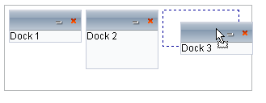

# Highlighting


## 

By default, when the user drags a __RadDock__ control over a __RadDockZone__ control that can accept it, the only indication is a placeholder that appears where the __RadDock__ control will be docked:
>caption 



You can highlight the entire dock zone as well as showing the placeholder, providing the user with feedback about the limits of the dock zone as well as where the __RadDock__ control will be docked. To highlight the dock zone when it is ready to accept and dock a __RadDock__ control, use the __HighilghtedCssClass__ property.

To use the __HighlightedCssClass__ property,

1. Define a CSS class that will be applied to the <div> tag that is the rendered image of the dock zone. You can use a separate CSS file and link to it, or you can define the CSS class in the <head> tag of the Web page:

````ASPNET
	    <head runat="server">
	        <title>Untitled Page</title>
	        <style type="text/css">     
	            .MyHighlight     
	            {       
	                background-color:red !important;     
	            }    
	        </style>
	    </head>
````


>note Note the use of the __!important__ modifier on the CSS rule. This is to force the rule to override any more specific CSS rules for in the CSS file for the RadDockZone's skin.Without the __!important__ modifier, the CSS rule would not necessarily take effect.
>


1. Set the __HighlightedCssClass__ property of the __RadDockZone__ control to the name of your new CSS class:

````ASPNET
	    <telerik:raddockzone id="RadDockZone1" runat="server" skin="WebBlue" orientation="Horizontal"
	        height="100px" highlightedcssclass="MyHighlight"></telerik:raddockzone>
````


When the __HighlightedCssClass__ property is set, the __RadDockZone__ uses the new CSS class when a __RadDock__ control is dragged over the zone (as long as the __RadDockZone__ is not listed in the __RadDock__ control's __ForbiddenZones__ property).
>caption 


# See Also

 * [Drag And Drop]()

 * [Controlling RadDock's Appearance]()

 * [Tutorial: Creating a Custom Skin]()

 * [OnClientDockPositionChanging]()
