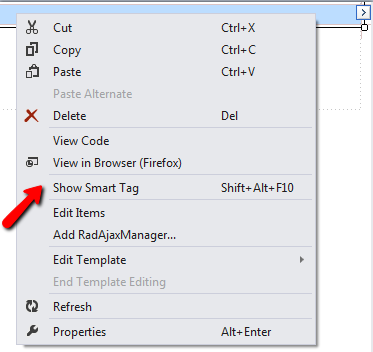
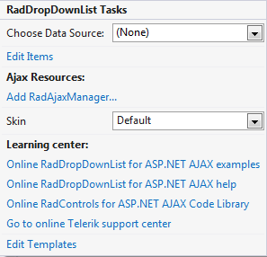

# Smart Tag

The __RadDropDownList__ Smart Tag allows easy access to frequently needed tasks. You can display the __Smart Tag__ by right clicking on a __RadDropDownList__ control in the design window, and choosing __Show Smart Tag.__

## Smart Tag of unbound RadDropDownList

When __RadDropDownList__ is unbound, the Smart Tag looks like the following:

Using the unbound __RadDropDownList__ Smart Tag you can perform the following:

## RadDropDownList Tasks

* __Choose Data Source__ lets you bind RadDropDownList declaratively by selecting a data source from a drop-down list of all available data source components. If you select __<New Data Source...>__ the standard Windows [Data Source Configuration Wizard](http://msdn2.microsoft.com/en-us/library/ms247282(VS.80).aspx) appears, where you can create and configure a data source component.

* __Build RadDropDownList__ opens the [RadDropDownList Item builder](), where you can add static items to the DropDownList and set their properties.

* __Skin__ lets you select from a list of available [skins]() to customize the look of your __RadDropDownList__.

## Smart Tag of bound RadDropDownList

When __RadDropDownList__ is bound to a data source, the Smart Tag looks like the following:

Using the Smart Tag of bound __RadDropDownList__ lets you perform any task you can perform with the Smart Tag of unbound RadDropDownList. In addition, you can choose __Configure Data Source...__ to open the standard [Data Source Configuration Wizard](http://msdn2.microsoft.com/en-us/library/ms247282(VS.80).aspx), where you can configure the currently bound data source component.

Once the Data Source is chosen, you can select each of the following: __DataTextField__ and __DataValueField__. These should be fields in the Data Source which will serve data respectively for __Text__ and __Value__ properties of RadDropDownList Items.
