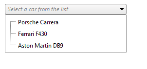
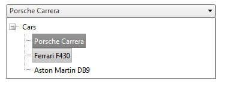

# Binding to Array, ArrayList and Generic List


Binding RadDropDownTree to a data source that implements **IEnumerable**, such as Array or ArrayList, can create a flat data structure as well as a hierarchy if the proper **ID** -> **ParentID** relationship is set.

Here is a general outline of **IEnumerable** data binding:

1. Create the collection.

2. Add values to the collection and set the **DataSource** property of RadDropDownTree to the instance of the collection.

3. Call the **DataBind()** method.

The collection is automatically mapped to the **Text** property of the respective tree Node.

## Binding to an Array

The examples below takes an array of strings as a data source.



````ASPNET
<telerik:RadDropDownTree ID="RadDropDownTree1" runat="server" Width="250px" DefaultMessage="Select a car from the list">
    <DropDownSettings Width="250px" />
</telerik:RadDropDownTree>
````


````C#
protected void Page_Load(object sender, EventArgs e)
{
    if (!IsPostBack)
    {
        string[] cars = new string[] { "Porsche Carrera", "Ferrari F430", "Aston Martin DB9" };
        RadDropDownTree1.DataSource = cars;
        RadDropDownTree1.DataBind();
    }
}
````
````VB.NET
Protected Sub Page_Load(ByVal sender As Object, ByVal e As EventArgs) Handles Me.Load
    If Not IsPostBack Then
        Dim cars As String() = New String() {"Porsche Carrera", "Ferrari F430", "Aston Martin DB9"}
        RadDropDownTree1.DataSource = cars
        RadDropDownTree1.DataBind()
    End If
End Sub
````


## Binding to an ArrayList

If you have a collection (any collection implementing **ICollection** or **IEnumerable**) that contains objects (as opposed to simple values),you can take advantage of **DataTextField**, and **DataValueField** properties to map object properties from the object directly to the **Text** or **Value** fields. If the **DataFieldID** and **DataFieldParentID** properties are set, RadDropDownTree will create a hierarchy of Nodes, determining the Root ones using the following algorithm:

>tip *their **DataFieldParentID** property must be **null** if it is of nullable (e.g. **int?** ) or reference (e.g. **string** ) type. Example:
> 

**ID**  **ParentID** 

1  (null)

2  1

>tip *their **DataFieldParentID** property must return the **default value** if it is value type (e.g. **0** for **int** , **Guid.Empty** for **Guid** ). Example:
> 
 
**ID**  **ParentID** 

1  0

2  1


Below you can find an example of a hierarchical data binding:



````ASPNET
<telerik:RadDropDownTree ID="RadDropDownTree1" runat="server" Width="350px" DefaultMessage="Select a car from the list">
    <DropDownSettings Width="350px" />
</telerik:RadDropDownTree>
````


````C#
protected void Page_Load(object sender, EventArgs e)
{
    if (!IsPostBack)
    {
        Car[] cars = new Car[] {
           new Car("Cars", 00000, 0, 4),
           new Car("Porsche Carrera", 79100, 4, 1),
           new Car("Ferrari F430", 229955, 4, 2),
           new Car("Aston Martin DB9", 168000, 4, 3),            
       };

        RadDropDownTree1.DataSource = cars;
        RadDropDownTree1.DataTextField = "Name";
        RadDropDownTree1.DataValueField = "Price";
        //establishing Parent-Child hierarchy 
        RadDropDownTree1.DataFieldParentID = "Parent";
        RadDropDownTree1.DataFieldID = "Id";

        RadDropDownTree1.DataBind();
    }
}

public class Car
{
    public Car(string name, double price, int parent, int id)
    {
        _name = name;
        _price = price;
        _parent = parent;
        _id = id;

    }
    private string _name;
    public string Name
    {
        get { return _name; }
        set { _name = value; }
    }
    private double _price;
    public double Price
    {
        get { return _price; }
        set { _price = value; }
    }
    private int _parent;
    public int Parent
    {
        get { return _parent; }
        set { _parent = value; }
    }
    private int _id;
    public int Id
    {
        get { return _id; }
        set { _id = value; }
    }

}
````
````VB.NET
Protected Sub Page_Load(ByVal sender As Object, ByVal e As EventArgs) Handles Me.Load


    If Not IsPostBack Then

        Dim cars As Car() = New Car() {
            New Car("Cars", 0, 0, 4),
            New Car("Porsche Carrera", 79100, 4, 1),
            New Car("Ferrari F430", 229955, 4, 2),
            New Car("Aston Martin DB9", 168000, 4, 3)}

        RadDropDownTree1.DataSource = cars
        RadDropDownTree1.DataTextField = "Name"
        RadDropDownTree1.DataValueField = "Price"
        RadDropDownTree1.DataFieldParentID = "Parent"
        RadDropDownTree1.DataFieldID = "Id"
        RadDropDownTree1.DataBind()
    End If
End Sub


Public Class Car
    Public Sub New(ByVal name As String, ByVal price As Double, ByVal parent As Integer, ByVal id As Integer)
        _name = name
        _price = price
        _parent = parent
        _id = id
    End Sub
    Private _name As String
    Public Property Name() As String
        Get
            Return _name
        End Get
        Set(ByVal value As String)
            _name = value
        End Set
    End Property
    Private _price As Double
    Public Property Price() As Double
        Get
            Return _price
        End Get
        Set(ByVal value As Double)
            _price = value
        End Set
    End Property
    Private _parent As Integer
    Public Property Parent() As Integer
        Get
            Return _parent
        End Get
        Set(ByVal value As Integer)
            _parent = value
        End Set
    End Property
    Private _id As Integer
    Public Property Id() As Integer
        Get
            Return _id
        End Get
        Set(ByVal value As Integer)
            _id = value
        End Set
    End Property
End Class
````


## Binding to a Generic List


````ASPNET
<telerik:RadDropDownTree ID="RadDropDownTree1" runat="server" Width="350px" DefaultMessage="Select a product from the list">
    <DropDownSettings Width="350px" />
</telerik:RadDropDownTree>
````


````C#
protected void Page_Load(object sender, EventArgs e)
{
    if (!IsPostBack)
    {
        BindToIEnumerable(RadDropDownTree1);
    }
}

private static void BindToIEnumerable(RadDropDownTree dropdowntree)
{
    List<SiteDataItem> siteData = new List<SiteDataItem>();

    siteData.Add(new SiteDataItem(1, 0, "Products"));
    siteData.Add(new SiteDataItem(2, 1, "RadControls for ASP.NET Ajax"));
    siteData.Add(new SiteDataItem(3, 1, "RadControls for Silverlight"));
    siteData.Add(new SiteDataItem(4, 2, "RadGrid"));
    siteData.Add(new SiteDataItem(5, 2, "RadScheduler"));
    siteData.Add(new SiteDataItem(6, 2, "RadEditor"));
    siteData.Add(new SiteDataItem(7, 3, "RadGrid"));
    siteData.Add(new SiteDataItem(8, 3, "RadMenu"));
    siteData.Add(new SiteDataItem(9, 3, "RadEditor"));

    dropdowntree.DataTextField = "Text";
    dropdowntree.DataFieldID = "ID";
    dropdowntree.DataFieldParentID = "ParentID";
    dropdowntree.DataSource = siteData;
    dropdowntree.DataBind();
}

internal class SiteDataItem
{
    private string _text;
    private int _id;
    private int _parentId;

    public string Text
    {
        get { return _text; }
        set { _text = value; }
    }


    public int ID
    {
        get { return _id; }
        set { _id = value; }
    }

    public int ParentID
    {
        get { return _parentId; }
        set { _parentId = value; }
    }

    public SiteDataItem(int id, int parentId, string text)
    {
        _id = id;
        _parentId = parentId;
        _text = text;
    }
}
````
````VB.NET
Protected Sub Page_Load(sender As Object, e As EventArgs) Handles Me.Load

    If Not Page.IsPostBack Then

        BindToIEnumerable(RadDropDownTree1)
    End If

End Sub

Private Shared Sub BindToIEnumerable(ByVal dropdowntree As RadDropDownTree)
    Dim siteData As New List(Of SiteDataItem)()

    siteData.Add(New SiteDataItem(1, 0, "Products"))
    siteData.Add(New SiteDataItem(2, 1, "RadControls for ASP.NET Ajax"))
    siteData.Add(New SiteDataItem(3, 1, "RadControls for Silverlight"))
    siteData.Add(New SiteDataItem(4, 2, "RadGrid"))
    siteData.Add(New SiteDataItem(5, 2, "RadScheduler"))
    siteData.Add(New SiteDataItem(6, 2, "RadEditor"))
    siteData.Add(New SiteDataItem(7, 3, "RadGrid"))
    siteData.Add(New SiteDataItem(8, 3, "RadMenu"))
    siteData.Add(New SiteDataItem(9, 3, "RadEditor"))

    dropdowntree.DataTextField = "Text"
    dropdowntree.DataFieldID = "ID"
    dropdowntree.DataFieldParentID = "ParentID"
    dropdowntree.DataSource = siteData
    dropdowntree.DataBind()
End Sub

Friend Class SiteDataItem
    Private _text As String
    Private _id As Integer
    Private _parentId As Integer

    Public Property Text() As String
        Get
            Return _text
        End Get
        Set(ByVal value As String)
            _text = value
        End Set
    End Property


    Public Property ID() As Integer
        Get
            Return _id
        End Get
        Set(ByVal value As Integer)
            _id = value
        End Set
    End Property

    Public Property ParentID() As Integer
        Get
            Return _parentId
        End Get
        Set(ByVal value As Integer)
            _parentId = value
        End Set
    End Property

    Public Sub New(ByVal id As Integer, ByVal parentId As Integer, ByVal text As String)
        _id = id
        _parentId = parentId
        _text = text
    End Sub
End Class
````

