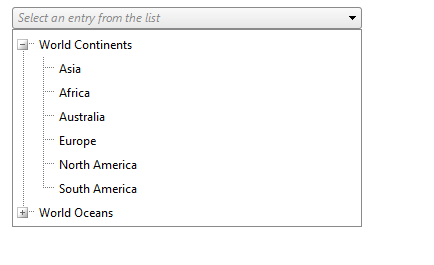

# Binding to DataTable, DataSet or DataView


## Binding to a DataTable

__RadDropDownTree__ can be bound to a __DataTable__, __DataSet__ and a __DataView__. This example shows binding to a __DataTable__ object.



````ASPNET
	            <telerik:RadDropDownTree ID="RadDropDownTree1" runat="server" Width="350px" DefaultMessage="Select an entry from the list">
	                <DropDownSettings Width="350px" />
	            </telerik:RadDropDownTree>
````


>tabbedCode

````C#
	protected void Page_Load(object sender, EventArgs e)
	    {
	        if (!IsPostBack)
	        {
	            RadDropDownTree1.DataFieldID = "ID";
	            RadDropDownTree1.DataFieldParentID = "ParentID";
	            RadDropDownTree1.DataValueField = "Value";
	            RadDropDownTree1.DataTextField = "Text";
	            RadDropDownTree1.DataSource = GetData();
	            RadDropDownTree1.DataBind();
	        }
	    }
	
	    public DataTable GetData()
	    {
	        DataTable table = new DataTable();
	        table.Columns.Add("ID");
	        table.Columns.Add("ParentID");
	        table.Columns.Add("Value");
	        table.Columns.Add("Text");
	
	        table.Rows.Add(new String[] { "1", null, "World_Continents", "World Continents" });
	        table.Rows.Add(new String[] { "2", null, "World_Oceans", "World Oceans" });
	
	        table.Rows.Add(new String[] { "3", "1", "Asia", "Asia" });
	        table.Rows.Add(new String[] { "4", "1", "Africa", "Africa" });
	        table.Rows.Add(new String[] { "5", "1", "Australia", "Australia" });
	        table.Rows.Add(new String[] { "6", "1", "Europe", "Europe" });
	        table.Rows.Add(new String[] { "7", "1", "North_America", "North America" });
	        table.Rows.Add(new String[] { "8", "1", "South_America", "South America" });
	
	        table.Rows.Add(new String[] { "9", "2", "Arctic_Ocean", "Arctic Ocean" });
	        table.Rows.Add(new String[] { "10", "2", "Atlantic_Ocean", "Atlantic Ocean" });
	        table.Rows.Add(new String[] { "11", "2", "Indian_Ocean", "Indian Ocean" });
	        table.Rows.Add(new String[] { "12", "2", "Pacific_Ocean", "Pacific Ocean" });
	        table.Rows.Add(new String[] { "13", "2", "South_Ocean", "SouthOcean" });
	
	        return table;
	    } 
````
````VB.NET
	    Protected Sub Page_Load(sender As Object, e As EventArgs) Handles Me.Load
	
	        If Not IsPostBack Then
	            RadDropDownTree1.DataFieldID = "ID"
	            RadDropDownTree1.DataFieldParentID = "ParentID"
	            RadDropDownTree1.DataValueField = "Value"
	            RadDropDownTree1.DataTextField = "Text"
	            RadDropDownTree1.DataSource = GetData()
	            RadDropDownTree1.DataBind()
	        End If
	
	
	    End Sub
	
	    Public Function GetData() As DataTable
	        Dim table As New DataTable()
	        table.Columns.Add("ID")
	        table.Columns.Add("ParentID")
	        table.Columns.Add("Value")
	        table.Columns.Add("Text")
	
	        table.Rows.Add(New [String]() {"1", Nothing, "World_Continents", "World Continents"})
	        table.Rows.Add(New [String]() {"2", Nothing, "World_Oceans", "World Oceans"})
	
	        table.Rows.Add(New [String]() {"3", "1", "Asia", "Asia"})
	        table.Rows.Add(New [String]() {"4", "1", "Africa", "Africa"})
	        table.Rows.Add(New [String]() {"5", "1", "Australia", "Australia"})
	        table.Rows.Add(New [String]() {"6", "1", "Europe", "Europe"})
	        table.Rows.Add(New [String]() {"7", "1", "North_America", "North America"})
	        table.Rows.Add(New [String]() {"8", "1", "South_America", "South America"})
	
	        table.Rows.Add(New [String]() {"9", "2", "Arctic_Ocean", "Arctic Ocean"})
	        table.Rows.Add(New [String]() {"10", "2", "Atlantic_Ocean", "Atlantic Ocean"})
	        table.Rows.Add(New [String]() {"11", "2", "Indian_Ocean", "Indian Ocean"})
	        table.Rows.Add(New [String]() {"12", "2", "Pacific_Ocean", "Pacific Ocean"})
	        table.Rows.Add(New [String]() {"13", "2", "South_Ocean", "SouthOcean"})
	
	        Return table
	    End Function
````
>end
