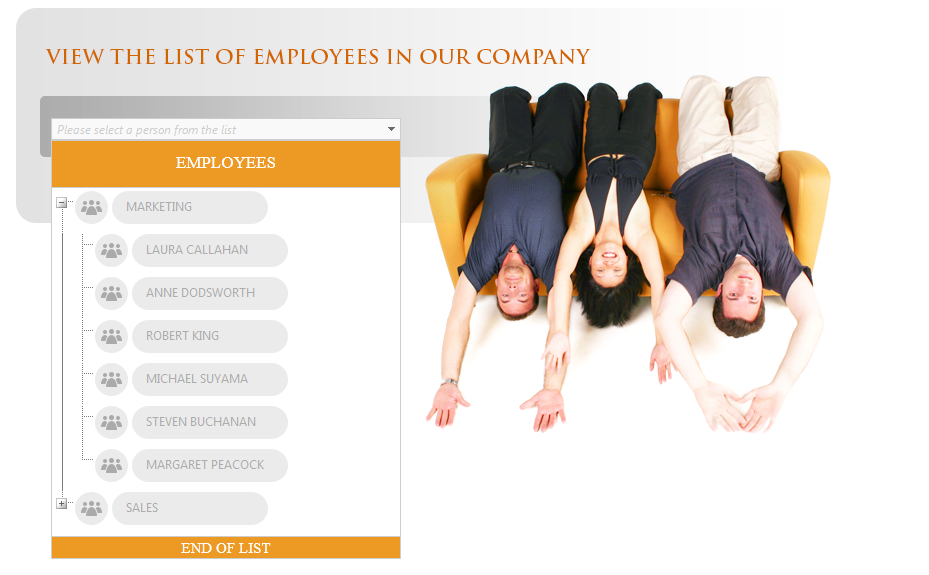

# Templates Overview

## 

**RadDropDownTree** control is extremely configurable. In addition to the preset skins, you can customize the appearance ofboth the dropdown and the nodes by using the different templates:

* **Header Template**

* **Footer Template**

* **Node Template**

You can embed any content inside a the header, footer of the node template, including:

* HTML markup

* ASP.NET server controls

* Other third-party controls (including other Telerik controls)

Below you can find more detailed information on the various types of templates of the RadDropDownTree control.

## Header Template

The **Header Template** appears right before all nodes in the RadDropDownTree control. It allows an easy customization of the header and thus providingmore information related to the dropdown when needed. Simply place the desired content within the **<HeaderTemplate> ... <\HeaderTemplate>** tags.As intended by design, clicking on the header does not invoke any server-side or client-side event by itself.

## Node Template

The Node Template allows and easy customization of the tree nodes placed in the dropdown. In general it is a global template that is applied to all of the nodes in the tree. You can place the desired contnet within the **<DropDownNodeTemplate> ... <\DropDownNodeTemplate>** tags.

## Footer Template

The **Footer Template** appears right after all nodes in the RadDropDownTree control. It can be very easily customizated so that is can providemore information related to the dropdown if needed. Simply place the desired content within the **<FooterTemplate> ... <\FooterTemplate>** tags.By design clicking on the footer does not invoke any server-side or client-side event by itself. However, any control placed in it, can invoke its client/server side events.

# See Also

 * [RadDropDownTree Templates](http://demos.telerik.com/aspnet-ajax/dropdowntree/examples/functionality/templates/defaultcs.aspx)
