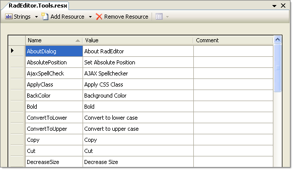
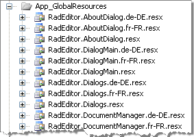
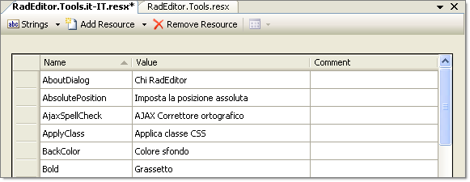

# Create a New Language


## 

With RadEditor you can create a new language pack or alter some of the labels of an existing language pack. All of the text used in RadEditor is obtained from [resource files](), which look similar to the example below:
>caption 



Each dialog, module or a context-menu has its own localization resource file located in the App_GlobalResources folder.
>caption 



The best way to create a new language is to duplicate an existing set of resource files and modify them. For example to create a new Italian resource file for Tools, you can copy the default RadEditor.Tools.resx to RadEditor.Tools.it-IT.resx.

>note The culture name has to follow the RFC 1766 standard in the format [Language Code]-[County/Region Code]. In our example, it-IT stands for Italian - Italy.
>


Then open the resource file in Visual Studio and change the __Value__ column entries to their Italian counterparts.
>caption 



Set the [Language](http://www.telerik.com/help/aspnet-ajax/p_telerik_web_ui_radeditor_language.html) property to the new culture code that represents the language at design-time:

````ASPNET
	     
							<telerik:RadEditor ID="RadEditor1" runat="server" Language="it-IT" ></telerik:RadEditor>
				
````


...or run-time:


````C#
	     
				RadEditor1.Language = "it-IT"; 
				
````
````VB
	
	        RadEditor1.Language = "it-IT"
	
````


When you run the application, the new resources will be recognized and the corresponding hints or other UI elements will display in the new language:
>caption 


