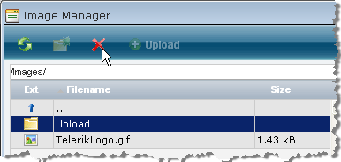
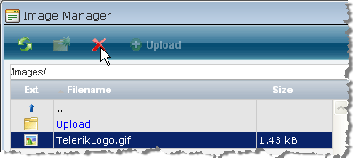
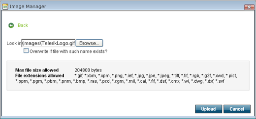

# Custom FileBrowserContentProvider


FileBrowserContentProvider provides the ability for using different files sources for the FileBrowser dialogs ([Document Manager](), [Flash Manager](), [Image Manager](), [Media Manager]() and [Template Manager]()).

## Implementing a Custom FileBrowserContentProvider

By default the editor file-based dialogs, such as ImageManager, FlashManager etc. read files from and upload files to physical directories within the web application. You may need an alternative mechanism in some scenarios, e.g. integrating RadEditor to existing CMS systems that have an established way of dealing with file resources.

RadEditor offers the ability to implement custom content providers that are plugged into the file-browser dialogs instead of the default provider. This enables the use of database, XML files for storing of files and file information. To create a custom content provider you need to create a descendant of __FileBrowserContentProvider__ and implement it's methods.__FileBrowserContentProvider__ is in the Telerik.Web.UI.Widgets namespace.

## Implementation Overview

The steps to implement a custom __FileBrowserContentProvider__ are:

1. Extend the abstract [Telerik.Web.UI.Widgets.FileBrowserContentProvider](http://www.telerik.com/help/aspnet-ajax/t_telerik_web_ui_widgets_filebrowsercontentprovider.html) class and implement its methods.

1. Set the dialog's property *[ContentProviderTypeName](http://www.telerik.com/help/aspnet-ajax/p_telerik_web_ui_filemanagerdialogconfiguration_contentprovidertypename.html)* e.g. *RadEditor1.ImageManager.ContentProviderTypeName* = "__DatabaseFileBrowser, EditorWebApp"__ where the value of the property [ContentProviderTypeName](http://www.telerik.com/help/aspnet-ajax/p_telerik_web_ui_filemanagerdialogconfiguration_contentprovidertypename.html) should be the qualified assembly name of your custom content provider. The general format of the assembly name should be __"Full.Class.Name.Including.The.Namespace, Assembly.Name"__. For example if your content provider class is in a separate project and is declared like this:

>tabbedCode

````C#
	     
	
	using Telerik.Web.UI.Widgets;
	
	namespace RadEditorCustomProvider
	{
	    public class MyContentProvider : FileBrowserContentProvider  
	    {    
	        //...override base methods  
	    }
	}
				
````


````VB
	
	
	Imports Telerik.Web.UI.Widgets
	
	Namespace RadEditorCustomProvider
	
	
	        Public Class MyContentProvider
	            Inherits FileBrowserContentProvider
	            ' ...override base methods 
	        End Class
	
	    End Namespace
	
````


>end

...when it is compiled in the __ContentProviders.dll__ assembly, you should set the following value:

RadEditor1.ImageManager.ContentProviderTypeName = "ContentProviders.RadEditor.DatabaseContentProvider,ContentProviders"

In .NET 2.0 web sites (as opposed to web application projects0, the code is not explicitly compiled into an assembly and that's why you should use App_Code instead of Assembly.Name:

RadEditor1.ImageManager.ContentProviderTypeName = "ContentProviders.RadEditor.DatabaseContentProvider, App_Code"

If the assembly where the class is defined will be located in the Global Assembly Cache (GAC), you should include the full assembly name, version, public key token, etc.

However, there is an easier way to set the value of this property from the code-behind which will work in all cases :RadEditor1.ImageManager.ContentProviderTypeName = typeof(DatabaseContentProvider).AssemblyQualifiedName

## FileBrowserContentProvider Architecture

At present the editor has content providers for physical folders and for Microsoft CMS. Many of the decisions for the content provider architecture were affected by the need for the MCMS support.Here are the requirements that needed to be supported:

1. Support for listing directories as a hierarchical tree and as a flat list.

1. Support for creating thumbnail images.

1. Support for multiple "virtual" root folders, each residing at a completely independent physical location.

1. Support for AJAXbased directory requests.

The support for these requirements added certain complexity which could not be avoided, yet most of the work is taken care of by the editor and implementing a custom provider is fairly straightforward, considering the information here and using the sample implementation provided as a starting point.

The ContentProvider revolves around the idea of Files and Directories - these being two separate, slightly different objects. When a request comes for a particular node (if no node is specified, the root node is assumed), a hierarchical tree is generated containing information only for the direct descendents (files and folders) of the node. This "load-on-demand" AJAX based approach allows for small footprint and response time.

There are methods to be implemented for creating a directory, creating a file, deleting a directory, deleting a file and several thumbnail-creation related methods.

## Implementing FileBrowserContentProvider

To get started implementing FileBrowserContentProvider:

1. Add the __Telerik.Web.UI.Widgets__ namespace to your "uses" (C#) or "Imports" (VB) section of code.

1. Create a new class, e.g. "MyFileBrowserContentProvider" that descends from __FileBrowserContentProvider__.

1. In C# projects:

1. right-click the __FileBrowserContentProvider__ declaration and select __Implement Abstract Class__ from the context menu.
>caption 

This step will create all the methods that can be implemented:
>caption 


1. Add a constructor with the signature shown in the code example below. The constructor provides basic dialog and path information.The "Context" parameter allows you to access the current HTTP state including the HTTP Request object:

````C#
	     
	
	public MyFileBrowserContentProvider(HttpContext context, string[] searchPatterns, string[] viewPaths, string[] uploadPaths, string[] deletePaths, string selectedUrl, string selectedItemTag)    
	    :    base(context, searchPatterns, viewPaths, uploadPaths, deletePaths, selectedUrl, selectedItemTag)
	{
	}
				
````


In VB.NET:

1. The class can be constructed in a similar manner to the example below:

````VB
	
	
	Imports Telerik.Web.UI.Widgets
	
	    Public MustInherit Class MyFileBrowserContentProvider
	        Inherits FileBrowserContentProvider
	        Public Sub New(ByVal context As HttpContext, ByVal searchPatterns As String(), ByVal viewPaths As String(), ByVal uploadPaths As String(), ByVal deletePaths As String(), ByVal selectedUrl As String, ByVal selectedItemTag As String)
	            MyBase.New(context, searchPatterns, viewPaths, uploadPaths, deletePaths, selectedUrl, selectedItemTag)
	        End Sub
	    End Class
	
````


From this starting point you can implement the FileBrowserContentProvider methods to suit your particular purpose. See [Custom File Dialogs Content Provider LiveDemo](http://demos.telerik.com/aspnet-ajax/editor/examples/dbfilebrowsercontentprovider/defaultcs.aspx) for a running example.

## Important Implementation Details

Some important details aimed at reducing the overall time needed by developers to implement the custom content provider:

1. Since the FileBrowserContentProvider class needs a number of parameters to be configured when created, it has no default constructor. This means that the subclass must explicitly define a similar constructor with the exact same number of arguments and it needs to explicitly make a call to the parent constructor.

1. The DirectoryItem class has two properties __Files__ and __Directories__ of array type. These are read-only and cannot be replaced, once set. These properties also need to be set during the __DirectoryItem__ construction phase__.__ This could have some implications on the exact algorithm for building the file tree.

1. The information here is for the ImageManager, but is valid for each of the remaining file-browser dialogs:If the property editor property __ViewPaths__ is not set, the __ResolveRootDirectoryAsTree__ method will not be called at all! This is because it will be assumed that no directory browsing should be allowed for the particular user using the editor. The __ResolveRootDirectoryAsTree__ is called for each item in the __ViewPaths__ array.

1. In order to allow creation of directories (and the *CreateDirectory* method to be called) the __CanCreateDirectory__ property must return true.

1. __GetFile__, __GetFileName, GetPath__ and __StoreBitmap__ methods are only related to the Thumbnail creation functionality and are not called by the regular file browser. Their implementation can be postponed for the end once all other functionality is working.

## Sample FileBrowserContentProvider implementation

The sample implementation is using a database for information storage, and a single physical directory as a file storage. The screenshots below explain the relationship between the actions that can be taken in the editor (using the [Custom File Dialogs Content Provider LiveDemo](http://demos.telerik.com/aspnet-ajax/editor/examples/dbfilebrowsercontentprovider/defaultcs.aspx)) and the methods that must be implemented in your __FileBrowserContentProvider__ descendant implementation:


>caption  

| User Action | Method called | Screenshot |
| ------ | ------ | ------ |
|Initial load of file browser dialog|

>tabbedCode

````C#
	     
		DirectoryItem ResolveRootDirectoryAsTree(
	            string path)
				
````


````VB
	
		ResolveRootDirectoryAsTree( _
		    ByVal path As String) As DirectoryItem
	
````


>end|
>caption 

|
|Press the Delete button when a directory is selected|

>tabbedCode

````C#
	     
		string DeleteDirectory(string path)
				
````


````VB
	
	    DeleteDirectory( _ 
	        ByVal path As String) As String
	
````


>end|
>caption 

|
|Press the Delete button when a file is selected|

>tabbedCode

````C#
	     
		string DeleteFile(string path)
				
````


````VB
	
	    DeleteFile( _ 
	        ByVal path As String) As String
	
````


>end|
>caption 

|
|Uploading a file|

>tabbedCode

````C#
	     
		string StoreFile(
	            Telerik.Web.UI.UploadedFile file,  
	            string path,  
	            string name,  
	            params string[] arguments)
				
````


````VB
	
		StoreFile( _ 
		    ByVal file As Telerik.Web.UI.UploadedFile, _
		    ByVal path As String, _
		    ByVal name As String, _
		    ParamArray arguments As String() _ 
		) As String
	
````


>end|
>caption 

|
|Previewing a selected file|This functionality should be implemented in cooperation with the customFileBrowserContentProvider. For example, if files are to be served by a special handler, the handler shouldbe aware how to process the URL and serve the file.|
>caption 

|

>caution The compilator will not complain if the FileBrowserContentProvider's methods bellow are not overridden, but it is highly recommended to override them as well:
>


>tabbedCode

````C#
	     
	
	public override bool CheckDeletePermissions(
	            string folderPath)
	{  
	    return base.CheckDeletePermissions(folderPath);
	}
	
	public override bool CheckWritePermissions(
	            string folderPath)
	{  
	    return base.CheckWritePermissions(folderPath);
	}
	
	//Introduced in the 2010.2.826 version of the control
	public override bool CheckReadPermissions(
	            string folderPath)
	{  
	    return base.CheckReadPermissions(folderPath);
	}
				
````


````VB
	
	
	    Public Overrides Function CheckDeletePermissions(ByVal folderPath As String) As Boolean
	        Return MyBase.CheckDeletePermissions(folderPath)
	    End Function
	
	    Public Overrides Function CheckWritePermissions(ByVal folderPath As String) As Boolean
	        Return MyBase.CheckWritePermissions(folderPath)
	    End Function
	
	    ' Introduced in the 2010.2.826 version of the control
	    Public Overrides Function CheckReadPermissions(ByVal folderPath As String) As Boolean
	        Return MyBase.CheckReadPermissions(folderPath)
	    End Function
	
````


>end

# See Also

 * [Custom File Dialogs Content Provider LiveDemo](http://demos.telerik.com/aspnet-ajax/editor/examples/dbfilebrowsercontentprovider/defaultcs.aspx)
