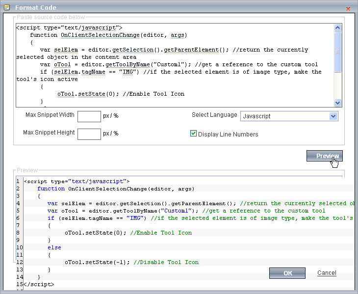

# Format Code Block


## 

The RadEditor __Format Code Block Dialog__ provides the ability to edit and format code blocks of:

* Markup, i.e. HTML, XHTML, ASPX, XML

* CSS

* JavaScript

* C#

* VB code blocks

* PHP

* Delphi

* Python

* SQL

Click the __Format Code__button, paste lines of text or code into the upper pane of the __Format Code__dialog, then select the format from the __Select Language__ dropdown and finally click the __OK__button to insert the formatted content into the editor. The dialog also provides a __Preview__button which allows you to see how the formatted content will look (depending on the selected Language item in the dropdown) before insertion into the content area.

To place the Format Code Block tool in the editor toolbar, you can add the FormatCodeBlock to the Tools collection at design-time or place the following ToolsFile declaration tag:

````XML
	
	    <tool name="FormatCodeBlock" />
	          
````


You can see a sample dialog preview below, which shows formatted content prior to insertion in the content area:
>caption 


