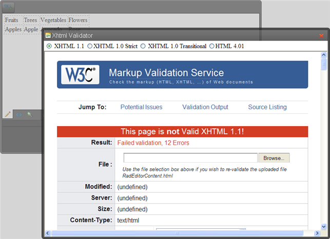

# XHTML Validator


## 

The __XhtmlValidator__dialog uses the W3C XHTML Validator Page to perform validation of the current editor content. The W3C service returns a compliancy report right within the editor dialog. This feature eliminates the need for manual copy/pasting of the HTML and validation in a separate browser window.
>caption 



You can enable this dialog by declaring the XhtmlValidator Tool in-line, adding it to the ToolsFile.xml or defining it programmatically:

````ASPNET
		<telerik:radeditor id="RadEditor1" runat="server" skin="Default">    
			<Tools>        
				<telerik:EditorToolGroup>            
					<telerik:EditorTool Name="XhtmlValidator" Text="Xhtml Validator Dialog" />        
				</telerik:EditorToolGroup>    
			</Tools>
		</telerik:radeditor>
````


````XML
		<root>  
			<tools name="Main" >    
				<tool name="XhtmlValidator" />  
			</tools>
		</root>
````


````C#
	
			// Remove default tools
			RadEditor1.Tools.Clear();
			// Create a new tool group and add to RadEditor Tools collection
			EditorToolGroup group = new EditorToolGroup();
			RadEditor1.Tools.Add(group);
			// Create the XhtmlValidator tool and add it to the tool group
			EditorTool tool = new EditorTool("XhtmlValidator");
			group.Tools.Add(tool);   
````


````VB.NET
	
		' Remove default tools
		RadEditor1.Tools.Clear()
		' Create a new tool group and add to RadEditor Tools collection
		Dim group As New EditorToolGroup()
		RadEditor1.Tools.Add(group)
		' Create the XhtmlValidator tool and add it to the tool group
		Dim tool As New EditorTool("XhtmlValidator")
		group.Tools.Add(tool) 			
````


