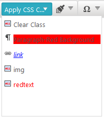
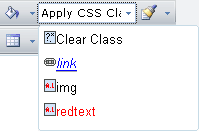

# CSS Styles


The CSS class dropdown of RadEditor displays all classes defined in the page or from [external CSS files]() by default. The dropdown is populated from the __CssClasses__Collection. You can add to the CssClasses collection declaratively, programmatically and using the ToolsFile.
>caption 



## Using the CssClasses Collection Declaratively

In the RadEditor declaration, add __EditorCssClass__ elements to __CssClasses__. In the example below all three CSS classes are listed along with a "Clear Class" entry. If the CssClasses tag is empty all available classes will be listed.

````ASPNET
	     
		<style>
		    a.link
		    {  
		         color: #0000ff;   
		         font-weight: normal;   
		         font-style: italic;
		    }
		    .img   
		    {
		        border: none;
		    }
		    .redtext
		    {     
		        color: red;
		    }
		</style>
	    
	    ...
	    
	    <telerik:RadEditor runat="server" ID="RadEditor1" Skin="WebBlue">    
	        <CssClasses>        
	            <telerik:EditorCssClass Name="Clear Class" Value="" />        
	            <telerik:EditorCssClass Name="link" Value="a.link" />        
	            <telerik:EditorCssClass Name="img" Value=".img" />        
	            <telerik:EditorCssClass Name="redtext" Value=".redtext" />    
	        </CssClasses>
	    </telerik:RadEditor>
				
````


## Using CssClasses Programmatically

Use the Add() method to include classes in the CssClasses collection. In the example below, only the a.link and .img styles will be listed in the dropdown:

>tabbedCode

````C#
	
	        RadEditor1.CssClasses.Add("Links Class", "a.link");
	        RadEditor1.CssClasses.Add("Images Class", ".img");
	
````
````VB
	
	        RadEditor1.CssClasses.Add("Links Class", "a.link")
	        RadEditor1.CssClasses.Add("Images Class", ".img")
	
````
>end

>caution Make sure you specify the exact name of the class (i.e. " __a.link__ " - not "a" or "link"; " __.img__ " - not "img").
>


Using the __Add()__ method resets the CssClasses dropdown, so the CssClasses you add will not be appended to the default set, but will rather create a new CssClasses set. If the CssClasses collection is left empty, all available classes will be listed.


>caption  

|  __Default state__  |  __Programmatic population__  |
| ------ | ------ |
|
>caption 

|
>caption 

|
|(The CSS class dropdown containsall existing classes)|(The CSS class dropdown containsonly the classes added usingthe __Add()__ method)|

## Using the ToolsFile

____You can also populate the CSS class dropdown using the __ToolsFile__, as shown in the example below:

````XML
	     
		<root>  
	        <tools name="MainToolbar" enabled="true">    
	            <tool name="ApplyClass" />      
	        </tools>  
	        <classes>    
	            <class name="Clear Class" value="" />    
	            <class name="Links Class" value="a.link" />    
	            <class name="Images Class" value=".img" />    
	            <class name="My Red Text" value=".redText" />  
	        </classes>
	    </root>
				
````


>note Bear in mind that RadEditor will persist its state (including the CSS classes set) between postbacks. In order to create a new set of CSS classes (e.g. for different users), you will need to clear it first. This can be done using __Remove()__ and __Clear()__ methods of CssClasses Collection.
>


>caution Please, note that if you have css classes defined with the following syntax:
> *.Emphasis, p em{color: #A4CE3A; font-style: normal; }* 
>then the editor will parse and read only the .Emphasis class and will populate the "Apply Class" dropdown only with this class. If RadEditor starts to parse the strings after the comma, this will drastically decrease the editor performance and it will be loaded slower on the page.
>


>caution If your page does not contain any css classes and you try set an item in the dropdown with the CssClasses.Add syntax, e.g.
>RadEditor1.CssClasses.Add("Links class ", "a.link")
>then the item will be not populated, because the a.link will not exist on the page
>


# See Also

 * [Set Properties]()

 * [External CSS Files]()
