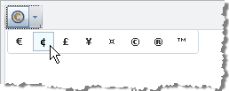
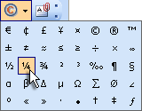

# Symbols

The RadEditor Symbols dropdown by default displays a predefined set of symbols. They are kept in the *Symbols* Collection. You can add to the Symbols collection declaratively, programmatically and using the ToolsFile.



## Using the Symbols Collection Declaratively

````ASP.NET
<telerik:RadEditor runat="server" ID="RadEditor1" Skin="WebBlue">
   <Symbols>
	   <telerik:EditorSymbol Char="\u20AC" />
	   <telerik:EditorSymbol Char="\u00A2" />
	   <telerik:EditorSymbol Char="\u00A3" />
	   <telerik:EditorSymbol Char="\u00A5" />
	   <telerik:EditorSymbol Char="\u00A9" />
	   <telerik:EditorSymbol Char="\u00AE" />
   </Symbols>
</telerik:RadEditor> 
````

## Using Symbols Programmatically

Use the RealFontSizes collection **Add()** method to include new items in the list. You can add a character using the unicode escape character "\u" plus the number of the character or use the symbol literals directly.

````C#
// Use the unicode escape character "\u"
RadEditor1.Symbols.Add("\u00A2");
RadEditor1.Symbols.Add("\u00A3");
RadEditor1.Symbols.Add("\u00A5");
RadEditor1.Symbols.Add("\u00A4");
RadEditor1.Symbols.Add("\u00A9");
RadEditor1.Symbols.Add("\u00AE");
	
// Use the symbol literals directly
RadEditor1.Symbols.Add("£"); 
RadEditor1.Symbols.Add("©"); 
RadEditor1.Symbols.Add("®");        
````
````VB
'Use the unicode escape character "\u"
RadEditor1.Symbols.Add("\u00A2")
RadEditor1.Symbols.Add("\u00A3")
RadEditor1.Symbols.Add("\u00A5")
RadEditor1.Symbols.Add("\u00A4")
RadEditor1.Symbols.Add("\u00A9")
RadEditor1.Symbols.Add("\u00AE")
'Use the symbol literals directly
RadEditor1.Symbols.Add("£")
RadEditor1.Symbols.Add("©")
RadEditor1.Symbols.Add("®")
````

When using the Symbols Collection **Add()** the Symbols dropdown will be reset, so the symbols you add will not be appended to the default set, but will rather create a new Symbol set. See the example below:

|  **Default state**  |  **Programmatic population**  |
| ------ | ------ |
|||
|(The Symbols dropdown contains the default set of symbols)|(The Symbols dropdown contains only those added using the **Add** method)|

## Using the ToolsFile

You can also populate the Symbols dropdown using **ToolsFile.xml**, as shown in the example below:

````XML
<root>
 <tools name="MainToolbar" enabled="true">
   <tool name="InsertSymbol" />
 </tools>
 <symbols>
   <symbol value="\u20AC" />
   <symbol value="\u00A2" />
   <symbol value="\u00A3" />
   <symbol value="\u00A5" />
   <symbol value="\u00A4" />
   <symbol value="\u00A9" />
   <symbol value="\u00AE" />
   <symbol value="\u2122" />
 </symbols>
</root> 
````

Here is a complete list of the symbols populating by default the "Insert Symbols" dropdown:\u20AC, \u00A, \u00A3, \u00A5, \u00A4, \u00A9, \u00AE, \u2122, u00B1, \u2260, \u2248, \u2264, \u2265, \u00F7, \u00D7, \u221E, \u00BD, \u00BC, \u00BE, \u00B2, \u00B3, \u2030, \u00B6, \u00A7, \u03B1, \u03B2, \u03B1, \u002E, \u0394, \u00B5, \u03A9, \u2211, \u00D8, \u2220, \u00BA, u00AB, \u00BB, \u00B7, \u2022, \u2020, \u2021, \u0192

>note Please bear in mind that RadEditor persists its state (including the Symbols set) between postbacks. To create a new set of symbols (e.g. for different users), clear the collection first using the Symbols **Remove()** or **Clear()** methods.
