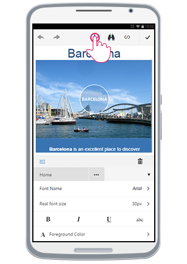
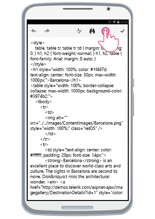

# End User Experience

You can find here some basic examples how **Phone Layout** can be used by the end-user.  

## Start Editing

>caption Figure 1: Phone Layout in Preview mode.

Initially, **RadEditor** is loaded in **Preview** mode (**Figure 1**). In order to start editing the content (full screen mode), the user should tap either the content, or the **Edit Content** button (). 

>caption Figure 2: Full screen mode

In full screen mode, user can edit the text and operate with the header tools. 

## Using the Tools

>caption Figure 3: Toggling the ToolZone.

The **ToolZone** can be shown by pressing the **Toggle ToolZone** button from the Header Tools (). Using the tools will affect the current selection. 

The animation in **Figure 4** shows how user would be able to use the tools and edit or format the content.

>caption Figure 4: User experience with content editing. 

## Using Tabs and Contextual Tabs

>caption Figure 5: Changing the Tab.

To change the current tab, user should press the **Tab Chooser** button (). As shown in **Figure 5**, a pop-up with all available tabs will be shown. Tapping on one of them, will load the corresponding tools from this tab into the **ToolZone**.

Additionally, tabs can be configured to be shown only when a certain element is selected. This can be controlled via the **Context** property of the **EditorToolGroup** items. You can read more about that in the [Toolbar Configuration]() article. In **Figure 6**, you can see how selecting an `` element in the content, opening the **ToolZone**, automatically shows the built-in **Image** tab.

>caption Figure 6: Working with contextual tabs.

## Toggling HTML Mode

>caption Figure 7: Toggling HTML mode.

The user can edit the content as HTML by switching to HTML mode. This is done by tapping  the **Toggle HTML** button () from the header tools. This will show the content's HTML. Once user is done, tapping the same button will switch the mode back to Design. 

## See Also

* [Getting Started]()
* [Elements Structure]()
* [Toolbar Configuration]()

