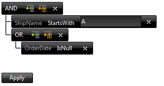
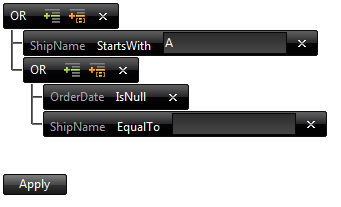

# Client-Side Programming Overview


This help articles demonstrates how to get reference to the **RadFilter** client object and cover its main properties, methods and events.

## Getting RadFilter client object

To get reference of the RadFilter client-side object, you can use one of the following approaches:

* Using the **$find(id)** method (shortcut for the *findComponent()* method) of the ASP.NET AJAX framework:

````ASPNET
<telerik:RadCodeBlock ID="RadCodeBlock1" runat="server">
    <script type="text/javascript">
        function GetRadFilter() {
            var filter = $find("<%= RadFilter1.ClientID %>");
        }
    </script>
</telerik:RadCodeBlock>
````


* Subscribing for the **OnFilterCreated** client-side event of the control. In its handler the *sender* argument references the RadFilter client object:

````ASPNET
<telerik:RadCodeBlock ID="RadCodeBlock2" runat="server">
    <script type="text/javascript">
        var filter = null;
        function FilterCreated(sender, eventArgs) {
            filter = sender;
        }
    </script>
</telerik:RadCodeBlock>
<telerik:RadFilter ID="RadFilter1" runat="server">
    <ClientSettings>
        <ClientEvents OnFilterCreated="OnFilterCreated" />
    </ClientSettings>
</telerik:RadFilter>
````


## Properties and events

The RadFilter provides the *.get_contextMenu()* property with which the RadContextMenu used for displaying the fields of the field editors and the filter functions is accessed. You can find more information on it in the [Customizing the Menu]() and [Enable Scrolling for ContextMenu in RadFilter]() help topics.

The following table lists the events you should be aware of when working with the RadFilter control:


>caption  

|  Event |  Description  |
| ------ | ------ |
| **OnFilterCreated** |This client-side event is fired after the RadFilter is created.|
| **OnFilterCreating** |This client-side event is fired before the RadFilter is created.|
| **OnFilterDestroying** |This client-side event is fired when RadFilter object is destroyed, i.e. on each window.onunload.|
| **OnMenuShowing** |This client-side event is fired before the RadFilter.ContextMenu is shown.|
| **OnMenuShown** |This client-side event is fired when the RadFilter.ContextMenu is shown.|

## Methods

The RadFilter provides means for client-side manipulation of its functionality. Below are listed the client-side methods of the RadFilter client object:


>caption  

|  Method  |  Description  |
| ------ | ------ |
| **fireCommand(command, argument)** |Method which triggers the specific command with the corresponding arguments for the RadFilter when executed.|
| **addExpression(ownerIndex)** |Method which adds a new expression at the level specified by the *ownerIndex* parameter.|
| **addGroup(ownerIndex)** |Method which adds a new group at the level specified by the *ownerIndex* parameter.|
| **changeGroupOperator(ownerIndex, groupOperator)** |Method which changes the group operation of the group at the level specified by the *ownerIndex* parameter to the value of the *groupOperator* parameter.|
| **changeFilterFunction(ownerIndex, filterFunction)** |Method which changes the filter function of the expression at the level specified by the *ownerIndex* parameter to the value of the *filterFunction* parameter.|
| **changeExpressionFieldName(ownerIndex, fieldName)** |Method which changes the field name of the expression at the level specified by the *ownerIndex* parameter to the value of the *fieldName* parameter.|
| **applyExpressions()** |Method which raises the ApplyExpressions command.|

The following example shows how to add a new expression to the second group of the RadFilter below and how to change the root group operation:


````ASPNET
<telerik:RadFilter runat="server" ID="RadFilter1" Skin="Black">
    <FieldEditors>
        <telerik:RadFilterTextFieldEditor FieldName="ShipName" />
        <telerik:RadFilterDateFieldEditor FieldName="OrderDate" />
    </FieldEditors>
</telerik:RadFilter>
<input type="button" value="Add expression to filter" onclick="filterAddExpression();" />
<input type="button" value="Change group operation" onclick="filterGroupOperation();" />
<telerik:RadCodeBlock ID="RadCodeBlock1" runat="server">
    <script type="text/javascript">

        function filterAddExpression() {
            var filter = $find("<%= RadFilter1.ClientID %>");
            filter.addExpression("1_0");
        }

        function filterGroupOperation() {
            var filter = $find("<%= RadFilter1.ClientID %>");
            filter.changeGroupOperator("0", "Or")
        }

    </script>
</telerik:RadCodeBlock>
````


Here is the same RadFilter after the both buttons have been clicked:


>note Please note that all methods from the client-side API fire commands to the server and trigger a postback. If you have two or more subsequent calls to any of the client methods, only the last one will be executed.
>

