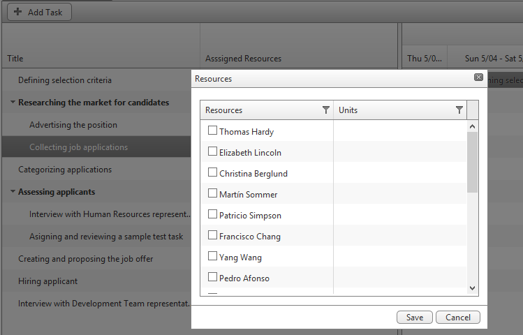
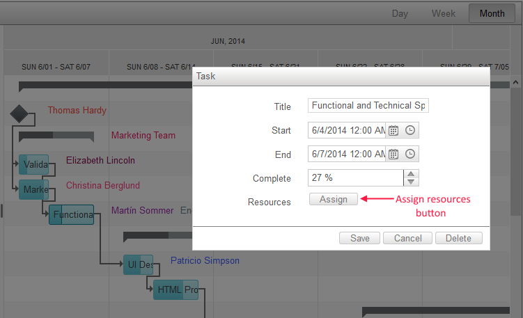

# Resoruces Overview

The following article describes the overall benefit and usage of the __Resources__ of __RadGantt__

## Overview

As from __Q1 2015__ release of the __Telerik UI for ASP.NET AJAX__, the RadGantt control provides full support for __Resources__. Using it, you will able to assign resources to your tasks, which could carry additional information for them. These resources might be people, materials, budget amount or anything else fitting your application. This could be very helpful in scenarios, where you need to associate people with the tasks in a particular project.

The __Resources__ are enabled by setting the __EnableResources__ property of the __RadGantt__ to __true__. Each resource is defined by three fields : __ID, Text and Color__, where the __Color__ is optional. The connection between __Tasks__ and resources is done via __Assignments__. Each assignment is defined by an __ID__, __TaskID__ and __ResourceID__. The assignment can also have a __Units__ value associated with it, describing how much of each resource is taken up by the current task. Another optional column for the Resources is __Format__. This column define the format of the assignment __Units__ and its default value is __percentage("p0")__.

## Visualization

The __Resources__ are displayed next to the task that they are associated with in the __Timeline View__.The resources can also be visualized in the TreeList View with the __GanttResourceColumn__. The resources in the __Timeline View__ could be colorized if the __ColorField__ is defined (see __Figure 1__).

__Figure 1__: RadGantt with colorized Resources.

## Binding Resources

The __RadGantt__ control allows the implementation of the __Resources__ in each of its binding scenarios which are listed below:

* [Declarative Data Binding (SqlDataSource)]()

* [XML Provider Data Binding]()

* [Web Service DataBinding]()

* [Custom EntityFramework Provider Data Binding]()

## Editing Assignments

You can edit each Task’s assignments via a popup editor, which can be opened either by double-clicking on the resource cell in the __TreeList View__ (see __Figure 2__), or through the __Assign__ button in the __Advanced Edit Form__(see __Figure 3__) .

__Figure 2__: Assign Resources Popup.

__Figure 3__: Advanced Edit Form.

# See Also

 * [Resources Online Demo](http://demos.telerik.com/aspnet-ajax-beta/gantt/examples/functionality/resources/defaultcs.aspx)
