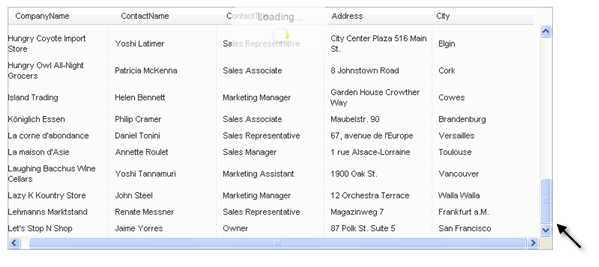

# Virtual Scrolling and Paging


When working with large data sets, it is convenient to use the **RadGrid** paging mechanism. However, for really huge data sets, crawling through pages using only the grid pager may become a hard and boring task for users. For really huge data sets, **RadGrid** allows virtual scrolling.

## Virtual scroll bar

When scrolling with the virtual scroll bar, **RadGrid** can use either standard postbacks or AJAX requests (when AJAX callbacks are enabled using **RadAjaxManager**, **RadAjaxPanel**, or MS **UpdatePanel**). By using AJAX callbacks, the overall behavior is smooth, with no flicker.


To enable virtual scrolling for browsing large record sets,

1. Set the **ClientSettings.Scrolling.AllowScroll** and **ClientSettings.Scrolling.EnableVirtualScrollPaging** properties to **True**.

1. Set the **AllowPaging** and **AllowCustomPaging** properties to **True**. Set the **VirtualItemCount** property to the total number of records in the data source.

1. Bind the grid using the **NeedDataSource** event, and in the event handler, use the **CurrentPageIndex** property to determine which subset of the records to fetch.

````C#
	  <telerik:RadAjaxManager ID="RadAjaxManager1" runat="server">
	    <AjaxSettings>
	      <telerik:AjaxSetting AjaxControlID="RadGrid1">
	        <UpdatedControls>
	          <telerik:AjaxUpdatedControl ControlID="RadGrid1" LoadingPanelID="RadAjaxLoadingPanel1" />
	        </UpdatedControls>
	      </telerik:AjaxSetting>
	    </AjaxSettings>
	  </telerik:RadAjaxManager>
	
	  <telerik:RadAjaxLoadingPanel ID="RadAjaxLoadingPanel1" runat="server" Height="75px"
	    Width="75px" Transparency="25">
	    '
	      style="border: 0;" /></telerik:RadAjaxLoadingPanel>
	
	  <telerik:RadGrid ID="RadGrid1" runat="server" Width="97%" Skin="Silk" AllowSorting="True"
	    AllowPaging="True" PageSize="14" AllowCustomPaging="true" VirtualItemCount="100000"
	    OnNeedDataSource="RadGrid1_NeedDataSource">
	    <PagerStyle Mode="NumericPages" />
	    <MasterTableView TableLayout="Fixed" />
	    <ClientSettings>
	      <Scrolling AllowScroll="True" EnableVirtualScrollPaging="True" UseStaticHeaders="True"
	        SaveScrollPosition="True" />
	    </ClientSettings>
	  </telerik:RadGrid>
````


````C#
	    protected void RadGrid1_NeedDataSource(object source, Telerik.Web.UI.GridNeedDataSourceEventArgs e)
	    {
	        RadGrid1.DataSource = GetDataTable("SELECT [OrderID], [ProductID], [Quantity], [Discount] FROM [LargeOrderDetails] WHERE ID BETWEEN " + RadGrid1.CurrentPageIndex * RadGrid1.PageSize + " AND " + ((RadGrid1.CurrentPageIndex + 1) * RadGrid1.PageSize));
	    }
````
````VB
	    Protected Sub RadGrid1_NeedDataSource(ByVal source As Object, _  ByVal e As GridNeedDataSourceEventArgs) Handles RadGrid1.NeedDataSource
	        RadGrid1.DataSource = GetDataTable("SELECT [OrderID], [ProductID], [Quantity], [Discount] FROM [LargeOrderDetails] WHERE ID BETWEEN " & RadGrid1.CurrentPageIndex * RadGrid1.PageSize & " AND " & ((RadGrid1.CurrentPageIndex + 1) * RadGrid1.PageSize))
	    End Sub
````


## Fetching additional records when the scroll bar reaches its endpoint

Another approach is to trigger an AJAX request to increase the page size when the user drags the scroll bar to the bottom. This is attained with a few lines of javascript and server-side code. Additional data is supplied as long as the rendered rows are less than the entire source record count:


The following steps describe how to achieve this effect:

1. Add a **RadGrid** control to your Web page.

1. vBind it to a data source.

1. Enable **Paging** in the grid, but set the **PagerStyle.Visible** property to **False** so that the pager does not show.

1. Enable Scrolling in the grid. Set the **ClientSettings.Scrolling.ScrollHeight** sufficiently small so that the scroll bar appears when the grid first loads.

1. Add a **RadAjaxManager** and **RadAjaxLoadingPanel** to the Web page.

1. Configure the **RadAjaxManager** so that it lets **RadGrid** initiate AJAX requests. Set **RadGrid** as the control to update in response to those requests, and set the **LoadingPanelID** property for those updates to the ID of the **RadAjaxLoadingPanel**.

1. Add an **AjaxRequest** event handler to the **RadAjaxManager**. In the event handler, increase the **PageSize** property of the **RadGrid** and the call the grid's **Rebind** method. This increases the number of pages that the grid can display.

1. In the ASPX file, Add a **RadCodeBlock** with a javascript function (called "HandleScrolling" in the example below) to triggers an AJAX request when the grid's scroll bar is at the bottom. This AJAX request will cause the **AjaxRequest** event handler that you just added to execute and fetch more records.

1. Assign the javascript function as the event handler for the **OnScroll** client event of the grid.

````C#
	  <telerik:RadCodeBlock ID="RadCodeBlock1" runat="server">
	    <script type="text/javascript">
	      function HandleScrolling(e) {
	        var grid = $find("<%=RadGrid1.ClientID %>");
	        var scrollArea = document.getElementById("<%= RadGrid1.ClientID %>" + "_GridData");
	        if (IsScrolledToBottom(scrollArea)) {
	          var currentlyDisplayedRecords = grid.get_masterTableView().get_pageSize() * (grid.get_masterTableView().get_currentPageIndex() + 1);
	          //if the visible items are less than the entire record count       
	          //trigger an ajax request to increase them    
	          if (currentlyDisplayedRecords < 100)
	          { $find("<%= RadAjaxManager1.ClientID %>").ajaxRequest("LoadMoreRecords"); }
	        }
	      }
	      //calculate when the scroll bar is at the bottom    
	      function IsScrolledToBottom(scrollArea) {
	        var currentPosition = scrollArea.scrollTop + scrollArea.clientHeight;
	        return currentPosition == scrollArea.scrollHeight;
	      } 
	    </script>
	  </telerik:RadCodeBlock>
	  <telerik:RadAjaxManager ID="RadAjaxManager1" runat="server" OnAjaxRequest="RadAjaxManager1_AjaxRequest">
	    <AjaxSettings>
	      <telerik:AjaxSetting AjaxControlID="RadGrid1">
	        <UpdatedControls>
	          <telerik:AjaxUpdatedControl ControlID="RadGrid1" LoadingPanelID="RadAjaxLoadingPanel1" />
	        </UpdatedControls>
	      </telerik:AjaxSetting>
	    </AjaxSettings>
	  </telerik:RadAjaxManager>
	  <telerik:RadAjaxLoadingPanel ID="RadAjaxLoadingPanel1" runat="server" Height="75px"
	    Width="75px" Transparency="25">
	    '
	      style="border: 0;" /></telerik:RadAjaxLoadingPanel>
	
	  <telerik:RadGrid ID="RadGrid1" runat="server" Skin="Silk" DataSourceID="SqlDataSource1"
	    AllowSorting="True" AllowPaging="True" PageSize="15" Width="97%" GridLines="None">
	    <PagerStyle Visible="False" />
	    <MasterTableView Width="99%" TableLayout="Fixed" CommandItemDisplay="None" CurrentResetPageIndexAction="SetPageIndexToFirst"
	      DataSourceID="SqlDataSource1" PageSize="15">
	    </MasterTableView>
	    <ClientSettings>
	      <Scrolling AllowScroll="True" UseStaticHeaders="True" ScrollHeight="100px" />
	      <ClientEvents OnScroll="HandleScrolling" />
	    </ClientSettings>
	  </telerik:RadGrid>
	  <asp:SqlDataSource ID="SqlDataSource1" runat="server" ConnectionString="<%$ ConnectionStrings:NorthwindConnectionString %>"
	    SelectCommand="SELECT * FROM [Customers]"></asp:SqlDataSource>
````


````C#
	    protected void RadAjaxManager1_AjaxRequest(object sender, AjaxRequestEventArgs e)
	    {
	        RadGrid1.PageSize = 10 + RadGrid1.PageSize;
	        RadGrid1.Rebind();
	    }
````
````VB
	
	    Protected Sub RadAjaxManager1_AjaxRequest(ByVal sender As Object, ByVal e As Web.UI.AjaxRequestEventArgs) Handles RadAjaxManager1.AjaxRequest
	        RadGrid1.PageSize = 10 + RadGrid1.PageSize
	        RadGrid1.Rebind()
	    End Sub
	
````


For a live example demonstrating the techniques described above, see [Virtual scrolling and paging](http://demos.telerik.com/aspnet-ajax/Grid/Examples/Client/VirtualScrollPaging/DefaultCS.aspx).
