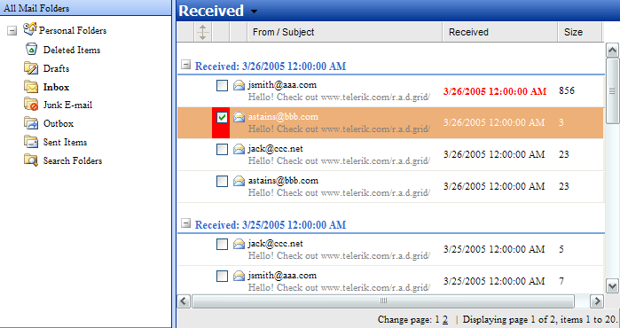

# Conditional Formatting


## 

The object model and events in *RadGrid *provide opportunities for customization and conditional formatting of grid elements. In order to format some data based on column type, you need to use the properties of the respective column. __GridBoundColumn__ for example has __DataFormatString__ property that you can use to format the appearance of the data in the cells of that column.The formatting is based on the general formatting rules in *.NET*, i.e. *Telerik RadGrid *uses internally the __string.Format(string, args )__ function. This way you should just provide the corresponding format string in the __DataFormatString__ property.For example the format string "{0:C}" would format the values in the cells of the column as currency.

The example below shows how to use conditional formatting in a sample mailbox implementation. Selected Items and recently received mail are marked red:



>tabbedCode

````C#
	    protected void RadGrid1_ItemDataBound(object sender, Telerik.Web.UI.GridItemEventArgs e)
	    {
	        //Is it a GridDataItem
	        if (e.Item is GridDataItem)
	        {
	            //Get the instance of the right type
	            GridDataItem dataBoundItem = e.Item as GridDataItem;
	
	            //Check the formatting condition
	            if (int.Parse(dataBoundItem["Size"].Text) > 100)
	            {
	                dataBoundItem["Received"].ForeColor = Color.Red;
	                dataBoundItem["Received"].Font.Bold = true;
	                //Customize more...
	            }
	        }
	    }
````
````VB.NET
	    Protected Sub RadGrid1_ItemDataBound(ByVal sender As Object, ByVal e As Telerik.Web.UI.GridItemEventArgs)
	        'Is it a GridDataItem
	        If (TypeOf (e.Item) Is GridDataItem) Then
	            'Get the instance of the right type
	            Dim dataBoundItem As GridDataItem = e.Item
	
	            'Check the formatting condition
	            If (Integer.Parse(dataBoundItem("Size").Text) > GridItemType.Footer) Then
	                dataBoundItem("Received").ForeColor = Color.Red
	                dataBoundItem("Received").Font.Bold = True
	                'Customize more...
	            End If
	        End If
	    End Sub
````
>end

>note When you apply Skin for the grid the custom style attributes set for the some of the grid rows will be overridden by the skin definitions. If you want to customize the appearance for some of the grid rows when Skin is assigned to the control, you will need to define your own CssClass for the corresponding row and apply the style preferences in its body.>
>


Below is an example which will alter the look and feel for items which has text __Mexico__ in their __Country__ column:

````XML
	  <pre xmlns="http://ddue.schemas.microsoft.com/authoring/2003/5">
	<style type="text/css">
	  .MyMexicoRowClass
	  {
	    background-color: aqua;
	    font-size: 16px;
	    font-family: Arial;
	  }
	</style>        </pre>
````


And in the code-behind:

>tabbedCode

````C#
	    protected void RadGrid1_ItemDataBound(object sender, Telerik.Web.UI.GridItemEventArgs e)
	    {
	        if (e.Item is GridDataItem)
	        {
	            GridDataItem dataItem = e.Item as GridDataItem;
	            if (dataItem["Country"].Text == "Mexico")
	                dataItem.CssClass = "MyMexicoRowClass";
	        }
	    }
````
````VB.NET
	    Protected Sub RadGrid1_ItemDataBound(ByVal sender As Object, ByVal e As Telerik.Web.UI.GridItemEventArgs) Handles RadGrid1.ItemDataBound
	        If (TypeOf e.Item Is GridDataItem) Then
	            Dim dataItem As GridDataItem = CType(e.Item, GridDataItem)
	            If (dataItem("Country").Text = "Mexico") Then
	                dataItem.CssClass = "MyMexicoRowClass"
	            End If
	        End If
	    End Sub
````
>end
