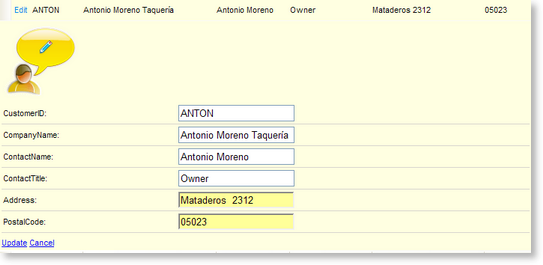

# Customizing Row Appearance


>note When you apply one of the external grid skins shipped with the installation, you will need to alter the corresponding classes inside the Skins/[Skins_Name]/[Control].[SkinName].css file (see[ this documentation topic]()for more details). This article information is applicable when you prefer not to use the skinning mechanism of Telerik RadGrid (choosing Skin="").
>


## Normal Item

These are the odd rows of the grid (rows 1 and 3 on the picture below).The appearance of the normal rows is controlled by the ItemStyle property.

## Alternating Item

These are the even rows of the grid (rows 2 and 4 on the picture below).The appearance of the alternating rows is controlled by the **AlternatingItemStyle** property.


You can set the appearance of the normal and alternating rows programmatically or in the grid declaration:

**Example:**


````ASP.NET
<telerik:RadGrid runat="server" ... />
<AlternatingItemStyle BackColor="Orange" ... />
<ItemStyle BackColor="White" ... />
````
````VB
Dim RadGrid1 As RadGrid = New RadGrid()
RadGrid1.AlternatingItemStyle.BackColor = Color.Orange
RadGrid1.ItemStyle.BackColor = Color.White
````
````C#
RadGrid RadGrid1 = new RadGrid();
RadGrid1.AlternatingItemStyle.BackColor = Color.Orange;
RadGrid1.ItemStyle.BackColor = Color.White;
````


## Selected Item

You can customize the appearance of the selected row, using the **SelectedItemStyle** property:

````ASP.NET
<style type="text/css">
 .SelectedItem
 {
  background-image: url(img/SelectedRow.gif);
  background-repeat: no-repeat;
  background-position: top right;
 }
</style>

<telerik:radgrid id="RadGrid1" cssclass="RadGrid" runat="server" allowpaging="True" allowsorting="True"
 pagesize="10" width="95%" showfooter="True" allowmultirowselection="True">
...
 <selecteditemstyle CssClass="SelectedItem"></selecteditemstyle>
 <mastertableview Width="100%" CssClass="MasterTable" style="border-collapse:separate;">
  <rowindicatorcolumn uniquename="RowIndicator">
   <headerstyle width="20px"></headerstyle>
  </rowindicatorcolumn>
  <columns>
   <telerik:gridtemplatecolumn groupable="False" uniquename="TemplateColumn">
    <headerstyle width="20px"></headerstyle>
    <ItemStyle CssClass="ResizeItem"></ItemStyle>
    <itemtemplate>
     <asp:checkbox id="CheckBox1" autopostback="False" runat="server"></asp:checkbox>
    </itemtemplate>
   </telerik:gridtemplatecolumn>
  </columns>
  <expandcollapsecolumn buttontype="ImageButton" visible="False" uniquename="ExpandColumn">
   <headerstyle width="19px"></headerstyle>
  </expandcollapsecolumn>
 </mastertableview>
</telerik:radgrid>         
````


## Edit Item

You can customize the appearance of the selected row, using the **EditItemStyle** property:

````ASP.NET
	        <style type="text/css">
	 .EditedItem, .EditedItem TABLE TR
	 {
	  background-color: #ffffe1;
	  background-image: none;
	 }
	 .EditRow TD
	 {
	  border-bottom: 1px solid #d9d6cf;
	 }
	</style>
	
	<telerik:RadGrid id="RadGrid1" CssClass="RadGrid" runat="server" AllowPaging="True" AllowSorting="True" PageSize="10" Width="95%" ShowFooter="True" GridLines="None">
	 <Columns>
	  <telerik:GridEditCommandColumn ButtonType="LinkButton" UpdateText="Update" CancelText="Cancel" EditText="Edit">
	   <HeaderStyle Width="37px"></HeaderStyle>
	   <ItemStyle CssClass="ResizeItem"></ItemStyle>
	  </telerik:GridEditCommandColumn>
	 </Columns>
	 <EditItemStyle CssClass="EditedItem" Height="25px"></EditItemStyle>
	 <MasterTableView>
	  <EditFormSettings CaptionFormatString=''>
	   <FormMainTableStyle GridLines="None" CellSpacing="0" CellPadding="3" Width="100%" CssClass="none"/>
	    <FormTableStyle CssClass="EditRow" CellSpacing="0" BorderColor="#c4c0b5" CellPadding="2" Width="100%"/>
	    <FormStyle Width="100%" BackColor="#ffffe1"></FormStyle>
	  </EditFormSettings>
	 </MasterTableView>
	</telerik:RadGrid>
	         
````



