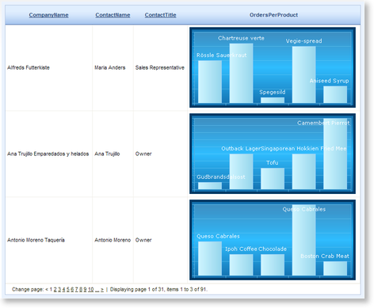

# RadChart in RadGrid column


## 

[This example](http://demos.telerik.com/aspnet-ajax/Controls/Examples/Integration/GridAndChart/ChartInGrid/DefaultCS.aspx?product=grid) demonstrates how to embed RadChart instances in template column of RadGrid. The data source of the charts is set in the ItemDataBound event handler of the grid depending on the corresponding item's data. This is especially useful when you want to display a diagram showing summarized graphical information for each record in the grid table.



Here are the code snippets extracted from the online demo:


````ASPNET
	        <asp:ScriptManager ID="ScriptManager1" runat="server">
	        </asp:ScriptManager>
	        <telerik:RadAjaxManager ID="RadAjaxManager1" runat="server" DefaultLoadingPanelID="RadAjaxLoadingPanel1">
	            <AjaxSettings>
	                <telerik:AjaxSetting AjaxControlID="RadGrid1">
	                    <UpdatedControls>
	                        <telerik:AjaxUpdatedControl ControlID="RadGrid1" />
	                    </UpdatedControls>
	                </telerik:AjaxSetting>
	            </AjaxSettings>
	        </telerik:RadAjaxManager>
	        <telerik:RadAjaxLoadingPanel ID="RadAjaxLoadingPanel1" runat="server"> 
	        </telerik:RadAjaxLoadingPanel>
	        <telerik:Header runat="server" ID="Header1" NavigationLanguage="C#"></telerik:Header>
	        <!-- content start -->
	        <telerik:RadGrid ID="RadGrid1" runat="server" DataSourceID="SqlDataSource1" GridLines="None"
	            OnItemDataBound="RadGrid1_ItemDataBound" AllowPaging="True" PageSize="3"
	            Width="750px" AllowSorting="True">
	            <MasterTableView DataSourceID="SqlDataSource1" AutoGenerateColumns="False" DataKeyNames="CustomerID">
	                <Columns>
	                    <telerik:GridBoundColumn DataField="CompanyName" HeaderText="CompanyName" SortExpression="CompanyName"
	                        UniqueName="CompanyName">
	                    </telerik:GridBoundColumn>
	                    <telerik:GridBoundColumn DataField="ContactName" HeaderText="ContactName" SortExpression="ContactName"
	                        UniqueName="ContactName">
	                    </telerik:GridBoundColumn>
	                    <telerik:GridBoundColumn DataField="ContactTitle" HeaderText="ContactTitle" SortExpression="ContactTitle"
	                        UniqueName="ContactTitle">
	                    </telerik:GridBoundColumn>
	                    <telerik:GridTemplateColumn DataField="CustomerID" UniqueName="ChartColumn" HeaderText="OrdersPerProduct">
	                        <ItemTemplate>
	                            <telerik:RadChart ID="RadChart1" runat="server" Width="350" Height="170"
	                                ChartTitle-Visible="false" DataSourceID="SqlDataSource2" CreateImageMap="false">
	                                <Series>
	                                    <telerik:ChartSeries Name="Orders" DataYColumn="quantity" DataLabelsColumn="pName">
	                                    </telerik:ChartSeries>
	                                </Series>
	                                <PlotArea Appearance-Dimensions-Margins="10,10,10,10" />
	                                <Legend Visible="false"></Legend>
	                            </telerik:RadChart>
	                        </ItemTemplate>
	                    </telerik:GridTemplateColumn>
	                </Columns>
	            </MasterTableView>
	            <PagerStyle Mode="NextPrevAndNumeric" />
	        </telerik:RadGrid>
	        <asp:SqlDataSource ID="SqlDataSource1" runat="server" ConnectionString="<%$ ConnectionStrings:NorthwindConnectionString %>"
	            SelectCommand="SELECT [CustomerID], [CompanyName], [ContactName], [ContactTitle] FROM [Customers]">
	        </asp:SqlDataSource>
	        <asp:SqlDataSource ID="SqlDataSource2" runat="server" ConnectionString="<%$ ConnectionStrings:NorthwindConnectionString %>"
	            SelectCommand="SELECT top 5 p.ProductName as pName, p.ProductID as pID, od.Quantity as quantity FROM orders as o, [order details] as od, products as p 
	                           WHERE od.ProductID = p.ProductID and od.OrderID = o.OrderID and CustomerID = @CustomerID">
	            <SelectParameters>
	                <asp:Parameter Name="CustomerID" />
	            </SelectParameters>
	        </asp:SqlDataSource>
````
````C#
	    protected void RadGrid1_ItemDataBound(object sender, GridItemEventArgs e)
	    {
	        if (e.Item is GridDataItem)
	        {
	            GridDataItem item = e.Item as GridDataItem;
	            RadChart chart = item["ChartColumn"].FindControl("RadChart1") as RadChart;
	            SqlDataSource2.SelectParameters[0].DefaultValue = item.GetDataKeyValue("CustomerID").ToString();
	            chart.DataSource = SqlDataSource2.Select(DataSourceSelectArguments.Empty);
	            chart.DataBind();
	        }
	    }
````
````VB.NET
	    Protected Sub RadGrid1_ItemDataBound(ByVal sender As Object, ByVal e As GridItemEventArgs)
	        If TypeOf e.Item Is GridDataItem Then
	            Dim item As GridDataItem = TryCast(e.Item, GridDataItem)
	            Dim chart As RadChart = TryCast(item("ChartColumn").FindControl("RadChart1"), RadChart)
	            SqlDataSource2.SelectParameters(0).DefaultValue = item.GetDataKeyValue("CustomerID").ToString()
	            chart.DataSource = SqlDataSource2.Select(DataSourceSelectArguments.Empty)
	            chart.DataBind()
	        End If
	    End Sub
````

