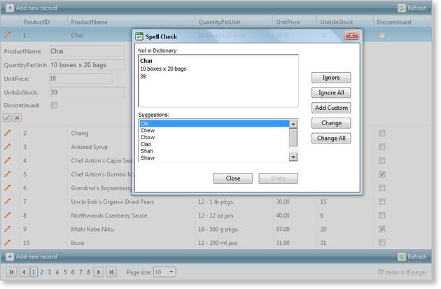

# Spell Check RadGrid Editors


## 

[This demo](http://demos.telerik.com/aspnet-ajax/controls/examples/integration/gridandspell/defaultcs.aspx?product=grid) illustrates how to spell check text input fields in RadGrid's edit form using RadSpell. This is useful when you would like to notify the end user when there are spelling mistakes in the text editor fields he/she uses to update/insert grid records.

The key moments are:

* Attach a client script to the "Update" button in the grid's edit form (using asp HiddenField to store its id for this purpose).

* Take advantage of RadSpell.ControlsToCheck property, add the ClientID's of all the textbox editors that should be checked.

* Call the startSpellCheck() client method of RadSpell to check the specified input controls.

* Raise a flag when the check is finished to update/insert the data.

Additionally, the grid and spell components are ajaxified using RadAjaxManager instance to perform the data editing operations with asynchronous requests. Here are the relevant code snippets from the online demo:


````JavaScript
	
	    <telerik:RadCodeBlock ID="RadCodeBlock1" runat="server">    
	    //boolean flag which determines whether the spell check has been processed or not  
	    var IsChecked = false;
	    //starts the spell check operation   
	    function StartCheck() {
	      if (!IsChecked) {
	        var spell = $find('<%= RadSpell1.ClientID %>');
	        spell.startSpellCheck(); return false;
	      } else { return true; } 
	    }
	    function SpellCheckFinished(sender, args) {
	      IsChecked = true;
	    }
	    function SpellCheckClosed(sender, args) {
	      if (IsChecked) {
	        //trigger submit from the update/insert button in the grid      
	        //the id of the update or insert button is extracted from a hidden field   
	        var buttonID = document.getElementById('<%=HiddenField1.ClientID %>').value;
	        document.getElementById(buttonID).click(); IsChecked = false;
	      } 
	    }
	    </telerik:RadCodeBlock>
````
````ASPNET
	  <telerik:RadAjaxManager ID="RadAjaxManager1" runat="server" EnableAJAX="true">
	    <AjaxSettings>
	      <telerik:AjaxSetting AjaxControlID="RadGrid1">
	        <UpdatedControls>
	          <telerik:AjaxUpdatedControl ControlID="RadGrid1" LoadingPanelID="RadAjaxLoadingPanel1" />
	          <telerik:AjaxUpdatedControl ControlID="RadSpell1" />
	          <telerik:AjaxUpdatedControl ControlID="HiddenField1" />
	          <telerik:AjaxUpdatedControl ControlID="lblMessage" />
	        </UpdatedControls>
	      </telerik:AjaxSetting>
	    </AjaxSettings>
	  </telerik:RadAjaxManager>
	  <telerik:RadAjaxLoadingPanel ID="RadAjaxLoadingPanel1" runat="server" />
	  <asp:HiddenField ID="HiddenField1" runat="server" />
	  <telerik:RadSpell ID="RadSpell1" runat="server" ButtonType="None" OnClientDialogClosed="SpellCheckClosed"
	    OnClientCheckFinished="SpellCheckFinished" />
	  <telerik:RadGrid ID="RadGrid2" runat="server" Width="100%" DataSourceID="SqlDataSource1"
	    AllowAutomaticInserts="true" AllowAutomaticUpdates="true" OnItemCreated="RadGrid1_ItemCreated"
	    OnColumnCreated="RadGrid1_ColumnCreated" OnItemUpdated="RadGrid1_ItemUpdated" OnItemInserted="RadGrid1_ItemInserted">
	    <MasterTableView AllowSorting="true" PageSize="10" AllowPaging="True" Width="100%"
	      DataKeyNames="ProductID" DataSourceID="SqlDataSource1" CommandItemDisplay="TopAndBottom">
	      <Columns>
	        <telerik:GridEditCommandColumn ButtonType="ImageButton" />
	      </Columns>
	      <EditFormSettings>
	        <EditColumn ButtonType="ImageButton" />
	      </EditFormSettings>
	    </MasterTableView></telerik:RadGrid><asp:Label ID="lblMessage" runat="server" EnableViewState="false" /><br />
	  <asp:SqlDataSource ID="SqlDataSource1" runat="server" ConnectionString="<%$ ConnectionStrings:NorthwindConnectionString %>"
	    SelectCommand="SELECT ProductID, ProductName, QuantityPerUnit, UnitPrice, UnitsInStock, Discontinued FROM [Products]"
	    InsertCommand="INSERT INTO Products(ProductName, QuantityPerUnit, UnitPrice, UnitsInStock, Discontinued) VALUES (@ProductName, @QuantityPerUnit, @UnitPrice, @UnitsInStock, @Discontinued)"
	    UpdateCommand="UPDATE [Products] SET [ProductName] = @ProductName, [QuantityPerUnit] = @QuantityPerUnit, [UnitPrice] = @UnitPrice, [UnitsInStock] = @UnitsInStock, [Discontinued] = @Discontinued WHERE [ProductID] = @ProductID">
	    <UpdateParameters>
	      <asp:Parameter Name="ProductName" Type="String" />
	      <asp:Parameter Name="QuantityPerUnit" Type="String" />
	      <asp:Parameter Name="UnitPrice" Type="Decimal" />
	      <asp:Parameter Name="UnitsInStock" Type="Int16" />
	      <asp:Parameter Name="Discontinued" Type="Boolean" />
	    </UpdateParameters>
	    <InsertParameters>
	      <asp:Parameter Name="ProductName" Type="String" />
	      <asp:Parameter Name="QuantityPerUnit" Type="String" />
	      <asp:Parameter Name="UnitPrice" Type="Decimal" />
	      <asp:Parameter Name="UnitsInStock" Type="Int16" />
	      <asp:Parameter Name="Discontinued" Type="Boolean" />
	    </InsertParameters>
	  </asp:SqlDataSource>
````
````C#
	
	
	    protected void RadGrid1_ItemCreated(object sender, GridItemEventArgs e)
	    {
	        if (e.Item is GridEditableItem && e.Item.IsInEditMode)
	        {
	            GridEditableItem editedItem = e.Item as GridEditableItem;
	            GridEditManager editMan = editedItem.EditManager;
	            ImageButton actionButton;
	            //insert mode      
	            if (editedItem.OwnerTableView.IsItemInserted)
	            {
	                actionButton = editedItem.FindControl("PerformInsertButton") as ImageButton;
	            }
	            //edit mode 
	            else
	            {
	                actionButton = editedItem.FindControl("UpdateButton") as ImageButton;
	            }
	            actionButton.OnClientClick = "return StartCheck();";
	            HiddenField1.Value = actionButton.ClientID;
	            Stack controlsToCheck = new Stack();
	            int index = 0;
	            foreach (GridColumn column in editedItem.OwnerTableView.RenderColumns)
	            {
	                if (column is IGridEditableColumn && column.IsEditable)
	                {
	                    IGridColumnEditor editor = editMan.GetColumnEditor(column as IGridEditableColumn);
	                    if (editor is GridTextBoxColumnEditor)
	                    {
	                        string editorID = (editor as GridTextBoxColumnEditor).TextBoxControl.ClientID;
	                        controlsToCheck.Push(editorID);
	                        index++;
	                    }
	                }
	            }
	            RadSpell1.ControlsToCheck = new string[index];
	            while (controlsToCheck.Count > 0)
	            {
	                RadSpell1.ControlsToCheck.SetValue(controlsToCheck.Pop(), controlsToCheck.Count);
	            }
	            RadSpell1.IsClientID = true;
	        }
	    }
	    protected void RadGrid1_ColumnCreated(object sender, GridColumnCreatedEventArgs e)
	    {
	        //make the product id column read-only  
	        if (e.Column.IsBoundToFieldName("ProductID"))
	        {
	            (e.Column as GridBoundColumn).ReadOnly = true;
	        }
	    }
	    protected void RadGrid1_ItemUpdated(object source, Telerik.Web.UI.GridUpdatedEventArgs e)
	    {
	        GridEditableItem item = (GridEditableItem)e.Item;
	        String id = item.GetDataKeyValue("ProductID").ToString();
	
	        if (e.Exception != null)
	        {
	            e.KeepInEditMode = true;
	            e.ExceptionHandled = true;
	            SetMessage("Product with ID " + id + " cannot be updated. Reason: " + e.Exception.Message);
	        }
	        else
	        {
	            SetMessage("Product with ID " + id + " is updated!");
	        }
	    }
	    protected void RadGrid1_ItemInserted(object source, GridInsertedEventArgs e)
	    {
	        if (e.Exception != null)
	        {
	            e.ExceptionHandled = true;
	            SetMessage("Product cannot be inserted. Reason: " + e.Exception.Message);
	        }
	        else
	        {
	            SetMessage("New product is inserted!");
	        }
	    }
	    private void SetMessage(string message)
	    {
	        lblMessage.Text = message;
	    }
	
````
````VB.NET
	
	    Protected Sub RadGrid1_ItemCreated(ByVal sender As Object, ByVal e As GridItemEventArgs) Handles RadGrid1.ItemCreated
	        If TypeOf e.Item Is GridEditableItem AndAlso e.Item.IsInEditMode Then
	            Dim editedItem As GridEditableItem = TryCast(e.Item, GridEditableItem)
	            Dim editMan As GridEditManager = editedItem.EditManager
	            Dim actionButton As ImageButton
	            'insert mode            
	            If editedItem.OwnerTableView.IsItemInserted Then
	                actionButton = TryCast(editedItem.FindControl("PerformInsertButton"), ImageButton)
	            Else
	                'edit mode         
	                actionButton = TryCast(editedItem.FindControl("UpdateButton"), ImageButton)
	            End If
	            actionButton.OnClientClick = "return StartCheck();"
	            HiddenField1.Value = actionButton.ClientID
	            Dim controlsToCheck As New Stack()
	            Dim index As Integer = 0
	            For Each column As GridColumn In editedItem.OwnerTableView.RenderColumns
	                If TypeOf column Is IGridEditableColumn AndAlso column.IsEditable Then
	                    Dim editor As IGridColumnEditor = editMan.GetColumnEditor(TryCast(column, IGridEditableColumn))
	                    If TypeOf editor Is GridTextBoxColumnEditor Then
	                        Dim editorID As String = TryCast(editor, GridTextBoxColumnEditor).TextBoxControl.ClientID
	                        controlsToCheck.Push(editorID)
	                        index += 1
	                    End If
	                End If
	            Next
	            RadSpell1.ControlsToCheck = New String(index - 1) {}
	            While controlsToCheck.Count > 0
	                RadSpell1.ControlsToCheck.SetValue(controlsToCheck.Pop(), controlsToCheck.Count)
	            End While
	            RadSpell1.IsClientID = True
	        End If
	    End Sub
	
	    Protected Sub RadGrid1_ColumnCreated(ByVal sender As Object, ByVal e As GridColumnCreatedEventArgs) Handles RadGrid1.ColumnCreated
	        'make the product id column read-only 
	        If e.Column.IsBoundToFieldName("ProductID") Then
	            TryCast(e.Column, GridBoundColumn).ReadOnly = True
	        End If
	    End Sub
	
	    Protected Sub RadGrid1_ItemUpdated(ByVal source As Object, ByVal e As Telerik.Web.UI.GridUpdatedEventArgs) Handles RadGrid1.ItemUpdated
	        Dim item As GridEditableItem = DirectCast(e.Item, GridEditableItem)
	        Dim id As [String] = item.GetDataKeyValue("ProductID").ToString()
	        If e.Exception IsNot Nothing Then
	            e.KeepInEditMode = True
	            e.ExceptionHandled = True
	            SetMessage("Product with ID " + id + " cannot be updated. Reason: " + e.Exception.Message)
	        Else
	            SetMessage("Product with ID " + id + " is updated!")
	        End If
	    End Sub
	
	Protected Sub RadGrid1_ItemInserted(ByVal source As Object, ByVal e As GridInsertedEventArgs) Handles 
	        RadGrid1.ItemInserted()
	        If e.Exception IsNot Nothing Then
	            e.ExceptionHandled = True
	            SetMessage("Product cannot be inserted. Reason: " + e.Exception.Message)
	        Else
	            SetMessage("New product is inserted!")
	        End If
	    End Sub
	    Private Sub SetMessage(ByVal message As String)
	        lblMessage.Text = message
	    End Sub
	
````

