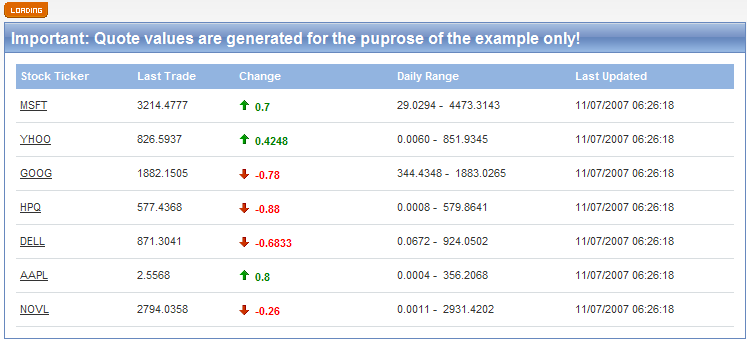

# Server Binding


## 

The following code snippet demonstrates how RadGrid can be integrated with the ASP.NET AJAX framework. The example features the following components:

* RadGrid - displays the stock quote data.

* ASP.NET AJAX UpdatePanel -- wraps the grid control and performs the Ajax requests.

* ASP.NET AJAX UpdateProgress -- responsible for the visual indication on the client-side of an ongoing Ajax request.

* ASP.NET AJAX Timer -- triggers the Ajax requests for data refresh on a regular interval.

The grid is bound via an ObjectDataSource control that returns a dataset with the respective quote data. The ObjectDataSource implementation internally uses WebService calls to handle the data retrieval. When the WebService is called for the first time it establishes a connection to a website (finance.yahoo.com) and gets some real-world data that will be used as a starting point for the sample application. The quote data is then persisted locally in an xml file for later use and a resultant dataset is generated from the same xml file. For consequent calls to the WebService (essentially triggered by the timer component on the client-side) no data is downloaded from the Internet but the data from the xml is modified locally to simulate stock quote rate changes; then it is persisted again in the same xml file and a resultant dataset is returned to the ObjectDataSource instance.

The example can be easily extended to use real data by supplying a different DataSet in the StockQuoteService.GetStockQuotes(...) WebService method.




````JavaScript
	    Sys.WebForms.PageRequestManager.getInstance().add_endRequest(endRequest);
	    function endRequest(sender, e) {
	      if (e.get_error()) {
	        debug.trace("[" + new Date().toLocaleTimeString() + "] An error occurred while processing the request on the server. Please try again later.");
	        e.set_errorHandled(true);
	      }
	    }
	    Sys.Application.notifyScriptLoaded();
````
````XML
	  <?xml version="1.0" encoding="utf-8" ?>
	  <quotes>  
	      <quote stockTicker="MSFT" lastTrade="29.0294" change="-0.4596" lastUpdated="12/20/2006 17:07:52" dailyMaxRange="30.24" dailyMinRange="29.0294" />  
	      <quote stockTicker="YHOO" lastTrade="26.2045" change="0.3" lastUpdated="12/20/2006 17:07:52" dailyMaxRange="26.31" dailyMinRange="25.3645" />  
	      <quote stockTicker="GOOG" lastTrade="467.5230" change="0.5" lastUpdated="12/20/2006 17:07:52" dailyMaxRange="471.50" dailyMinRange="467.0230" />  
	      <quote stockTicker="HPQ" lastTrade="40.3625" change="-0.5550" lastUpdated="12/20/2006 17:07:52" dailyMaxRange="41.742" dailyMinRange="40.35" />  
	      <quote stockTicker="DELL" lastTrade="25.8672" change="-0.4" lastUpdated="12/20/2006 17:07:52" dailyMaxRange="26.3650" dailyMinRange="25.4050" />  
	      <quote stockTicker="AAPL" lastTrade="87.6258" change="-0.3790" lastUpdated="12/20/2006 17:07:52" dailyMaxRange="88.7048" dailyMinRange="85.76" />  
	      <quote stockTicker="NOVL" lastTrade="3.5758" change="-0.166" lastUpdated="12/20/2006 17:07:52" dailyMaxRange="6.14" dailyMinRange="3.5758" />
	  </quotes>
````
````ASPNET
	  <asp:ScriptManager ID="ScriptManager1" runat="server">
	    <Scripts>
	      <asp:ScriptReference Path="~/Scripts/TraceUtils.js" />
	    </Scripts>
	  </asp:ScriptManager>
	  <div style="height: 20px">
	    <asp:UpdateProgress ID="UpdateProgress1" runat="server" AssociatedUpdatePanelID="UpdatePanel1"
	      DisplayAfter="0">
	      <ProgressTemplate>
	        
	      </ProgressTemplate>
	    </asp:UpdateProgress>
	  </div>
	  <div style="height: auto;">
	    <asp:UpdatePanel ID="UpdatePanel1" runat="server">
	      <ContentTemplate>
	        <asp:Timer ID="Timer1" runat="server" Interval="3000" OnTick="Timer1_Tick">
	        </asp:Timer>
	        <div class="quotes">
	          Important: Quote values are generated for the puprose of the example only!</div>
	        <telerik:RadGrid ID="RadGrid1" runat="server" Width="718px" Skin="Web20" AutoGenerateColumns="False"
	          DataSourceID="ObjectDataSource1" HorizontalAlign="NotSet" GridLines="none" OnItemDataBound="RadGrid1_ItemDataBound">
	          <MasterTableView DataSourceID="ObjectDataSource1">
	            <Columns>
	              <telerik:GridHyperLinkColumn DataTextField="StockTicker" DataNavigateUrlFields="StockTicker"
	                UniqueName="StockTicker" HeaderText="Stock Ticker" DataNavigateUrlFormatString="http://ddue.schemas.microsoft.com/authoring/2003/5" />
	              <telerik:GridBoundColumn DataField="LastTrade" UniqueName="LastTrade" HeaderText="Last Trade" />
	              <telerik:GridTemplateColumn UniqueName="Change" HeaderText="Change">
	                <ItemTemplate>
	                  <asp:Image ID="DirectionImage" runat="server" />&nbsp;
	                  <asp:Label ID="ChangeLabel" runat="server" Style="font-weight: bold;" Text='<%# Eval("Change") %>' />
	                </ItemTemplate>
	                <ItemStyle Width="150px" />
	              </telerik:GridTemplateColumn>
	              <telerik:GridTemplateColumn UniqueName="DailyRange" HeaderText="Daily Range" FilterImageUrl=""
	                SortAscImageUrl="" SortDescImageUrl="">
	                <ItemTemplate>
	                  <asp:Label ID="DailyMinLabel" runat="server" Text='<%# Eval("DailyMinRange") %>' />&nbsp;-&nbsp;
	                  <asp:Label ID="DailyMaxLabel" runat="server" Text='<%# Eval("DailyMaxRange") %>' />
	                </ItemTemplate>
	              </telerik:GridTemplateColumn>
	              <telerik:GridBoundColumn DataField="LastUpdated" UniqueName="LastUpdated" HeaderText="Last Updated"
	                FilterImageUrl="" SortAscImageUrl="" SortDescImageUrl="" />
	            </Columns>
	            <EditFormSettings>
	              <EditColumn CancelImageUrl="" EditImageUrl="" FilterImageUrl="" InsertImageUrl=""
	                SortAscImageUrl="" SortDescImageUrl="" UpdateImageUrl="">
	              </EditColumn>
	            </EditFormSettings>
	            <ExpandCollapseColumn CollapseImageUrl="" ExpandImageUrl="" FilterImageUrl="" SortAscImageUrl=""
	              SortDescImageUrl="" Visible="False">
	              <HeaderStyle Width="19px" />
	            </ExpandCollapseColumn>
	            <RowIndicatorColumn FilterImageUrl="" SortAscImageUrl="" SortDescImageUrl="" Visible="False">
	              <HeaderStyle Width="20px" />
	            </RowIndicatorColumn>
	          </MasterTableView>
	        </telerik:RadGrid><asp:ObjectDataSource ID="ObjectDataSource1" runat="server" SelectMethod="GetData"
	          TypeName="QuoteHelper" OldValuesParameterFormatString="original_{0}"></asp:ObjectDataSource>
	      </ContentTemplate>
	    </asp:UpdatePanel>
	  </div>
````
````C#
	
	
	    protected void Timer1_Tick(object sender, EventArgs e)
	    {
	        RadGrid1.Rebind();
	    }
	    protected void RadGrid1_ItemDataBound(object sender, GridItemEventArgs e)
	    {
	        if (e.Item is GridDataItem)
	        {
	            GridDataItem item = (GridDataItem)e.Item;
	            TableCell cell = item["Change"];
	            Image directionImage = (Image)cell.FindControl("DirectionImage");
	            Label changeText = (Label)cell.FindControl("ChangeLabel");
	            Decimal change = Decimal.Parse(((DataRowView)e.Item.DataItem).Row["Change"].ToString(), CultureInfo.InvariantCulture);
	            if (change > 0)
	            {
	                directionImage.ImageUrl = "Images/up.gif";
	                changeText.Style["color"] = "green";
	            }
	            else if (change < 0)
	            {
	                directionImage.ImageUrl = "Images/down.gif";
	                changeText.Style["color"] = "red";
	            }
	            else
	            {
	                directionImage.Visible = false;
	            }
	        }
	    }
	
````
````VB.NET
	
	
	    Protected Sub Timer1_Tick(ByVal sender As Object, ByVal e As EventArgs)
	        RadGrid1.Rebind()
	    End Sub
	    'Timer1_Tick
	    Protected Sub RadGrid1_ItemDataBound(ByVal sender As Object, ByVal e As GridItemEventArgs)
	        If TypeOf e.Item Is GridDataItem Then
	            Dim item As GridDataItem = CType(e.Item, GridDataItem)
	            Dim cell As TableCell = item("Change")
	            Dim directionImage As System.Web.UI.WebControls.Image = CType(cell.FindControl("DirectionImage"), System.Web.UI.WebControls.Image)
	            Dim changeText As Label = CType(cell.FindControl("ChangeLabel"), Label)
	            Dim change As [Decimal] = [Decimal].Parse(CType(e.Item.DataItem, DataRowView).Row("Change").ToString(), CultureInfo.InvariantCulture)
	            If change > 0 Then
	                directionImage.ImageUrl = "Images/up.gif"
	                changeText.Style("color") = "green"
	            ElseIf change < 0 Then
	                directionImage.ImageUrl = "Images/down.gif"
	                changeText.Style("color") = "red"
	            Else
	                directionImage.Visible = False
	            End If
	        End If
	    End Sub
	
````

