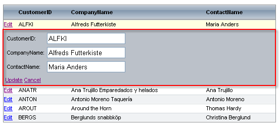

# Edit Forms


To display the grid column editors in an auto-generated form when the grid switches into edit mode, set the table view's **EditMode** property to "EditForms" or "PopUp".

When **EditMode** is "EditForms", the edit form appears immediately below the item that is being edited:

````ASPNET
	  <telerik:RadGrid ID="RadGrid1" runat="server" DataSourceID="SqlDataSource1">
	    <MasterTableView EditMode="EditForms" DataSourceID="SqlDataSource1">
	      <Columns>
	        <telerik:GridEditCommandColumn />
	      </Columns>
	    </MasterTableView>
	  </telerik:RadGrid>
````




When **EditMode** is "PopUp", the edit form appears in a popup window above the grid:

````ASPNET
	  <telerik:RadGrid ID="RadGrid1" runat="server" DataSourceID="SqlDataSource1">
	    <MasterTableView EditMode="PopUp" DataSourceID="SqlDataSource1">
	      <Columns>
	        <telerik:GridEditCommandColumn />
	      </Columns>
	    </MasterTableView>
	  </telerik:RadGrid>
````


To limit the number of characters the user can enter in the text box editor of the edit form, set the **MaxLength** property of the column.

## GridItem type for edit mode

When **EditMode** is "EditForms" or "PopUp", the grid row is of type **GridDataItem** in regular mode but not in edit mode. In event handlers such as the **ItemCreated** event (for example), you can cast the item to **GridEditableItem** (a base class of **GridDataItem**) when the item is in edit mode:


````C#
	private void RadGrid1_ItemCreated(object sender, Telerik.Web.UI.GridItemEventArgs e)
	{   
	    if(e.Item is GridDataItem)   
	    {    
	        //the item is in regular mode 
	        GridDataItem dataItem = e.Item as GridDataItem;   
	        //do something here 
	    }
	    else if (e.Item is GridEditableItem && e.Item.IsInEditMode)
	    {   
	        //the item is in edit mode    
	        GridEditableItem editedItem = e.Item as GridEditableItem;    
	        //do something here  
	    }
	}			
````
````VB.NET
	    Private Sub RadGrid1_ItemCreated(ByVal sender As Object, ByVal e As Telerik.Web.UI.GridItemEventArgs) Handles RadGrid1.ItemCreated
	        If (TypeOf e.Item Is GridDataItem) Then
	            'the item is in regular mode 
	            Dim dataItem As GridDataItem = CType(e.Item, GridDataItem)
	            'do something here 
	        ElseIf (TypeOf e.Item Is GridEditableItem AndAlso e.Item.IsInEditMode) Then
	            'the item is in edit mode 
	            Dim editedItem As GridEditableItem = CType(e.Item, GridEditableItem)
	            'do something here
	        End If
	    End Sub
````


When the item is edited, you can cast it to **GridEditFormItem** (a class that extends the **GridEditableItem** class) to reference the controls in it. The **GridEditFormItem** class has an **EditFormCell** property that provides access to the cell which wraps the controls inside the edit form.

You can also use the **ParentItem** property of **GridEditFormItem** to access the parent data item object from code inside an **UpdateCommand**, **InsertCommand**, or **ItemCommand** event handler:


````C#
	if(e.Item is GridDataItem)
	{ 
	    //find the edit form item  
	    GridEditFormItem formItem = (e.Item as GridDataItem).EditFormItem as GridEditFormItem;
	    //get the cell which wraps the controls inside the edit form 
	    TableCell cell = formItem.EditFormCell as TableCell;
	}
	if (e.Item is GridEditableItem)
	{ 
	    //cast the item to GridEditFormItem 
	    GridEditFormItem formItem = e.Item as GridEditFormItem;
	    //reference its parent data item 
	    GridDataItem dataItem = formItem.ParentItem as GridDataItem;
	}			
````
````VB.NET
	        If (TypeOf e.Item Is GridDataItem) Then
	            'find the edit form item
	            Dim formItem As GridEditFormItem = CType(CType(e.Item, GridDataItem).EditFormItem, GridEditFormItem)
	            'get the cell which wraps the controls inside the edit form
	            Dim cell As TableCell = CType(formItem.EditFormCell, TableCell)
	        End If
	        If (TypeOf e.Item Is GridEditableItem) Then
	            'cast the item to GridEditFormItem
	            Dim formItem As GridEditFormItem = CType(e.Item, GridEditFormItem)
	            'reference its parent data item
	            Dim dataItem As GridDataItem = CType(formItem.ParentItem, GridDataItem)
	        End If
````


Further information about how to reference controls inside grid rows and edit forms, see [Referencing controls in grid row/edit form]().

## Using the EditItems collection

The grid's **EditItems** collection contains the items (rows) of the grid that are currently being edited. When using **InPlace** edit mode, these items contain the edit controls. When using **EditForms** or **PopUp** however, the items in the collection are the items in their initial (unedited) form. To access the edit form for an item in the list, use its **EditFormItem** property.

To support all edit modes in an application, check the table view's **EditMode** property when traversing the **EditItems** collection:


````C#
	foreach (GridDataItem item in RadGrid1.EditItems)
	{
	 GridEditableItem itemToEdit =
	   (item.OwnerTableView.EditMode == GridEditMode.InPlace)
	     ? item : (GridEditableItem) item.EditFormItem;
	 //perform further operations
	}
````
````VB.NET
	    Dim item As GridDataItem
	    For Each item In RadGrid1.EditItems
	        Dim itemToEdit As GridEditableItem = _
	        (IIf item.OwnerTableView.EditMode = GridEditMode.InPlace Then _
	        CType(item, GridEditableItem) _
	        Else CType(item.EditFormItem, GridEditableItem))
	    'perform further operations
	    Next item
````

