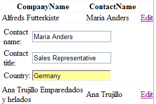

# FormTemplate Mimics Auto-generated Forms


## 

The conventions for the __Display/ReadOnly/Visible__ properties of grid columns (explained in [ Column types]()) are not applicable when you use __FormTemplate__ with binding expressions for editing. You will need to take care of the showing/hiding the edited fields in your __FormTemplate__ with custom code.

The example below illustrates how to simulate the behavior of auto-generated forms with __FormTemplate__.

Note that our grid instance on this example contains four bound columns - __CompanyName__ (__ReadOnly = true__), __ContactName__, __ContactTitle__ (__Display = false__) and __Country__ (__Visible = false__).

Only the first two of them will be displayed on initial load (__CompanyName__ and __ContactName__). When the user presses the edit button for an arbitrary grid row, an edit form (__FormTemplate__) will be visualized.

Note that this edit form will present the __ContactName__, __ContactTitle__ and __Country__ fields. The __CompanyName__ column is shown/hidden through binding expression syntax which sets the __Visible__ property of the respective label/textbox editor.

````ASPNET
	  <telerik:RadGrid ID="RadGrid1" DataSourceID="SqlDataSource1" runat="server" Width="300px">
	    <MasterTableView Width="100%" CssClass="MasterTable" DataSourceID="SqlDataSource1"
	      AutoGenerateColumns="False">
	      <EditFormSettings EditFormType="Template">
	        <FormTemplate>
	          <table style="width: 171px">
	            <tbody>
	              <tr>
	                <td>
	                  <label id="CompanyName" text="Company name" visible='<%# !(RadGrid1.MasterTableView.Columns.FindByUniqueName
	        ("CompanyName") as GridBoundColumn).ReadOnly %>'>
	                  </label>
	                </td>
	                <td>
	                  <asp:TextBox ID="TextBox1" runat="server" Text='<%# Bind("CompanyName") %>' Visible='<%# !(RadGrid1.MasterTableView.Columns.FindByUniqueName("CompanyName")
	       as GridBoundColumn).ReadOnly %>'>></asp:TextBox>
	                </td>
	              </tr>
	              <tr>
	                <td>
	                  Contact name:
	                </td>
	                <td>
	                  <asp:TextBox ID="TextBox2" runat="server" Text='<%# Bind("ContactName") %>'></asp:TextBox>
	                </td>
	              </tr>
	              <tr>
	                <td>
	                  Contact title:
	                </td>
	                <td>
	                  <asp:TextBox ID="TextBox3" runat="server" Text='<%# Bind("ContactTitle") %>'></asp:TextBox>
	                </td>
	              </tr>
	              <tr>
	                <td>
	                  Country:
	                </td>
	                <td>
	                  <asp:TextBox ID="TextBox4" runat="server" Text='<%# Bind("Country") %>'></asp:TextBox>
	                </td>
	              </tr>
	            </tbody>
	          </table>
	        </FormTemplate>
	      </EditFormSettings>
	      <Columns>
	        <telerik:GridBoundColumn DataField="CompanyName" HeaderText="CompanyName" ReadOnly="True"
	          UniqueName="CompanyName" />
	        <telerik:GridBoundColumn DataField="ContactName" HeaderText="ContactName" UniqueName="ContactName" />
	        <telerik:GridBoundColumn DataField="ContactTitle" Display="False" HeaderText="ContactTitle"
	          UniqueName="ContactTitle" />
	        <telerik:GridBoundColumn DataField="Country" HeaderText="Country" UniqueName="Country"
	          Visible="False" />
	        <telerik:GridEditCommandColumn UniqueName="EditCommandColumn" />
	      </Columns>
	    </MasterTableView>
	  </telerik:RadGrid>
	  <asp:SqlDataSource ID="SqlDataSource1" runat="server" ConnectionString="<%$ ConnectionStrings:NorthwindConnectionString %>"
	    SelectCommand="SELECT * FROM [Customers]">
	  </asp:SqlDataSource>
````


And here is the result of this code:


