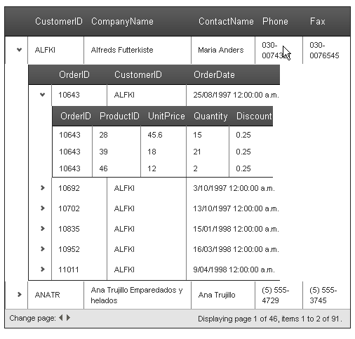
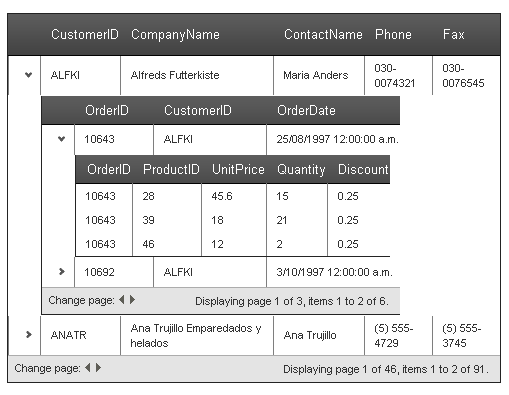

# RadGrid and MasterTableView Difference


The __RadGrid__ control has a __MasterTableView__ property that represents the top table in the grid. The instances of __RadGrid__ and __MasterTableView__ are almost identical, although they are of different types (__RadGrid__ and __GridTableView__, respectively).

The main difference between __RadGrid__ and __MasterTableView__ is that the properties of __RadGrid__ specify the defaults for every __GridTableView__ in the grid (the __MasterTableView__ and any __DetailTables__). The properties of __MasterTableView__ apply only to the top-level table in the grid. In other words, property settings on __MasterTableView__ are not inherited by any __DetailTables__ nested inside it. The properties of __MasterTableView__, as with the properties of any __DetailTable__ in the grid, act as overrides to the defaults set on the __RadGrid__ object.

For example, if you set blue border for the __RadGrid__ object, the __MasterTableView__ and any __DetailTables__ will also have blue border (assuming they do not override the property setting), while if you set blue border for the __MasterTableView__, this border will appear *only* on the top-level table, and not on any detail tables.

## Example

The following examples illustrate this difference.

* The first example shows a __RadGrid__ control that enables paging with __PageSize__ set to 2. All tables in the grid use paging and a pagesize of 2.

* The second example shows the same declaration, except that the __AllowPaging__ and __PageSize__ properties are set on the __MasterTableView__ instead of on the __RadGrid__ control. Only the master table view uses paging.

* The third example shows a __RadGrid__ control that enables paging with a __PageSize__ set to 2, but with a detail table that overrides this setting.

## Defaults set in RadGrid

````ASPNET
	  <telerik:RadGrid ID="RadGrid1" runat="server" DataSourceID="AccessDataSource1" AllowPaging="True"
	    PageSize="2">
	    <MasterTableView DataKeyNames="CustomerID" DataSourceID="AccessDataSource1" TableLayout="Auto">
	      <DetailTables>
	        <telerik:GridTableView runat="server" DataKeyNames="OrderID" DataSourceID="AccessDataSource2"
	          TableLayout="Auto">
	          <ParentTableRelation>
	            <telerik:GridRelationFields DetailKeyField="CustomerID" MasterKeyField="CustomerID" />
	          </ParentTableRelation>
	          <DetailTables>
	            <telerik:GridTableView runat="server" TableLayout="Auto" DataSourceID="AccessDataSource3">
	              <ParentTableRelation>
	                <telerik:GridRelationFields DetailKeyField="OrderID" MasterKeyField="OrderID" />
	              </ParentTableRelation>
	            </telerik:GridTableView>
	          </DetailTables>
	        </telerik:GridTableView>
	      </DetailTables>
	    </MasterTableView>
	  </telerik:RadGrid>
````


## Properties set in MasterTableView

````ASPNET
	  <telerik:RadGrid ID="RadGrid1" runat="server" DataSourceID="AccessDataSource1">
	    <MasterTableView DataKeyNames="CustomerID" DataSourceID="AccessDataSource1" TableLayout="Auto"
	      AllowPaging="True" PageSize="2">
	      <DetailTables>
	        <telerik:GridTableView runat="server" DataKeyNames="OrderID" DataSourceID="AccessDataSource2"
	          TableLayout="Auto">
	          <ParentTableRelation>
	            <telerik:GridRelationFields DetailKeyField="CustomerID" MasterKeyField="CustomerID" />
	          </ParentTableRelation>
	          <DetailTables>
	            <telerik:GridTableView runat="server" TableLayout="Auto" DataSourceID="AccessDataSource3">
	              <ParentTableRelation>
	                <telerik:GridRelationFields DetailKeyField="OrderID" MasterKeyField="OrderID" />
	              </ParentTableRelation>
	            </telerik:GridTableView>
	          </DetailTables>
	        </telerik:GridTableView>
	      </DetailTables>
	    </MasterTableView>
	  </telerik:RadGrid>
````



## Defaults set in RadGrid with overrides by detail table

````ASPNET
	  <telerik:RadGrid ID="RadGrid1" runat="server" DataSourceID="AccessDataSource1" AllowPaging="True"
	    PageSize="2">
	    <MasterTableView DataKeyNames="CustomerID" DataSourceID="AccessDataSource1" TableLayout="Auto">
	      <DetailTables>
	        <telerik:GridTableView runat="server" DataKeyNames="OrderID" DataSourceID="AccessDataSource2"
	          TableLayout="Auto">
	          <ParentTableRelation>
	            <telerik:GridRelationFields DetailKeyField="CustomerID" MasterKeyField="CustomerID" />
	          </ParentTableRelation>
	          <DetailTables>
	            <telerik:GridTableView runat="server" TableLayout="Auto" DataSourceID="AccessDataSource3"
	              AllowPaging="False">
	              <ParentTableRelation>
	                <telerik:GridRelationFields DetailKeyField="OrderID" MasterKeyField="OrderID" />
	              </ParentTableRelation>
	            </telerik:GridTableView>
	          </DetailTables>
	        </telerik:GridTableView>
	      </DetailTables>
	    </MasterTableView>
	  </telerik:RadGrid>
````


