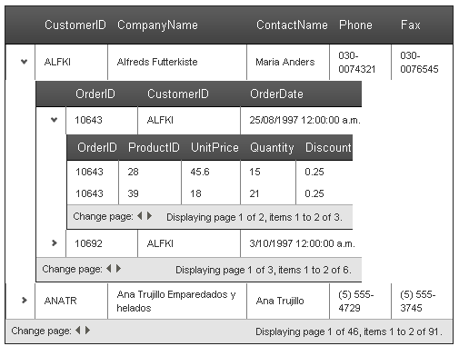

# RadGrid and MasterTableView Difference


The **RadGrid** control has a **MasterTableView** property that represents the top table in the grid. The instances of **RadGrid** and **MasterTableView** are almost identical, although they are of different types (**RadGrid** and **GridTableView**, respectively).

The main difference between **RadGrid** and **MasterTableView** is that the properties of **RadGrid** specify the defaults for every **GridTableView** in the grid (the **MasterTableView** and any **DetailTables**). The properties of **MasterTableView** apply only to the top-level table in the grid. In other words, property settings on **MasterTableView** are not inherited by any **DetailTables** nested inside it. The properties of **MasterTableView**, as with the properties of any **DetailTable** in the grid, act as overrides to the defaults set on the **RadGrid** object.

For example, if you set blue border for the **RadGrid** object, the **MasterTableView** and any **DetailTables** will also have blue border (assuming they do not override the property setting), while if you set blue border for the **MasterTableView**, this border will appear *only* on the top-level table, and not on any detail tables.

## Example

The following examples illustrate this difference.

* The first example shows a **RadGrid** control that enables paging with **PageSize** set to 2. All tables in the grid use paging and a pagesize of 2.

* The second example shows the same declaration, except that the **AllowPaging** and **PageSize** properties are set on the **MasterTableView** instead of on the **RadGrid** control. Only the master table view uses paging.

* The third example shows a **RadGrid** control that enables paging with a **PageSize** set to 2, but with a detail table that overrides this setting.

## Defaults set in RadGrid

````ASPNET
	  <telerik:RadGrid ID="RadGrid1" runat="server" DataSourceID="AccessDataSource1" AllowPaging="True"
	    PageSize="2">
	    <MasterTableView DataKeyNames="CustomerID" DataSourceID="AccessDataSource1" TableLayout="Auto">
	      <DetailTables>
	        <telerik:GridTableView runat="server" DataKeyNames="OrderID" DataSourceID="AccessDataSource2"
	          TableLayout="Auto">
	          <ParentTableRelation>
	            <telerik:GridRelationFields DetailKeyField="CustomerID" MasterKeyField="CustomerID" />
	          </ParentTableRelation>
	          <DetailTables>
	            <telerik:GridTableView runat="server" TableLayout="Auto" DataSourceID="AccessDataSource3">
	              <ParentTableRelation>
	                <telerik:GridRelationFields DetailKeyField="OrderID" MasterKeyField="OrderID" />
	              </ParentTableRelation>
	            </telerik:GridTableView>
	          </DetailTables>
	        </telerik:GridTableView>
	      </DetailTables>
	    </MasterTableView>
	  </telerik:RadGrid>
````




## Properties set in MasterTableView

````ASPNET
	  <telerik:RadGrid ID="RadGrid1" runat="server" DataSourceID="AccessDataSource1">
	    <MasterTableView DataKeyNames="CustomerID" DataSourceID="AccessDataSource1" TableLayout="Auto"
	      AllowPaging="True" PageSize="2">
	      <DetailTables>
	        <telerik:GridTableView runat="server" DataKeyNames="OrderID" DataSourceID="AccessDataSource2"
	          TableLayout="Auto">
	          <ParentTableRelation>
	            <telerik:GridRelationFields DetailKeyField="CustomerID" MasterKeyField="CustomerID" />
	          </ParentTableRelation>
	          <DetailTables>
	            <telerik:GridTableView runat="server" TableLayout="Auto" DataSourceID="AccessDataSource3">
	              <ParentTableRelation>
	                <telerik:GridRelationFields DetailKeyField="OrderID" MasterKeyField="OrderID" />
	              </ParentTableRelation>
	            </telerik:GridTableView>
	          </DetailTables>
	        </telerik:GridTableView>
	      </DetailTables>
	    </MasterTableView>
	  </telerik:RadGrid>
````


## Defaults set in RadGrid with overrides by detail table

````ASPNET
	  <telerik:RadGrid ID="RadGrid1" runat="server" DataSourceID="AccessDataSource1" AllowPaging="True"
	    PageSize="2">
	    <MasterTableView DataKeyNames="CustomerID" DataSourceID="AccessDataSource1" TableLayout="Auto">
	      <DetailTables>
	        <telerik:GridTableView runat="server" DataKeyNames="OrderID" DataSourceID="AccessDataSource2"
	          TableLayout="Auto">
	          <ParentTableRelation>
	            <telerik:GridRelationFields DetailKeyField="CustomerID" MasterKeyField="CustomerID" />
	          </ParentTableRelation>
	          <DetailTables>
	            <telerik:GridTableView runat="server" TableLayout="Auto" DataSourceID="AccessDataSource3"
	              AllowPaging="False">
	              <ParentTableRelation>
	                <telerik:GridRelationFields DetailKeyField="OrderID" MasterKeyField="OrderID" />
	              </ParentTableRelation>
	            </telerik:GridTableView>
	          </DetailTables>
	        </telerik:GridTableView>
	      </DetailTables>
	    </MasterTableView>
	  </telerik:RadGrid>
````


