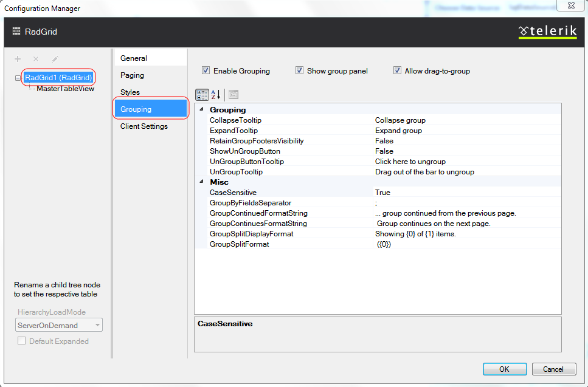
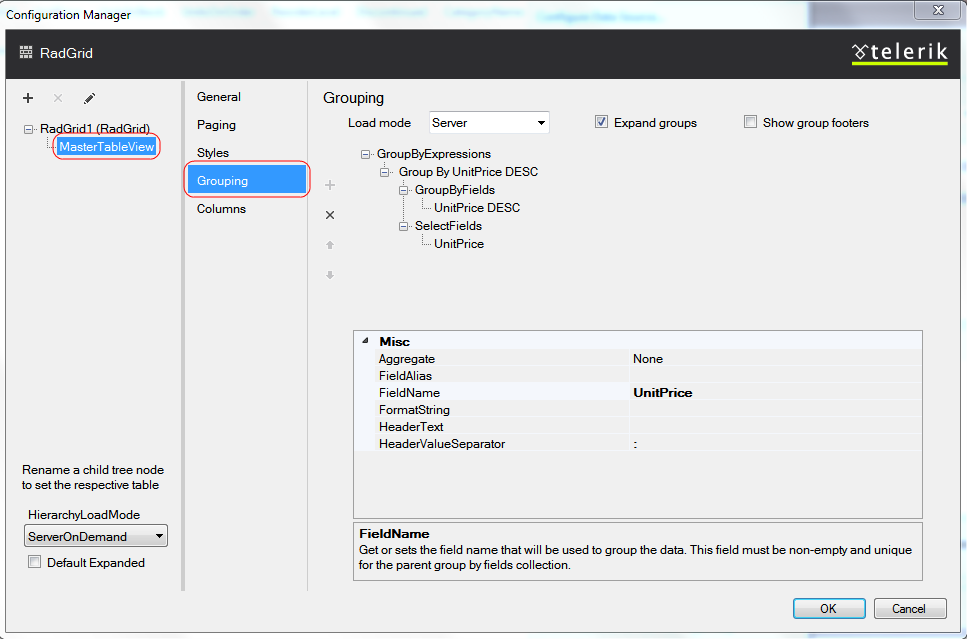

# Setting grouping from Design-Time

## Grouping

The Grouping section of the Telerik RadGrid Properties lets you specify whether your grid will use grouping and the specific group options.

In order to enable grouping you must check the [__Enable Grouping__] box on the top of the Editor. This will enable the default grouping mechanism of Telerik RadGrid. To be able to show grouping options, a special area called the __GridGroupPanel__ can be displayed at the top of the grid. You should check the [__Show group panel__] box on the top to display the grid group panel. To allow users to change the grouping by dragging column headers, check the [__Allow drag-to-group__] box.

## MasterTableView Grouping

The following screenshot demonstrates how you can set group-by expressions declaratively at design time:

From the combobox at the top of the editor you can control where the grouping will be handled on the client or on the server, using the __GroupLoadMode__ property of the GridTableView instance.Each __GridTableView__ object has a __GroupByExpressions__ property. GroupByExpressions is a collection of group expressions(GridGroupByExpression objects). __GridGroupByExpression__ object contains two collections in turn:

* The __SelectFields__ collection determines the information that is displayed in the group header.

* The __GroupByFields__ collection determines the field values that are used to group the data.

To expand all groups on grid load you must check [__Expand groups__] box. You can also enable group footers feature which provides the option to render footer under each group in the grid, by checking the [__Show group footers__] box on the top of the Editor.
