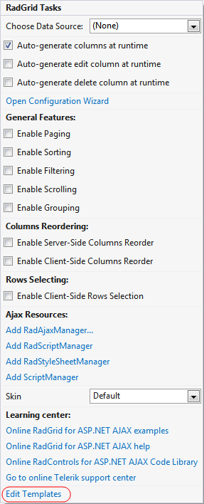

# SmartTag

The __RadGrid__ Smart Tag provides convenient access to frequently needed tasks. You can display the __Smart Tag__ by right clicking on the grid in the design window, and choosing __Show Smart Tag__ from its context menu.

The smart tag lets you perform the following:

## RadGrid Tasks

* The __Choose Data Source__ drop-down lets you bind the grid to a [declarative data source](). You can select from the existing data source components on the Web page, or create and configure a new one.

* The __Configure Data Source__ link launches the __Configure Data Source wizard__ for the current data source. This link does not appear in the Smart Tag unless the grid is bound to a declarative data source.

* The __Refresh Schema__ link refreshes the schema for the data source to which the grid is bound. This link does not appear in the Smart Tag unless the grid is bound to a declaraative data source.

* The __Auto-generate columns at runtime__ check box sets __AutoGenerateColumns__ property of the __RadGrid__ control. This specifies whether the table views in the grid automatically create [columns]() for all fields in the data source at runtime by default. This default behavior can be overridden by the __AutoGenerateColumns__ property of any __GridTableView__ in the grid.

* The __Auto-generate edit column at runtime__ check box sets the __AutoGenerateEditColumn__ property of the __RadGrid__ control. This specifies whether the table views in the grid automatically insert a __GridEditCommandColumn__ column before any auto-generated data columns to allow the user to edit the data in the grid rows. This default behavior can be overridden by the __AutoGenerateEditColumn__ property of any __GridTableView__ in the grid.

>note In order to enable editing, you must configure the data source to allow updates as well as adding the edit command column.
>

* The __Auto-generate delete column at runtime__ check box sets the __AutoGenerateDeleteColumn__ property of the __RadGrid__ control. This specifies whether the table views in the grid automatically insert a __GridButtonColumn__ column before any auto-generated data or edit columns to allow the user to delete grid rows.

>note In order to enable row deletion, you must configure the data source to allow deletes as well as adding the delete column.
>

* The __Open Editor__ link lauches the [RadGrid Editor](), where you can configure the grid, including all __GridTableView__ objects that it contains. The __RadGrid Editor__ helps organize the many child controls and functions of the __RadGrid__ control.

## General Features

* The __Enable Paging__ check box sets the __AllowPaging__ property of the __RadGrid__ control. This specifies whether the grid supports [basic paging](). The __AllowPaging__ property of the __RadGrid__ control can be overridden by the __AllowPaging__ property of any __GridTableView__ in the grid.

* The __Enable Sorting__ check box sets the __AllowSorting__ property of the __RadGrid__ control. This specifies whether the grid supports [basic sorting](). The __AllowSorting__ property of the grid can be overridden by the __AllowSorting__ property of any __GridTableView__ in the grid.

* The __Enable Filtering__ check box sets the __AllowFilteringByColumn__ property of the __RadGrid__ control. This specifies whether the grid supports [basic filtering](). The __AllowFilteringByColumn__ property of the grid can be overridden by the __AllowFilteringByColumn__ property of any __GridTableView__ in the grid.

* The __Enable Scrolling__ check box sets the __ClientSettings.Scrolling.AllowScroll__ property of the __RadGrid__ control. This property controls whether [scrolling]() is enabled in the grid.

* The __Enable Grouping__ check box sets the __ShowGroupPanel__ and __ClientSettings.AllDragToGroup__ properties of the __RadGrid__ control. These controls allow users to specify [grouping]() by columns from the data source.

## Columns Reordering

* The __Enable Server-Side Columns Reorder__ check box sets the __ClientSettings.AllowColumnsReorder__ and __ClientSettings.ReorderColumnsOnClient__ properties of the grid. When __Enable Server-Side Columns Reorder__ is checked, the __AllowColumnsReorder__ property is set to __True__ and the __ReorderColumnsOnClient__ property is set to __False__. This allows the user to [re-order the columns of the grid](), where the re-ordering occurs in server-side code.

* The __Enable Client-Side Columns Reorder__ check box sets the __ClientSettings.AllowColumnsReorder__ and __ClientSettings.ReorderColumnsOnClient__ properties of the grid. When __Enable Client-Side Columns Reorder__ is checked, both the __AllowColumnsReorder__ property and the __ReorderColumnsOnClient__ property are set to __True__. This allows the user to re-rder the columns of the grid, where the re-ordering occurs in client-side code.

## Rows Selecting

The __Enable Client-Side Rows Selection__ check box sets the __ClientSettings.Selecting.AllowRowSelect__ property of the grid. This specifies whether the user can [select rows by clicking on them]().

## Ajax Resources

* The __Add RadAjaxManager...__ link adds a __RadAjaxManager__ component to your Web page, and displays the __RadAjax Property Builder__ where you can configure it.Adding a __RadAjaxManager__ to your Web page lets you take advantage of the [AJAX technology]() to improve performance by performing postbacks asynchronously.

* The __Replace ScriptManager with RadScriptManager__ link replaces the default __ScriptManager__ component that is added for AJAX-enabled Web sites with __RadScriptManager__.

* The __Add____RadStyleSheetManager__ link adds a __RadStyleSheetManager__ to your Web page.

## Skin

The __Skin__ drop down lets you select a [Skin]() to set the look-and-feel of the grid.

## Learning Center

Links navigate you directly to __RadGrid__ examples, help, or code library. You can also search the Telerik web site for a given string.

## Edit Templates

The __Edit Templates__ link lets you launch the template design surface for a particular template that the grid uses. You can select from a drop-down list of all possible templates, including templates for [template columns](), the [no records template](), [pager template](), [command item template](), [edit form template](), global item template, or nested view template.

