# Add Controls to Column Templates

This tutorial shows how to:

* Add controls to a __RadGrid__ template column's ItemTemplate and EditItemTemplate.

* Enable the grid controlfor editing using automatic updates.

* Set RadGrid's skin using the Smart Tag.

* Enable paging for RadGrid and changing its page size with the design editor.

## Creating and Binding the Grid

1. Locate the "..\Live Demos\App_Data" folder underneath the folder where you have installed yourcontrols. In this folder, find the __Northwind.mdf__ file, and copy it into the__App_Data__ folder of your Web application. The__Solution Explorer__ for you application should look something like the following:

1. Drag and drop a __RadGrid__ control from Visual Studio's toolbox onto your Web page:

1. Using the __RadGrid's__[Smart Tag](), expand the drop-down listlabelled __Choose Data Source__ and select __<New data source...>__:

1. The __Data Source Configuration Wizard__ appears. On the__Choose a Data Source Type__ page, select __SQL Database__ andclick __OK__: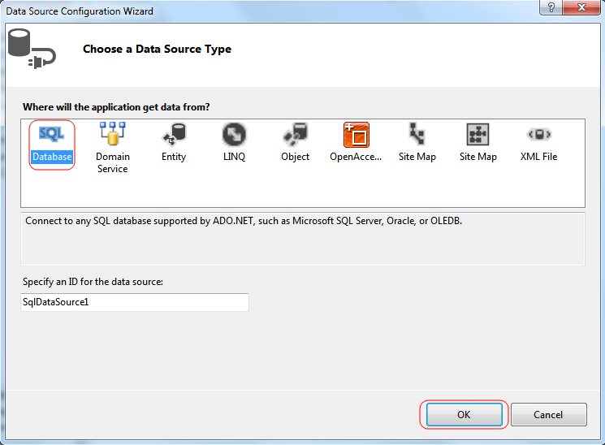

1. On the __Choose Your Data Connection__ page, expand the drop-down list by clicking the little triangle on the right side and select the __Northwind.mdf__ from the available options. Then click the __Next__ button:

>note If you happen to encounter a __"Database schema could not be retrieved"__ exception, please follow the guide in[this]()help topic.
>

1. On the __Configure Select Statement__ page, select the Orders table from thedrop-down list, and select theOrderID, CustomerID, EmployeeID, andOrderDate fields and then click __Next__ button:

1. Click the __Specify a custom SQL statement or stored procedure__ radio button.Then choose __Next__:

1. Add an __Update__ statement to the data source: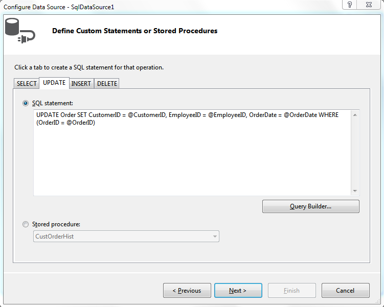

1. On the __Test Query__ page, click the __Test Query__ button to see the data. Then click __Finish__, to exit the__Configure Data Source__ wizard: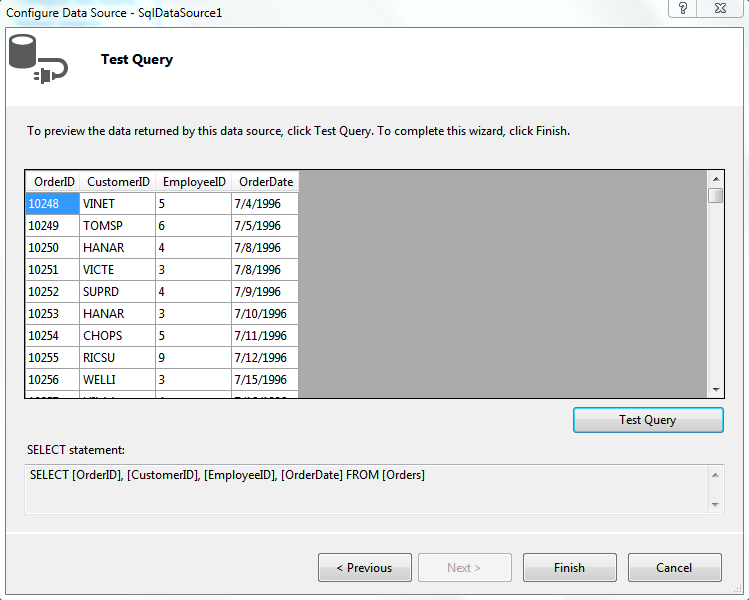

## Adding Template columns

1. Using the RadGrid's Editor, add a template column to the grid:

* Open __RadGrid's Configuration Wizard__ from the [Smart Tag]().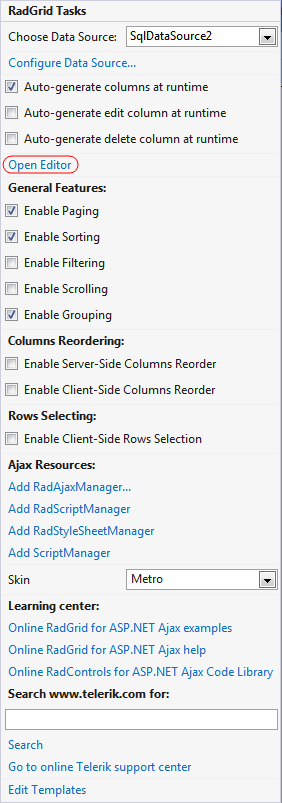

* Select __MasterTableView__ under __RadGrid__ node.

* Select __Columns__ tab from the right pane.

* Select __Template__ column under __Available columns__.

* Click the __"+"__ button to add the template column.

* In the right pane, set the __HeaderText__ property to __TemplateColumn__.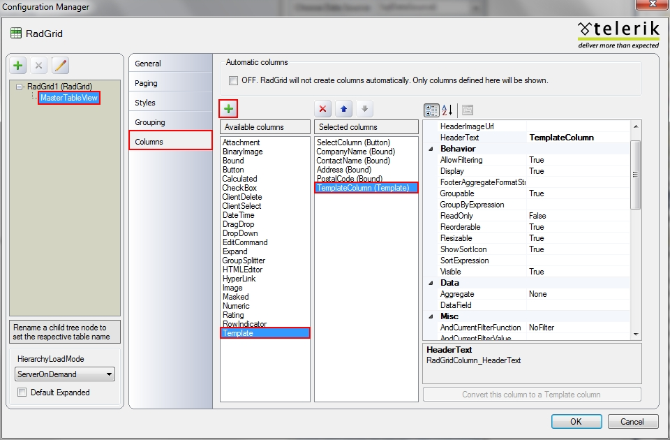

1. Click __Edit Templates__ from the __RadGrid's__[Smart Tag]():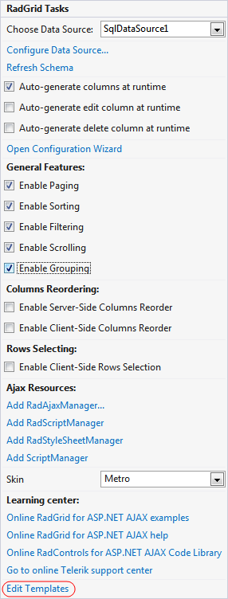

1. Choose the Template column that you wish to edit:

1. Drag and drop a __RadDatePicker__ control from Visual Studio's toolbox ontothe __EditItemTemplate__.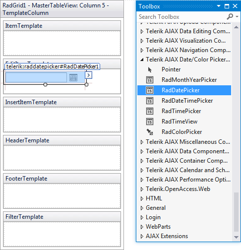

1. Now add a __Label__ controlto the __ItemTemplate__.

1. Select __Edit DataBindings__ from the __RadDatePicker's____Smart Tag__:

1. In the __DataBindings__ dialog:

* Check __Show all properties__ to view the properties of the date picker.

* Choose the __SelectedDate__ property as the property to bind.

* Choose the __OrderDate__ field as the __Fieldbinding__.

* Check the __Two-way data binding__ box to enable the control to update the field value.

1. Use a similar technique to bind the __Label__ control: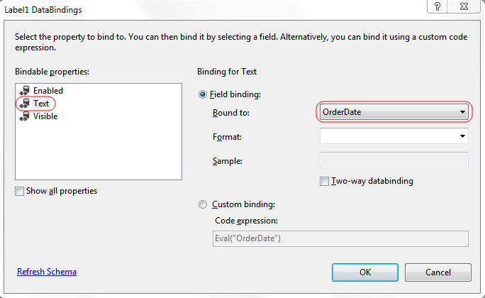

1. Use the __RadGrid's__[Smart Tag]() to end template editing:

## Enabling editing, paging, and change the Skin

1. Back in __RadGrid's__ Editor, add an edit command column to the grid: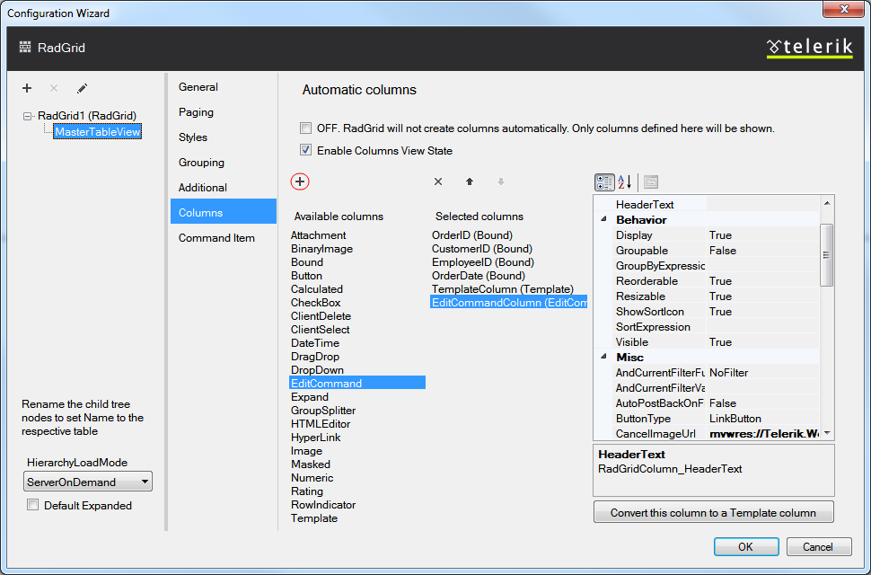

1. Remove the __OrderDate__ column; the Template column will be used instead:

1. Still in the RadGrid's Editor check the__AllowAutomaticUpdates__ checkbox on the right pane: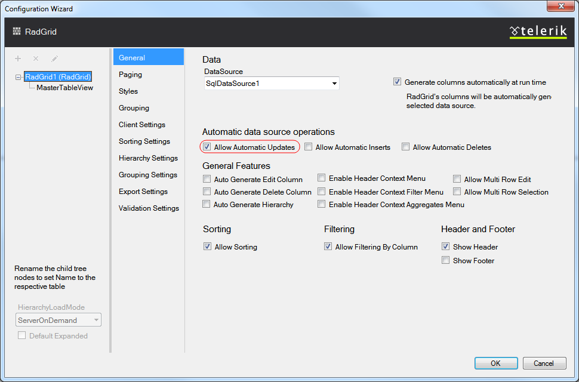

1. Now select the __MasterTableView__ node, then select __Paging__ tab and change the __Page size__ to __5__ rows.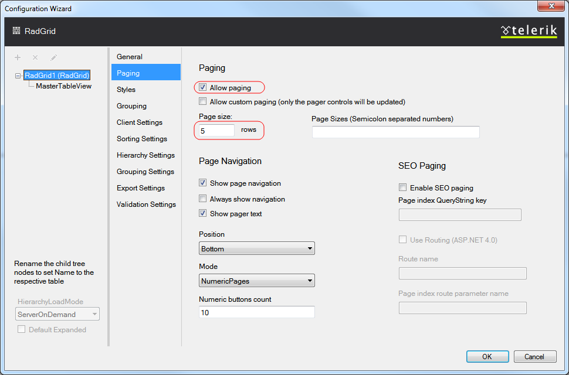

1. From the __RadGrid's__[Smart Tag]() expand the drop-down list labeled __Skin__ and choose __Metro__ skin.

1. Run the application. Click the edit column to see the edit template you added. Note that ifyou edit a value in the grid, the database is updated: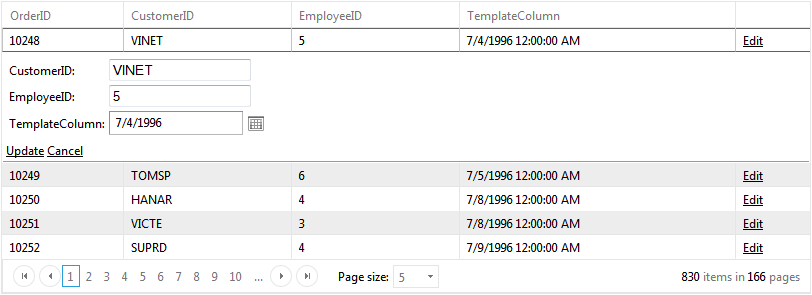
