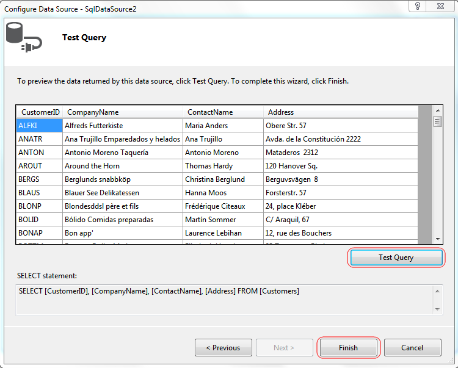
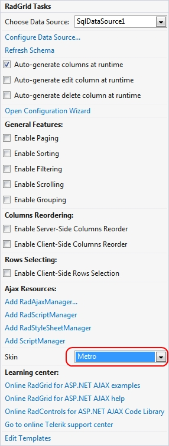
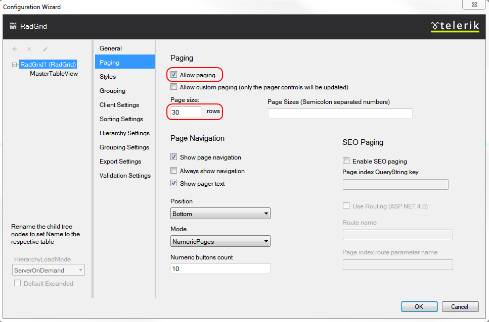
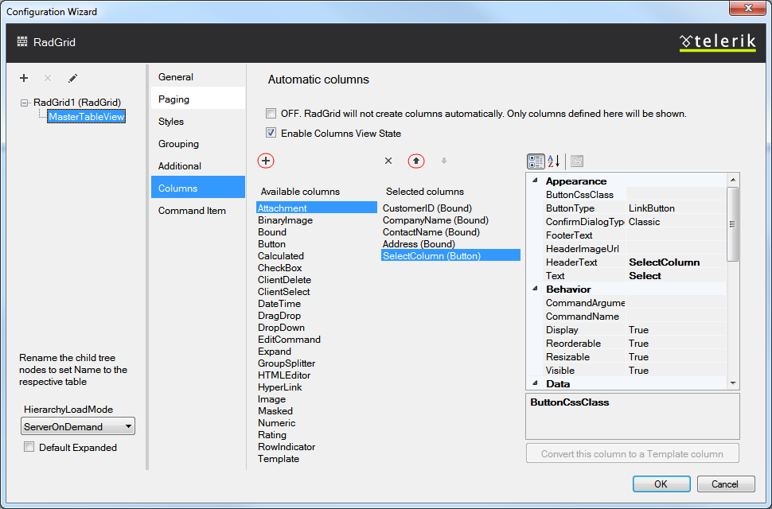
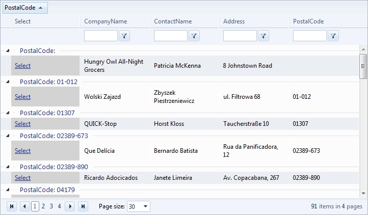
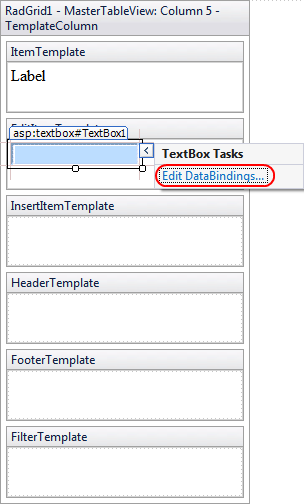
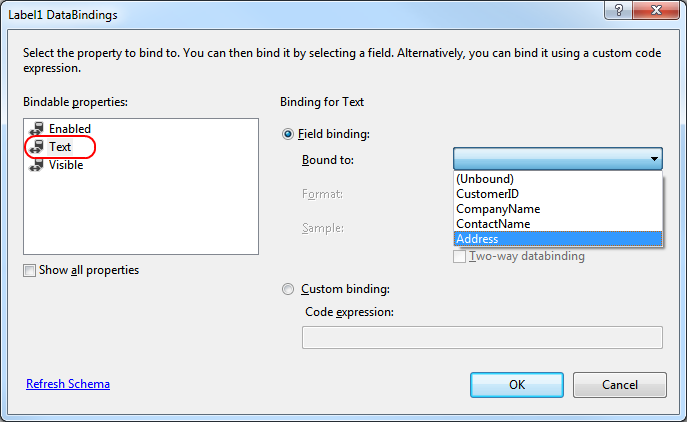

# Getting Started with RadGrid for ASP.NET AJAX

This tutorial will walk you through creating a Web page that contains a __RadGrid__ control. It shows how to:

* Bind the grid using a declarative data source.

* Configure the grid to support the most common features including:

* Paging

* Sorting

* Scrolling

* Grouping

* Filtering

* Selecting

* Add a template column for customized data display.

## Creating and Binding the Grid

1. Locate the "..\Live Demos\App_Data" folder underneath the folder where you have installed your controls. In this folder, find the __Northwind.mdf__ file, and copy it into the __App_Data__ folder of your Web application. The __Solution Explorer__ for you application should look something like the following:

1. Drag and drop a __RadGrid__ control from the toolbox onto your Web page:

1. Using the __RadGrid__[Smart Tag]() expand the drop-down list labelled Choose Data Source and select __<New data source...>__:

1. The __Data Source Configuration Wizard__ appears. On the __Choose a Data Source Type__ page, select __SQL Database__ and click __OK__:

1. On the __Choose Your Data Connection__ page, expand the drop-down list by clicking the little triangle on the right side and select the __Northwind.mdf__ from the available options. Then click the __Next__ button:

>note If you happen to encounter a "Database schema could not be retrieved" exception, please follow the guide in[this]()help topic.
>

1. On the __Configure the Select Statement__ page, select the Customers table from the drop-down list, select the CompanyName, ContactName, Address, and PostalCode fields. Then choose __Next__:

1. On the __Test Query__ page, click the __Test Query__ button to see the data. Then click __Finish__ to exit the __Configure Data Source__ wizard:

## Configuring the grid for paging, sorting, and scrolling

1. From the __Skin__ drop-down of the __RadGrid's__[Smart Tag]() choose the __Metro__ skin:

1. In the __General Features__ section, check the boxes to enable __paging__, __sorting__, and __scrolling__:

1. Still in the __Smart Tag__ click the link labeled __Open Editor__:

1. In the __RadGrid__[Editor]():

* Select __RadGrid__ from the __Configuration Manager__.

* On the right side, click __Styles__ tab. Then select __RadGrid style__.

* In the __Layout__ section of the RadGrid's style editor, locate the __Width__ property and set it to __720px__:

1. On the same window, just one tab above the __Styles__ tab select __Paging tab__. Then on the right pane, set the __Page size__ to __30__ rows.

1. Run the application to check out what you have created so far. Note the pager elements in the grid footer and the scroll bar on the right side. When you click on column headers the column data will be sorted:

## Configuring the grid for selecting, filtering, and grouping

1. Add a select column:

* Open the __Editor__.

* Select __MasterTableView__ under __RadGrid__node.

* Select __Columns__ from the right pane.

* Select __Button__ column under __Available columns__.

* Click the __"+"__ button to add the button column.

* Use the up arrow button to move it to the first position.

* You need to customize the column a bit in order to work as a select column.

* Set values to the __HeaderText__, __Text__, and __CommandName__ properties.

* Additionally, you could change the __UniqueName__ and __BackColor__ of the column.

1. Use the __RadGrid__[Smart Tag]() to enable __filtering__ and __grouping__:

1. Run the application to see the result of your changes. A select column appears as the first column of the grid. Each column now has a filter control at the top. A grouping panel appears at the top of the grid. Drag the header of the __PostalCode__ column onto the grouping panel. The rows of the grid are now grouped by postal code, and an item for this group appears in the grouping panel that lets you change the sort order of the groups:

## Adding Template columns

1. Back in the Editor, add a template column to the grid:

* Select __MasterTableView__ under __RadGrid__ node.

* Select __Columns__ from the right pane.

* Select __Template__ column under __Available columns__.

* Click the __"+"__ button to add the template column.

* In the right pane, set the __HeaderText__ property to __TemplateColumn__.

1. In the [Smart Tag]() select __Edit Templates__ option:

1. In the drop-down list of the __Smart Tag__ in Template Editing Mode, select the template column to bring up the template design surface for the template column:

1. Add a __Label__ to the item template and a __TextBox__ to its edit item template, using drag and drop from the Visual Studio toolbox. From the __Smart Tag__ of the __Label__ and of the __TextBox__, choose __Edit DataBindings__ to display the DataBindings editor:

1. In the DataBindings editor for the __Label__ and for the __TextBox__, bind the __Text__ property to a field in the datasource:

1. Now, you have a fully functional __RadGrid__ with no code behind. Paging, sorting, filtering, scrolling and grouping are enabled. There is a column for server-side selection and a template column for specific data display:
