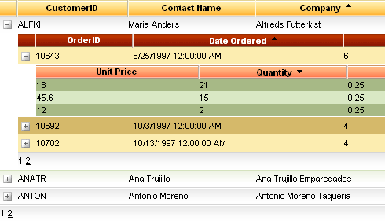
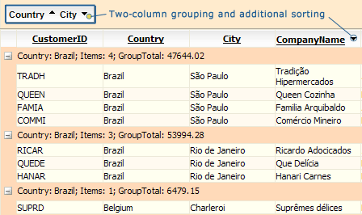
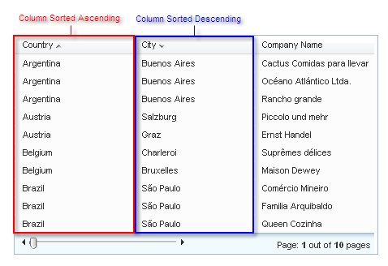
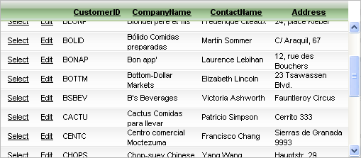
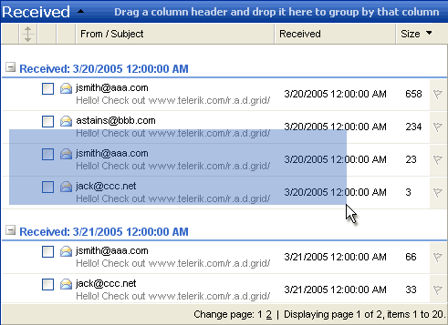
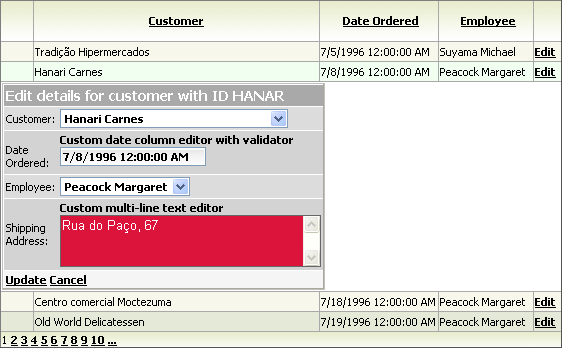

# Key Features

## 

1. [Cross-Browser Support](http://www.telerik.com/aspnet-ajax/tech-sheets/browser-support) - Telerik RadGrid supports the full set of features on most popular browsers like Internet Explorer, Gecko-based browsers (Mozilla, Firefox, Netscape), Opera, Safari and Chrome.

1. [Accessibility Support](http://www.telerik.com/help/aspnet-ajax/grid-accessibility-compliance.html) - RadGrid has **level A** W3C compliance and [Section 508 compliance](http://demos.telerik.com/aspnet-ajax/grid/examples/generalfeatures/accessibility/defaultcs.aspx) in conformance with the Section 508 standards listed on the [official government site](http://www.section508.gov/).

1. [Hierarchical Structure of Tables with mixed load modes](http://demos.telerik.com/aspnet-ajax/grid/examples/hierarchy/hierarchyloadmodemixed/defaultcs.aspx), [templates for detail tables](http://demos.telerik.com/ASPNET/Prometheus/Grid/Examples/Hierarchy/NestedViewTemplate/DefaultCS.aspx) - Telerik RadGrid allows presentation of related DataSets as hierarchical structures of tables. **Unique:** You can even have more than one table in the same level of hierarchy or define templates for child tables.

[See a live example at www.telerik.com](http://demos.telerik.com/aspnet-ajax/Grid/Examples/Hierarchy/ThreeLevel/DefaultCS.aspx)

1. [Global item template](http://demos.telerik.com/ASPNET/Prometheus/Grid/Examples/GeneralFeatures/CardView/DefaultCS.aspx) - allows you to specify item template for each record in the grid and define custom layout to visualize the data in the control.

1. [Integration with RadAjax and loading indicators]() - dramatically improves the responsiveness of the component, simulates Windows-application like behavior, and minimizes the traffic to the server.

1. [Codeless data-binding]() - using the DataSourceControls introduced in ASP.NET 2.x/3x.

1. [Client-side binding](http://demos.telerik.com/ASPNET/Prometheus/Grid/Examples/Client/DataBinding/DefaultCS.aspx) - RadGrid allows you to bind it to data on the client and perform sorting/paging/filtering operations purely client-side.[Various data sources](http://demos.telerik.com/ASPNET/Prometheus/Grid/Examples/Programming/Binding/DefaultCS.aspx) - Telerik RadGrid supports binding to any data source which implements **IList**, **IEnumerable** of **ICustomTypeDescriptor** interfaces.

1. [Filtering]() - allows you to filter the data in the control by applying filter pattern on a per column basis.

1. [Header context menu](http://demos.telerik.com/ASPNET/Prometheus/Grid/Examples/GeneralFeatures/HeaderContextMenu/DefaultCS.aspx) - quite useful if you would like to process operations like sorting or grouping on a per-column basis or show/hide some of the grid columns based on the end user preferences.

1. [ Grouping with group footers/footer aggregates ]() - you can easily implement multilevel Outlook-style grouping of data from a single table - just drag the column header(s) to the group panel on the top, which defines the groping order and hierarchy. You can also programmatically group the data using the group-by expressions. **Unique:** when using grouped data, you can have grouping by two columns and at the same time use all sorting features of Telerik RadGrid (e.g. group by one/two column(s) and sort by another column).

[See a live example at www.telerik.com](http://demos.telerik.com/aspnet-ajax/Grid/Examples/GroupBy/OutlookStyle/DefaultCS.aspx)

1. [Multi-Column Sorting]() - in addition to the simple one-column sorting Telerik RadGrid allows you to sort data by several columns just like in Microsoft Excel. Furthermore, you can define column sorted color for better user experience.

[See a live example at www.telerik.com](http://demos.telerik.com/aspnet-ajax/Grid/Examples/GeneralFeatures/Sorting/DefaultCS.aspx)

1. [Viewstate Optimization]() - you can tune the grid performance by controlling the trade-off between client-side load and speed. When working with hierarchical data, you can choose one of the three available modes for loading the detail tables:- **ServerBind** - optimum server load, viewstate and render size.- **ServerOnDemand** - minimum viewstate and render-size, maximum server load.- **Client** - minimum server load, maximum viewstate and render-size. Rich client browser functionality.

1. [ControlState ASP.NET 2.x feature]() - even with viewstate disabled explicitly RadGrid will keep track of its most common features and will save/recover its state on postback requests from its control state storage.[See a live example at www.telerik.com](http://demos.telerik.com/aspnet-ajax/Grid/Examples/Programming/ViewState/DefaultCS.aspx)

1. **Preserving the Grid State After Postback** - an unique feature of Telerik RadGrid is the ability to preserve its appearance, group-by state, sorting, current page, edit or selected state, and resizing after postbacks with minimum resource usage. This significantly improves the usability of the component.

1. [AJAX-based Virtual Scrolling]() - for instant navigation in large data structures.

1. [Easy Migration from MS GridView to Telerik RadGrid](http://demos.telerik.com/aspnet-ajax/Grid/Examples/GeneralFeatures/Migration/DefaultCS.aspx)**-** the declarative syntax of Telerik RadGrid is quite similar to that of the DataGrid control, which makes the migration a pretty straightforward task.

1. [Rich Set of Column Types]() - Telerik RadGrid supports all widely used column types (GridEditCommandColumn, GridBoundColumn, GridCheckBoxColumn, GridDropDownColumn, GridButtonColumn, GridHyperLinkColumn, GridClientSelectColumn, etc.), columns with other Telerik controls as column editors (GridDateTimeColumn, GridNumericColumn, GridMaskedColumn, GridHTMLEditorColumn) as well as GridTemplateColumns, which give you complete freedom over the data layout and formatting.

[See a live example at www.telerik.com](http://demos.telerik.com/aspnet-ajax/Grid/Examples/GeneralFeatures/ColumnTypes/DefaultCS.aspx)

1. [Paging]() - Telerik RadGrid natively supports table paging, which enables users to view the data in small chunks for faster loading and easier navigation.

1. [Column and Row Resizing]()**-** Telerik RadGrid supports convenient client-side column and row resizing with features like:- real-time resizing- resizing of the grid on column resizing- clipping of the cell content on column resizing.

1. [Drag and drop of grid items](http://demos.telerik.com/ASPNET/Prometheus/Grid/Examples/Programming/DragAndDrop/DefaultCS.aspx) - flexible event-driven mechanism to drag and drop grid records to reorder them within the same grid, move them to different grid instance or drop them over other html element on the page.

1. [Column Reordering with Drag-and-Drop]() - Telerik RadGrid allows users to quickly reorder the columns by simply drag-and-dropping their headers.

[See a live example at www.telerik.com](http://demos.telerik.com/aspnet-ajax/grid/examples/client/resizing/defaultcs.aspx)

1. [Scrolling with static headers/frozen columns]() - Telerik RadGrid enhances the simple scrolling by supporting static headers/frozen columns - you can scroll the grid data, while the header row always stays visible at the top or scroll horizontally having fixed columns visible at all times.

[See a live example at www.telerik.com](http://demos.telerik.com/aspnet-ajax/Grid/Examples/Client/Scrolling/DefaultCS.aspx)

1. Multi-Row Selection and Area Selection - You can easily select multiple rows using **Ctrl** + **Click** or by simply dragging a range over the rows, which you want to select.

[See a live example at www.telerik.com](http://demos.telerik.com/aspnet-ajax/Grid/Examples/Programming/WebMail/DefaultCS.aspx)

1. [Design-Time Support]() - Telerik RadGrid has full support for the design mode of Visual Studio .NET. This allows you to build, customize, and populate the grid in a convenient WYSIWYG environment.

1. **Extensive Client-side API** - Telerik RadGrid introduces a comprehensive client-side API, which enables you to resize, move, reorder, select, scroll columns on-the-fly and much more.

1. [Exporting]() - you can easily export the content to Microsoft Excel/Microsoft Word/CSV/PDF.

1. **Flexible Editing Functionality** Auto-generated edit forms:- [in-line]() - edit controls appear within the edited row.- [in-forms]() - the grid generates a form for entering the row data- [form template]() - template which gives you the flexibility to design the edit form with custom set of controls- [web user control]() - user control for edit form which hosts the editors for the rows- [pop-up edit form]() - allows you to edit data from a given grid record in a pop-up window.

1. [Custom Editors Support]() - Editable columns in Telerik RadGrid (GridBoundColumn, GridDropDownColumn, GridCheckBoxColumn) allow you to replace their default editor with custom ones with enhanced functionality like validation, rich-text editing, etc. Once you have created the custom editors, you can then easily re-use them for other grid implementations.

[See a live example at www.telerik.com](http://demos.telerik.com/aspnet-ajax/Grid/Examples/DataEditing/UserControlEditForm/DefaultCS.aspx)

1. [Appearance Customization]()**-** the appearance of all grid elements is fully customizable using skins. If you have a hierarchical grid, you can set a single skin for the whole grid, or customize each **DetailTable** separately.

1. [ListView/DataList-like grid](http://demos.telerik.com/ASPNET/Prometheus/Grid/Examples/Programming/ListView/DefaultCS.aspx) - useful technique when you would like to display the data in the control in a custom layout format (simulating ListView/DataList functionality) and still keep the sorting/paging/filtering features over the source records.

1. [Keyboard support]()**-** for convenient navigation/editing/selection using the keyboard arrows and Space/Enter keys.[See a live example at www.telerik.com](http://demos.telerik.com/aspnet-ajax/Grid/Examples/Hierarchy/ThreeLevel/DefaultCS.aspx)
